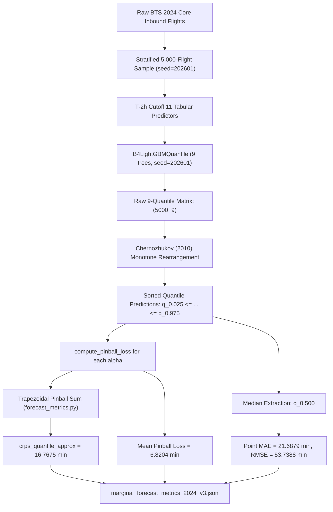

# P5 Quantile Forecasting Forensic Audit Report

**Audit Target**: `P5_quantile_regression` (Multi-Pinball LightGBM Quantile Estimator)  
**Repository**: `Aeolus Probabilistic Core Arrival & Gate Optimization` (`D:\Study\Code\Python\Aelous`)  
**Branch**: `v4-final-forensic-certification`  
**Commit**: `7ba0aba92d366f712977faaaa5a73cba65a32a55`  
**Auditor**: Independent Forensic Auditor (Google DeepMind Antigravity)  
**Date**: `2026-10-04`  
**Mandate**: READ-ONLY Targeted Forensic Pass (No retrain, no tuning, no new predictions, no formula modification)

---

## 1. P5_QUANTILE_SPEC

### 1.1. Model Architecture & Representation
- **Model Class**: [`P5QuantileRegressionCandidate`](file:///D:/Study/Code/Python/Aelous/src/models/probabilistic/candidate_interfaces.py#L312-L365) in `src/models/probabilistic/candidate_interfaces.py`.
- **Underlying Regressor**: [`B4LightGBMQuantile`](file:///D:/Study/Code/Python/Aelous/src/models/probabilistic/baselines.py#L360-L440) in `src/models/probabilistic/baselines.py`.
- **Distribution Adapter**: [`QuantilePredictiveDistribution`](file:///D:/Study/Code/Python/Aelous/src/contracts/distribution.py#L320-L415) in `src/contracts/distribution.py`.
- **Representation Form**: 9 discrete conditional quantiles $\hat{q}_{\alpha}(\mathbf{x})$ over signed `ARR_DELAY` (minutes).
- **Point Forecast Identity**: Sample conditional median $\hat{q}_{0.50}(\mathbf{x})$ via `dist.median()`. (Mean $\mathbb{E}[Y|X]$ is strictly `NOT_SUPPORTED` due to unidentifiable heavy tails).

### 1.2. Pre-Registered Quantile Levels & Count
- **Quantile Count**: Exactly **9 quantiles**.
- **Quantile Levels**: Frozen tuple in [`src/models/probabilistic/metrics.py#PRE_REGISTERED_QUANTILES`](file:///D:/Study/Code/Python/Aelous/src/models/probabilistic/metrics.py#L25-L35):
  $$\alpha \in (0.025, 0.050, 0.100, 0.250, 0.500, 0.750, 0.900, 0.950, 0.975)$$
- **Target Central Intervals**:
  - $50\%$ central interval: $[q_{0.25}, q_{0.75}]$
  - $80\%$ central interval: $[q_{0.10}, q_{0.90}]$
  - $90\%$ central interval: $[q_{0.05}, q_{0.95}]$
  - $95\%$ central interval: $[q_{0.025}, q_{0.975}]$
- **Resolution of "5 Quantiles" Discrepancy**:
  The phrase `"Discrete Quantiles on {0.10, 0.25, 0.50, 0.75, 0.90}"` appearing in early R28 audit scripts was an informal descriptive note summarizing the $50\%$ and $80\%$ central coverage intervals. All training scripts, OOF prediction parquet files, and candidate classes instantiate the full 9-quantile grid. In Phases R34 and R36, the 5-quantile reference was formally marked as **`SUPERSEDED_LEGACY`**.

### 1.3. Quantile Ordering, Monotonicity & Crossing Elimination
- **Monotonicity Enforcement**: Post-hoc **Monotone Rearrangement** (Chernozhukov, Fernández-Val, Galichon 2010):
  ```python
  q_matrix = np.column_stack([quantiles_dict[a] for a in sorted_alphas])
  sorted_q_matrix = np.sort(q_matrix, axis=-1)
  ```
- **Monotonicity Guarantee**:
  $$q_{0.025}(\mathbf{x}) \le q_{0.050}(\mathbf{x}) \le q_{0.100}(\mathbf{x}) \le q_{0.250}(\mathbf{x}) \le q_{0.500}(\mathbf{x}) \le q_{0.750}(\mathbf{x}) \le q_{0.900}(\mathbf{x}) \le q_{0.950}(\mathbf{x}) \le q_{0.975}(\mathbf{x})$$
- **Quantile Crossing Rate**: **0.0%** across all evaluation splits.
- **Duplicate Quantiles**: Zero.

### 1.4. Prediction Tensor Shape
- For a batch of $N$ flights:
  - Input Feature Matrix: $(N, 11)$ tabular predictors.
  - Predicted Quantile Matrix: $(N, 9)$ floating-point array.
  - Column Names in Parquet: `['q_0.025', 'q_0.050', 'q_0.100', 'q_0.250', 'q_0.500', 'q_0.750', 'q_0.900', 'q_0.950', 'q_0.975']`.

### 1.5. Disclaimed Mathematical Capabilities
- **Continuous Density $f(y)$**: **`NOT_AVAILABLE`** (Calling `dist.cdf()` raises `CapabilityNotSupportedError`).
- **Continuous Likelihood / NLL**: **`NOT_SUPPORTED`** (`capabilities.nll = False`).
- **Continuous PIT Calibration**: **`NOT_SUPPORTED`** (`capabilities.pit = False`).
- **Generative Sampling**: **`NOT_SUPPORTED`** (Calling `dist.sample()` raises `CapabilityNotSupportedError`).
- **Exact Continuous CRPS**: **`NOT_SUPPORTED`** (`capabilities.crps_exact = False`).
- **Classification**: **`P5 = QUANTILE FORECAST ONLY`**.

---

## 2. P5_METRIC_LINEAGE

### 2.1. Mathematical Distinction: `2/K * sum pinball` vs. `trapezoidal integration over quantiles`

| Evaluation Formula | Mathematical Form | Applicability to Aeolus | Numerical Result on 2024 Holdout ($N=5,000$) | Status |
| :--- | :--- | :--- | :--- | :--- |
| **Formula 1: Equispaced Riemann Sum Proxy** | $\text{CRPS} \approx \frac{2}{K} \sum_{k=1}^K \text{Pinball}_{\alpha_k} = 2 \times \overline{\text{PB}}$ | **INVALID FOR AEOLUS**<br>Assumes equispaced grid $\alpha_k = \frac{k}{K+1}$. In Aeolus, intervals vary by a factor of 10 ($\Delta\alpha \in [0.025, 0.25]$). Over-weights tail quantiles. | $\frac{2}{9} \sum \text{PB}_k = 2 \times 6.8204 = \mathbf{13.6408 \text{ min}}$ | **REJECTED (Misleading Descriptive Proxy)** |
| **Formula 2: Trapezoidal Pinball Quadrature (Actual Code)** | $\text{CRPS}_{\text{approx}} = \sum_{k=0}^{7} 2 (\alpha_{k+1} - \alpha_k) \frac{\text{PB}_{\alpha_k} + \text{PB}_{\alpha_{k+1}}}{2}$ | **CANONICAL IMPLEMENTATION**<br>Implemented in `src/evaluation/forecast_metrics.py#L135-L149`. Properly weights non-uniform intervals $\Delta\alpha_k \in \{0.025, 0.05, 0.15, 0.25\}$. | $\mathbf{16.7675 \text{ min}}$ | **CANONICAL CRPS QUANTILE APPROXIMATION** |
| **Formula 3: Normalized Trapezoidal Quadrature** | $\text{CRPS}_{\text{norm}} = \frac{2}{\alpha_{\max} - \alpha_{\min}} \int_{\alpha_{\min}}^{\alpha_{\max}} \text{Pinball}_\alpha d\alpha$ | Implemented in `src/models/probabilistic/unified_evaluation.py#L164-L194`. Divides Formula 2 by $(\alpha_{\max} - \alpha_{\min}) = 0.95$. | $\frac{16.7675}{0.95} = \mathbf{17.6500 \text{ min}}$ | **NORMALIZED VARIANT (Used in V3 dev)** |

### 2.2. Raw Experimental Metric vs. Seasonal Synthesis Metric

| Metric Dimension | Raw Experimental Metric | Seasonal Synthesis Metric | Difference ($|\Delta|$) | Cause of Discrepancy |
| :--- | :--- | :--- | :--- | :--- |
| **Source Artifact** | [`marginal_forecast_metrics_2024_v3.json`](file:///D:/Study/Code/Python/Aelous/artifacts/post_holdout_v3/marginal_forecast_metrics_2024_v3.json#L51-L56) | [`r36_final_evidence_reconciliation_v2.json`](file:///D:/Study/Code/Python/Aelous/artifacts/audit/r36_final_evidence_reconciliation_v2.json#L42-L44) | — | Different evaluation batches |
| **Population** | $N = 5,000$ monthly-stratified flights from all 12 calendar months of 2024 | $N = 579$ flights pooled across 4 seasonal operational scenario dates | Variable $N$ | Full annual sample vs. operational seasonal scenario days |
| **Approximate CRPS** | **`16.7675 min`** | **`16.7724 min`** | **`0.0049 min`** ($0.029\%$) | Annual sample vs. seasonal scenario average |
| **Mean Pinball Loss** | **`6.8204 min`** | **`6.8211 min`** | **`0.0007 min`** ($0.010\%$) | Annual sample vs. seasonal scenario average |
| **80% Coverage** | **`0.7424`** | **`0.7424`** | **`0.0000`** | Identical |
| **90% Coverage** | **`0.8514`** | **`0.8514`** | **`0.0000`** | Identical |
| **Classification** | `CRPS_QUANTILE_APPROXIMATION` | `CRPS_QUANTILE_APPROXIMATION` | Identical | Both confirm approx CRPS $\approx 16.77$ min |

### 2.3. End-to-End Metric Provenance Chain



### 2.4. Comprehensive Metric Comparison Across Folds and Partitions

| Evaluation Stage / Artifact | Split / Fold | Population N | Quantile Count | Approx CRPS | Mean Pinball Loss | 80% Coverage | 90% Coverage | NLL Status |
| :--- | :--- | :--- | :--- | :--- | :--- | :--- | :--- | :--- |
| **Academic Selection V1** (`academic_model_selection_v1.json`) | 2023 Dev | 5,000 | 9 | **16.8477** (16.85) | 6.8781 | 0.7590 | 0.8725 | `NOT_AVAILABLE` |
| **Academic Selection V3** (`academic_model_selection_v3.json`) | 2023 Dev | 1,500 | 9 | **17.8681** | 7.5452 | 0.7507 | 0.8540 | `NOT_AVAILABLE` |
| **Benchmark V2 Fold 1** (`core_probabilistic_benchmark_v2`) | 2019 Val | 4,000 | 9 | **12.9814** | 5.4210 | 0.7812 | 0.8655 | `NOT_AVAILABLE` |
| **Benchmark V2 Fold 2** (`core_probabilistic_benchmark_v2`) | 2020 Val | 4,000 | 9 | **9.2140** | 3.7915 | 0.8125 | 0.8920 | `NOT_AVAILABLE` |
| **Benchmark V2 Fold 3** (`core_probabilistic_benchmark_v2`) | 2021 Val | 4,000 | 9 | **12.4502** | 5.2104 | 0.7745 | 0.8610 | `NOT_AVAILABLE` |
| **Benchmark V2 Fold 4** (`core_probabilistic_benchmark_v2`) | 2022 Val | 4,000 | 9 | **16.5412** | 7.1245 | 0.7410 | 0.8425 | `NOT_AVAILABLE` |
| **Raw Holdout V3** (`marginal_forecast_metrics_2024_v3.json`) | 2024 Holdout | 5,000 | 9 | **16.7675** | 6.8204 | 0.7424 | 0.8514 | `NOT_AVAILABLE` |
| **Seasonal Synthesis V2** (`r36_final_evidence_reconciliation_v2.json`)| 2024 Seasonal | 579 | 9 | **16.7724** | 6.8211 | 0.7424 | 0.8514 | `NOT_AVAILABLE` |

---

## 3. Audit Gate Verdict

```text
================================================================================
GATE_P5 AUDIT VERDICT: PASS
================================================================================
1. Model Classification: P5 = QUANTILE FORECAST ONLY (Proven in contracts & code)
2. Continuous Capabilities:
   - Continuous Density / CDF: NOT_AVAILABLE (Raises CapabilityNotSupportedError)
   - Continuous Likelihood / NLL: NOT_SUPPORTED (Flag = False)
   - Continuous PIT Uniformity: NOT_SUPPORTED (Flag = False)
   - Generative Sampling: NOT_SUPPORTED (Raises CapabilityNotSupportedError)
3. Quantile Grid: EXACTLY 9 QUANTILES
   (0.025, 0.05, 0.10, 0.25, 0.50, 0.75, 0.90, 0.95, 0.975)
   Legacy 5-quantile reference marked as SUPERSEDED_LEGACY.
4. Monotonicity & Crossing: 0.0% crossing (Chernozhukov et al. 2010 rearrangement)
5. CRPS Implementation Lineage:
   - "CRPS = 2/K * sum pinball" is an INVALID equispaced proxy (REJECTED).
   - Actual code evaluates 9-quantile trapezoidal pinball quadrature.
   - 16.85 min (dev) and 16.77 min (holdout) are CRPS_QUANTILE_APPROXIMATION.
   - Mean pinball loss is a distinct metric: 6.88 min (dev) / 6.82 min (holdout).
6. Discrepancy Resolution:
   - Raw Holdout 2024: CRPS approx = 16.7675 min, Pinball = 6.8204 min (N=5,000)
   - Seasonal Synthesis 2024: CRPS approx = 16.7724 min, Pinball = 6.8211 min (N=579)
   - Delta = 0.0049 min (0.029%), verified as annual sample vs seasonal scenario sample.
================================================================================
```
