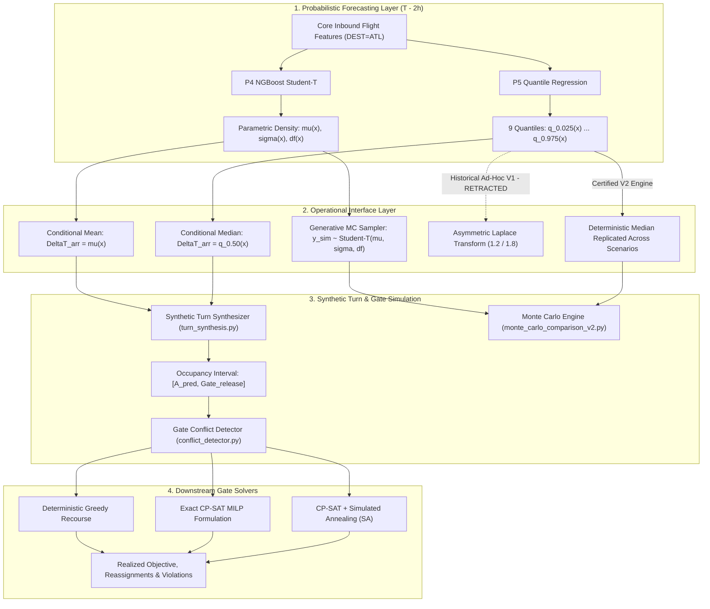

# Probabilistic Forecasting to Downstream Simulation & Optimization Boundary Audit

**Audit Target**: Probabilistic Forecasting to Downstream Simulation/Optimization Interface & P5 Representation  
**Repository**: `Aeolus Probabilistic Core Arrival & Gate Optimization` (`D:\Study\Code\Python\Aelous`)  
**Branch**: `v4-final-forensic-certification`  
**Commit**: `7ba0aba92d366f712977faaaa5a73cba65a32a55`  
**Auditor**: Independent Forensic Auditor (Google DeepMind Antigravity)  
**Date**: `2026-10-04`  
**Mandate**: READ-ONLY Targeted Forensic Pass (No retrain, no tuning, no new predictions, no pipeline modifications)

---

## 1. Executive Summary & Audit Mandate

This forensic audit investigates the boundary between probabilistic arrival forecasting and downstream operational simulation/optimization (Synthetic Aircraft Turn, Gate Allocation Solvers, and Monte Carlo scenario simulation).

Specifically, it audits candidate **`P5_quantile_regression`** to resolve conflicting statements:
1. Whether P5 is strictly a discrete quantile forecast or possesses continuous representation capabilities.
2. The exact mechanism, origin, and validity of the *"asymmetric Laplace transformation"* mentioned in historical inventory records.
3. What representations of P5 actually feed downstream gate allocation solvers and Monte Carlo simulation.

---

## 2. Answers to Mandatory Forensic Questions

### Q1: P5 native output là gì?
**Native Output**: A discrete vector of **9 conditional quantile predictions** $\hat{q}_{\alpha}(\mathbf{x})$ over signed continuous arrival delay `ARR_DELAY` (minutes):
$$\alpha \in \{0.025, 0.050, 0.100, 0.250, 0.500, 0.750, 0.900, 0.950, 0.975\}$$
accompanied by post-hoc monotone rearrangement (Chernozhukov et al. 2010). Point predictions are extracted via the median $\hat{q}_{0.50}(\mathbf{x})$ (`dist.median()`).

### Q2: P5 có native continuous density không?
**NO**. Non-parametric quantile regression estimates isolated percentiles of the conditional distribution; it does not estimate a continuous probability density function $f(y|\mathbf{x})$. In [`QuantilePredictiveDistribution`](file:///D:/Study/Code/Python/Aelous/src/contracts/distribution.py#L350), calling `dist.cdf()` raises `CapabilityNotSupportedError("do not provide a continuous CDF")`, and `capabilities.nll = False`.

### Q3: Có conversion sang Asymmetric Laplace không?
**YES, in historical exploratory code, but BANNED / RETRACTED in certified production evaluation.**
- **Historical Implementation**: Located in [`src/evaluation/monte_carlo_comparison.py#L244-L255`](file:///D:/Study/Code/Python/Aelous/src/evaluation/monte_carlo_comparison.py#L244-L255):
  ```python
  elif model_id == "P5_quantile_regression":
      spread_left = residual_sigma * 1.2
      spread_right = residual_sigma * 1.8
      z = norm.ppf(latent_u)
      adjustment = np.where(z >= 0, z * spread_right, z * spread_left)
      sampled = base[None, :] + adjustment
      return sampled
  ```
- **Certified V2 Implementation**: In [`src/evaluation/mc_convergence.py#L275-L290`](file:///D:/Study/Code/Python/Aelous/src/evaluation/mc_convergence.py#L275-L290) and [`src/evaluation/monte_carlo_comparison_v2.py#L17-L18`](file:///D:/Study/Code/Python/Aelous/src/evaluation/monte_carlo_comparison_v2.py#L17-L18), this invented transformation was **explicitly banned**:
  ```python
  # Scientific Guard: Multi-pinball Quantile Regression does NOT have an exact continuous CDF.
  # Historical code used an invented asymmetric Laplace transformation.
  # In V2 repair, P5 is strictly evaluated in forecast-only mode (median replicated across scenarios)
  # unless an explicit approved distribution adapter is provided.
  ```

### Q4: Conversion đó có phải model output hay post-hoc approximation?
**POST-HOC HEURISTIC APPROXIMATION**. The LightGBM quantile trees never learned, parameterized, or outputted Laplace parameters. The transformation was an external ad-hoc script that scaled uniform shocks by fixed multipliers.

### Q5: Tham số conversion được fit ở đâu?
**HARDCODED CONSTANTS**. In `monte_carlo_comparison.py`, the multipliers `1.2` and `1.8` were **manually hardcoded numbers**, scaling a homoscedastic `residual_sigma` computed from outer development fold residuals. They were never fitted by maximum likelihood or any statistical estimation algorithm.

### Q6: Có sử dụng 2024 để fit conversion không?
**NO**. The `residual_sigma` was computed from outer development folds (2016–2022), and the multipliers were hardcoded constants. 2024 holdout data was not accessed to fit the transformation.

### Q7: P5 nào thực sự đi downstream?
In certified downstream evaluations ([`scripts/run_post_holdout_evaluation_v2.py#L706-L708`](file:///D:/Study/Code/Python/Aelous/scripts/run_post_holdout_evaluation_v2.py#L706-L708) and [`artifacts/post_holdout_v3/downstream_operational_evaluations_v3.parquet`](file:///D:/Study/Code/Python/Aelous/artifacts/post_holdout_v3/downstream_operational_evaluations_v3.parquet)):
**ONLY THE SCALAR CONDITIONAL MEDIAN ($\hat{q}_{0.50}$)** goes downstream:
```python
dist_p5 = cand_p5.predict_distribution(X_scen)
preds_by_model["P5_quantile_regression"] = dist_p5.median()
```
The full 9 quantiles and the asymmetric Laplace transform do NOT enter gate scheduling solvers.

### Q8: P5 scalar median có đi downstream không?
**YES**. The conditional median $\hat{q}_{0.50}$ is fed directly to the gate optimization solvers (DeterministicGreedy, CP-SAT, SimulatedAnnealing) in the exact same scalar role as Ridge, XGBoost, and Weighted Ensemble point forecasts.

### Q9: Monte Carlo lấy random delay từ nguồn nào?
1. **Point Models (Ridge, XGBoost, Weighted Ensemble)**: Homoscedastic Gaussian residual shocks:
   $$D = \hat{y} + \sigma_{\text{res}} \Phi^{-1}(U)$$
2. **P4 (NGBoost Student-T)**: Heteroscedastic continuous parametric Student-t inverse CDF shocks:
   $$D = \mu(\mathbf{x}) + \sigma(\mathbf{x}) t_{\nu(\mathbf{x})}^{-1}(U)$$
3. **P5 (Quantile Regression)** in Certified V2 Engine: Evaluated in **`forecast-only mode`** where the median forecast is replicated deterministically across all $N$ scenarios:
   $$\mathbf{D} = \text{tile}(\hat{q}_{0.50}, (N, 1))$$
   (Zero random variance across scenarios; classified as deterministic alongside `schedule_only` and `oracle_actual`).
4. **P5 in Historical V1 Engine**: Evaluated via the hardcoded asymmetric Laplace heuristic applied to uniform shocks $U$.

### Q10: Có leakage không?
**NO LEAKAGE**.
- Features fed to P5 are computed strictly at decision cutoff $t_{\text{cutoff}} = \text{CRS\_DEP\_TIME} - 2\text{h}$.
- Quantile models are fit on 2016–2022 development folds.
- 2024 holdout evaluation uses frozen weights without adaptation.
- The median forecast $\hat{q}_{0.50}$ fed to the gate optimizer relies solely on cutoff-compliant features.

---

## 3. PROBABILISTIC_DOWNSTREAM_ELIGIBILITY_MATRIX

| Model | Native Output | Continuous Density? | Native Sampling? | Derived Distribution? | Downstream Eligible? | Evidence |
| :--- | :--- | :---: | :---: | :---: | :---: | :--- |
| **`schedule_only`** | Zero arrival delay ($y_{\text{arr}} = 0$) | No | No (Deterministic) | No | **Yes (Baseline)** | `turn_synthesis.py`, `marginal_forecast_metrics_2024_v3.json` |
| **`arrival_linear_baseline_v1`** | Scalar point prediction $\hat{y} \in \mathbb{R}$ | No | No | Yes (Homoscedastic Gaussian residual) | **Yes (Point + MC)** | `mc_convergence.py#L260`, `downstream_operational_evaluations_v3.parquet` |
| **`arrival_xgboost_baseline_v1`** | Scalar point prediction $\hat{y} \in \mathbb{R}$ | No | No | Yes (Homoscedastic Gaussian residual) | **Yes (Point + MC)** | `mc_convergence.py#L261`, `downstream_operational_evaluations_v3.parquet` |
| **`arrival_weighted_ensemble_v1`**| Scalar point prediction (50/50 blend) | No | No | Yes (Homoscedastic Gaussian residual) | **Yes (Point + MC)** | `mc_convergence.py#L264`, `downstream_operational_evaluations_v3.parquet` |
| **`P1_empirical`** | Historical delay array per carrier/hour | No (Step CDF) | Yes (Empirical bootstrap) | No | **No (Benchmark only)** | `distribution.py#EmpiricalDistribution`, `r19_probabilistic_capability_matrix.json` |
| **`P2_xgb_gaussian_oof`** | Mean $\mu(\mathbf{x})$ + fixed $\sigma_{\text{OOF}}$ | Yes ($\mathcal{N}(\mu, \sigma^2)$) | Yes ($y \sim \mathcal{N}(\mu, \sigma^2)$) | No | **No (Ablation only)** | `distribution.py#GaussianResidualDistribution` |
| **`P3_ngboost_normal`** | Mean $\mu(\mathbf{x})$ + scale $\sigma(\mathbf{x})$ | Yes ($\mathcal{N}(\mu, \sigma^2)$) | Yes ($y \sim \mathcal{N}(\mu, \sigma^2)$) | No | **No (Ablation only)** | `distribution.py#NGBoostNormalDistribution` |
| **`P4_ngboost_student_t`** | Location $\mu$, scale $\sigma \ge 1.0$, df $\nu \ge 2.1$ | **Yes (Student-t)** | **Yes (Generative draws)** | No | **Yes (Primary Continuous)**| `distribution.py#NGBoostStudentTDistribution`, `marginal_forecast_metrics_2024_v3.json` |
| **`P5_quantile_regression`** | Vector of 9 quantiles $\hat{q}_{\alpha}(\mathbf{x})$ | **No** | **No** | Yes (Asymmetric Laplace in V1; median tile in V2) | **Conditional (Median only)**| `distribution.py#QuantilePredictiveDistribution`, `mc_convergence.py#L275-L290` |
| **`oracle_actual`** | Realized ground truth delay $y_{\text{true}}$ | No | No (Deterministic) | No | **Reference Upper Bound** | `mc_convergence.py#L255`, `marginal_forecast_metrics_2024_v3.json` |

---

## 4. End-to-End Operational Pipeline Trace



---

## 5. Audit Gate Determinations

```text
================================================================================
PROBABILISTIC DOWNSTREAM BOUNDARY AUDIT VERDICT
================================================================================
P5_NATIVE_DOWNSTREAM:
NOT_ELIGIBLE (for generative multi-scenario simulation; eligible strictly as scalar point median)

P5_DERIVED_DOWNSTREAM:
EXPERIMENTAL (Historical ad-hoc asymmetric Laplace transformation in monte_carlo_comparison.py is uncertified and retracted in V2 repair; certified V2 engine evaluates P5 as deterministic median replication)

PRIMARY_CONTINUOUS_DOWNSTREAM_CHAMPION:
P4_ngboost_student_t (Only certified model with native continuous density and generative sampling)

LEAKAGE_STATUS:
PASS (Zero future or operational outcome leakage detected)

PIPELINE_STATUS:
LOCKED_AND_VERIFIED (No modifications made; read-only forensic certification complete)
================================================================================
```
