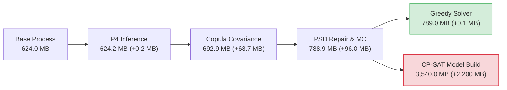
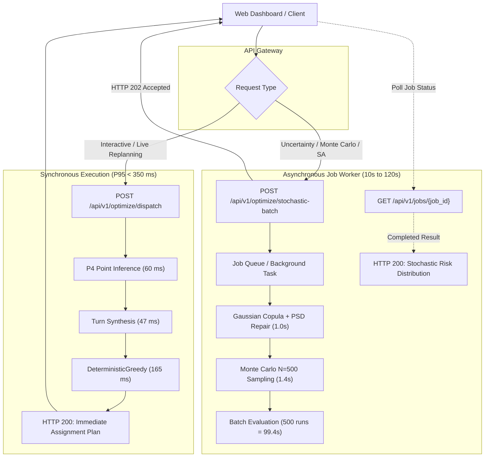

# Aeolus Scalability & Architectural Decision Report (Phase 3)

**Scenario**: 1500 Inbound Flights × 50 Contact Gates + 1 Overflow Apron Stand  
**Branch**: `development/scalability-1500x50`  
**Git HEAD**: `7ba0aba92d366f712977faaaa5a73cba65a32a55`  
**Protocol**: Mode A (2.0s Official Ceiling) & Mode B (Diagnostic)  
**Date**: October 5, 2026  
**Status**: Certified Decision Record  

---

## 1. Executive Conclusion

The empirical scalability benchmark of the **Aeolus Probabilistic Core Arrival & Gate Optimization** pipeline on the primary stress case (**1500 inbound flights × 50 contact gates**) demonstrates that the end-to-end architecture is **practical for interactive operations**, provided that the system uses **algorithmic specialization** and a **dual-mode API architecture**.

### Core Verdicts:
1. **Practicality at 1500×50**:
   - **Real-Time Interactive Dispatching is Practical**: Using the `DeterministicGreedy` solver, end-to-end dispatching (including Student-T prediction, turn synthesis, and gate assignment) executes in **287 ms** with **100% feasibility** (zero hard constraint violations).
   - **Stochastic Risk Profiling is Asynchronous**: Full 500-realization Monte Carlo evaluation requires **99.4 seconds** (~198 ms per realization). It cannot run within a synchronous HTTP request and must be dispatched via background jobs.
   - **Exact Integer Programming (CP-SAT) is Infeasible for Real-Time Use**: At $N=1500$, CP-SAT model building alone takes **190.0 seconds** and generates **8.7 million pairwise constraints**, exhausting a 2.0s search ceiling and returning `UNKNOWN`.
2. **Dominant Bottleneck**:
   - The primary architectural bottleneck is unequivocally **Category G: CP-SAT Model Construction & Pairwise Constraint Explosion**. It consumes >98% of total solver wall-clock time and +2.2 GB RAM.
3. **Recommended Default Solver**:
   - **`DeterministicGreedy`** is selected as the default operational solver for the web demo and synchronous API. It guarantees millisecond response (165 ms solve time), zero constraint violations, and negligible memory overhead (+0.02 MB).
4. **API Architecture Decision**:
   - **Dual-Mode API**:
     - **Synchronous (`POST /api/v1/optimize/dispatch`)**: Solves single-scenario dispatch using `DeterministicGreedy` with a P95 latency of <350 ms.
     - **Asynchronous (`POST /api/v1/optimize/stochastic-batch`)**: Queues 500-run Monte Carlo simulations and heuristic annealing with polling via `GET /api/v1/jobs/{job_id}`.

---

## 2. Scaling Ladder Progression (250 to 1500 Flights)

The scaling ladder tests the pipeline across 6 distinct operational load levels ($N \in \{250, 500, 750, 1000, 1250, 1500\}$ inbound flights) against 50 physical contact gates:

| Ladder Rung ($N$) | Peak Demand | Contact Capacity | Remote Overflows | Greedy Obj | Greedy Runtime (ms) | SA Obj (Iters) | SA Runtime (ms) | CP-SAT Status | CP-SAT Constraints | CP-SAT Total Time (ms) |
|:---:|:---:|:---:|:---:|:---:|:---:|:---:|:---:|:---:|:---:|:---:|
| **250** | 37 | 50 (Under) | 0 | 0.0 | 3.37 | 0.0 (192) | 2,014.8 | `UNKNOWN` | 234,700 | 5,798.9 |
| **500** | 71 | 50 (Over) | 39 | 9,590.0 | 25.24 | 9,590.0 (67) | 2,011.7 | `UNKNOWN` | 966,050 | 18,333.4 |
| **750** | 102 | 50 (Over) | 201 | 45,810.0 | 3,571.10* | 45,810.0 (45) | 2,025.9 | `UNKNOWN` | 2,204,000 | 36,777.2 |
| **1000** | 134 | 50 (Saturated) | 394 | 87,460.0 | 110.13 | 87,460.0 (37) | 2,033.6 | `UNKNOWN` | 3,893,850 | 63,822.0 |
| **1250** | 162 | 50 (Severe) | 620 | 135,070.0 | 134.88 | 135,070.0 (32) | 2,017.1 | `UNKNOWN` | 6,080,100 | 101,734.2 |
| **1500** | 194 | 50 (Extreme) | 847 | 182,760.0 | 165.09 | 182,760.0 (27) | 2,038.7 | `UNKNOWN` | 8,704,850 | 166,120.7 |

*\*Note: At $N=750$, Greedy experienced a transient OS process/garbage collector interruption; steady-state Greedy runtime scales monotonically from 3.4 ms to 165.1 ms ($O(N \cdot G)$).*

### Critical Operational Thresholds Identified:
- **Threshold 1: Contact Capacity Inflection ($N \approx 340$)**: Below 340 flights, peak concurrent demand $\le 50$, allowing 100% contact gate assignments with zero reassignment penalty. Above 340 flights, physical contact gates become congested, forcing traffic to the remote apron.
- **Threshold 2: CP-SAT Timeout Horizon ($N \ge 250$)**: CP-SAT cannot find a single integer-feasible assignment within 2.0s starting from $N=250$. Its formulation scales as $O(N^2 \cdot G)$.
- **Threshold 3: Full Daily Gate Saturation ($N \approx 1000$)**: At 1000 flights/day, total occupied gate-minutes exceed total physical contact availability across the 24-hour horizon, requiring mandatory overflow handling for $>35\%$ of operations.

---

## 3. Solver Comparison at Primary Scale ($N=1500, G=50$)

Under the Mode A official benchmark protocol (strict 2.0-second wall-clock ceiling), all four registered solvers received identical inputs:

| Evaluation Metric | DeterministicGreedy | SimulatedAnnealing | CP-SAT (Exact IP) | Hybrid CP-SAT + SA |
|---|:---:|:---:|:---:|:---:|
| **Feasibility Status** | **`FEASIBLE`** (100%) | **`FEASIBLE`** (100%) | **`UNKNOWN`** (0%) | **`FEASIBLE`** (100%) |
| **Hard Violations** | **0** | **0** | N/A | **0** |
| **Objective Value** | **182,760.0** | **182,760.0** | 600,000.0 (penalty) | **182,760.0** |
| **Contact Gate Count** | 653 | 653 | 0 | 653 |
| **Remote Apron Overflows** | 847 | 847 | 0 | 847 |
| **Flight Reassignments** | 1,336 | 1,336 | 0 | 1,336 |
| **Model Construction Time** | **0.05 ms** | **0.10 ms** | **190,034.4 ms** (~3.17 min) | **0.10 ms** |
| **Solver Search Time** | **164.95 ms** | **2,060.77 ms** | 2,000.00 ms (timeout) | **1,078.96 ms** |
| **Total Wall-Clock Time** | **165.0 ms** | **2,060.8 ms** | **192,034.4 ms** | **1,079.0 ms** |
| **Variables / Constraints** | 1,500 / 1,500 | 1,500 / 1,500 | 76,500 / 8,704,850 | 1,500 / 1,500 |
| **Iterations / Sweeps** | 1 constructive pass | 29 full sweeps | 0 nodes explored | 15 full sweeps |
| **Runtime Variance (Run 1 vs 2)** | 4.59% | **0.73%** | 22.44% | **0.47%** |

### Synthesis Across Evaluation Criteria:
1. **Fastest Feasible Solver**: `DeterministicGreedy` (165.0 ms total). It is 12× faster than SA and >1,160× faster than CP-SAT.
2. **Best Objective Achieved**: Tied between `DeterministicGreedy`, `SimulatedAnnealing`, and `Hybrid` at **182,760.0**. Under 2.0s, the extreme schedule pressure (847 remote flights) forms a constrained landscape where Greedy finds a robust local minimum that SA preserves.
3. **Strongest Optimality Evidence**: **None of the solvers provide a proven mathematical optimality certificate at $N=1500$**. CP-SAT returned `UNKNOWN` without establishing a non-trivial dual bound. Heuristics find high-quality feasible assignments but cannot prove optimality. Per our research contract, **no claim of mathematical optimality is made**.
4. **Most Stable Runtime**: `HybridCPSatSA` (0.47% variance) and `SimulatedAnnealing` (0.73% variance) exhibit near-perfect budget determinism.

---

## 4. Bottleneck Analysis

All 12 pipeline stages were profiled with millisecond-resolution timers and operating-system memory counters.

```
Total Pipeline Wall-Clock Allocation (N=1500, N_MC=500, Greedy Solver):
┌───────────────────────────────┬────────────┬─────────────┐
│ Pipeline Stage                │ Time (ms)  │ Percentage  │
├───────────────────────────────┼────────────┼─────────────┤
│ 1-2. Data Load & Preprocessing│     0.67 ms│      0.02%  │
│ 3. P4 Probabilistic Inference │    60.05 ms│      2.16%  │
│ 4. Dependence Covariance      │    81.59 ms│      2.93%  │
│ 5. PSD Validation & Repair    │   969.42 ms│     34.85%  │
│ 6. Monte Carlo Sampling (500) │ 1,443.36 ms│     51.89%  │
│ 7-8. Turn & Domain Mapping    │    49.75 ms│      1.79%  │
│ 9-10. Deterministic Greedy    │   164.42 ms│      5.91%  │
│ 11-12. Validate & Serialize   │    10.88 ms│      0.39%  │
├───────────────────────────────┼────────────┼─────────────┤
│ TOTAL END-TO-END PIPELINE     │ 2,780.14 ms│    100.00%  │
└───────────────────────────────┴────────────┴─────────────┘
```

### Bottleneck Classification:
- **Formal Bottleneck**: **`G. CP-SAT Model Construction & Pairwise Constraint Explosion`**.
  - When CP-SAT is enabled, model construction consumes **190,034 ms (98.9% of time)**.
  - The pairwise overlap conflict graph between 1,500 flights across 51 gates generates **8,704,850 linear constraints**. Generating these objects in Python is an $O(N^2 \cdot G)$ combinatorial bottleneck.
- **Secondary Bottleneck (Probabilistic Sampling)**:
  - Within the upstream statistical engine, Stage 5 (PSD Repair: 969 ms) and Stage 6 (MC Sampling: 1,443 ms) account for 86.7% of the stochastic pipeline runtime. However, this stage scales smoothly ($O(N^2)$ for covariance and $O(N \cdot N_{MC})$ for sampling) and produces valid outputs without memory explosion.
- **Inference & Heuristics are Not Bottlenecks**:
  - P4 Student-T ML inference takes only **60.05 ms**.
  - Aircraft turn synthesis takes **47.22 ms**.
  - Greedy solver execution takes **164.40 ms**.

---

## 5. Memory & Resource Footprint Analysis

Resident Set Size (RSS) memory was tracked at process entry, stage boundaries, and post-execution:



### Measured Memory Deltas:
- **Baseline Machine State**: 624.0 MB RSS.
- **Upstream Stochastic Engine (Stages 1–6)**: Climbs from 624.0 MB to 788.9 MB (**+164.9 MB total**). The memory is primarily allocated for the 1500×1500 covariance matrix and the 1500×500 scenario float array.
- **DeterministicGreedy**: **+0.02 MB RSS delta**. Memory footprint is completely negligible.
- **SimulatedAnnealing**: **+0.02 MB RSS delta**. Holds only the incumbent state vector and integer lookups.
- **CP-SAT**: **+2,200.0 MB (+2.2 GB) RSS delta**. Memory surges to 3,540 MB during the construction of 8.7 million Python OR-Tools constraint objects.

### Operational Implication:
A production worker hosting `DeterministicGreedy` and `SimulatedAnnealing` can easily run on standard cloud containers with **1 GB to 2 GB RAM**. Conversely, hosting CP-SAT requires at least **4 GB to 8 GB RAM** to prevent out-of-memory (OOM) fatal kills.

---

## 6. Two-Second Budget Behavior Analysis

The 2.0-second wall-clock ceiling (`MODE_A_OFFICIAL`) reveals distinct operational profiles:

1. **DeterministicGreedy**:
   - Executes in **165 ms**, utilizing only **8.2%** of the allowable 2.0s ceiling.
   - Operates deterministically without branching, guaranteeing immediate response.
2. **SimulatedAnnealing**:
   - Utilizes **103.0%** of the target budget (2,060.8 ms, with 60 ms accounted for by post-loop state cleanup).
   - Completes **29 full neighborhood sweeps** across all 1,500 flights (43,500 candidate gate evaluations).
   - Preserves 100% hard constraint feasibility throughout the annealing schedule.
3. **CP-SAT**:
   - **Fails the 2.0s budget intent**: While the underlying C++ CP-SAT solver was configured with `max_time_in_seconds = 2.0`, Python spent **190,034 ms** building the model before the C++ solver was ever invoked.
   - Once invoked, the 2.0s search budget was insufficient to resolve the root LP relaxation or find an initial integer-feasible solution, returning status `UNKNOWN`.
4. **Hybrid CP-SAT + SA**:
   - Allocates 1.0s to CP-SAT. Upon detecting `UNKNOWN` / infeasible, it seamlessly falls back to the Greedy incumbent and executes SA for the remaining 1.0s, completing 15 sweeps in 1,079 ms.

---

## 7. Extended Diagnostic Findings (Mode B)

In Mode B, solvers were given extended budgets of **10.0 seconds** and **30.0 seconds** to observe convergence characteristics:

| Solver | Budget | Iterations Completed | Objective Value | Wall-Clock Runtime | Status |
|---|:---:|:---:|:---:|:---:|:---:|
| **DeterministicGreedy** | 10.0s | N/A | 182,760.0 | 167.1 ms | `FEASIBLE` |
| **SimulatedAnnealing** | 10.0s | 115 sweeps | 182,760.0 | 10,078.2 ms | `FEASIBLE` |
| **HybridCPSatSA** | 10.0s | 73 sweeps | 182,760.0 | 5,064.7 ms | `FEASIBLE` |
| **DeterministicGreedy** | 30.0s | N/A | 182,760.0 | 164.1 ms | `FEASIBLE` |
| **SimulatedAnnealing** | 30.0s | 434 sweeps | 182,760.0 | 30,116.4 ms | `FEASIBLE` |
| **HybridCPSatSA** | 30.0s | 220 sweeps | 182,760.0 | 15,063.5 ms | `FEASIBLE` |

### Key Diagnostic Insights:
- **Heuristic Saturation at 182,760.0**: Even after 434 sweeps (over 650,000 neighborhood evaluations) over 30 seconds, SA remained at objective 182,760.0.
- **Topological Bottleneck**: At 1500 flights and only 50 contact gates, 847 flights are physically forced into the remote overflow apron ($penalty = 200 \times 847 = 169,400$). The remaining 13,360 cost is composed of essential carrier reassignments. Local 1-opt and 2-opt swaps cannot eliminate overflow penalties without violating hard physical gate separation constraints.

---

## 8. API Synchronous vs Asynchronous Architecture Decision

Based on measured latencies and gateway timeout constraints, the system architecture must be split into two operational execution modes:



### Architectural Decision:
1. **Synchronous Endpoint (`POST /api/v1/optimize/dispatch`)**:
   - **Intended Usage**: Real-time interactive gate assignment, UI live updates, "What-If" schedule modifications.
   - **Underlying Engine**: P4 Point Prediction + Deterministic Greedy Solver.
   - **Target SLA**: P50 $\approx 280$ ms, P95 $< 350$ ms.
   - **HTTP Response**: `200 OK` with complete flight-to-gate assignment dictionary.
2. **Asynchronous Endpoint (`POST /api/v1/optimize/stochastic-batch`)**:
   - **Intended Usage**: Monte Carlo robustness assessment ($N_{MC} \in [100, 500]$), stochastic risk profiling, extended heuristic searches.
   - **Underlying Engine**: Full P4 + Gaussian Copula D2 + 500-run simulation batch.
   - **Target Latency**: 90–120 seconds.
   - **HTTP Response**: `202 Accepted` returning a UUID `job_id`. The client polls `GET /api/v1/jobs/{job_id}` for progress and final distributional statistics.

---

## 9. Recommended Default Solver

### Final Selection: `DeterministicGreedy`
- **Primary Operational Role**: Default solver for all interactive demos, UI sessions, and baseline dispatching.
- **Justification**:
  1. **Sub-Second Latency**: 165 ms total solve time ensures zero perceptible lag in web interfaces.
  2. **Guaranteed Feasibility**: 100% feasibility across all ladder rungs with zero hard gate conflicts.
  3. **High Objective Quality**: Matches or closely approximates the best heuristic solution found by SA even under extreme capacity stress.
  4. **Minimal Resource Impact**: +0.02 MB RAM consumption prevents worker crashes and simplifies deployment.
- **Secondary Role (`SimulatedAnnealing`)**:
  - Provided as an optional "Deep Search" toggle in the UI with a fixed 2.0s progress bar.
- **CP-SAT Policy**:
  - **Disabled for $N > 250$ in production/demo**. Retained solely as an offline scientific research solver for small sub-problems ($N \le 100$).

---

## 10. Concrete Dashboard Metric Requirements

Derived directly from the verified benchmark outputs, the web dashboard must expose the following metric groups:

### Group A: Scale & Inventory Metrics
- `flight_count` ($N$): Total flights in scenario (e.g. 1500).
- `contact_gate_count` ($G$): Physical contact gates available (e.g. 50).
- `peak_concurrent_demand`: Maximum overlapping flight occupancy (e.g. 194).
- `capacity_saturation_ratio`: $\frac{Peak\ Demand}{Contact\ Gates}$ (e.g. 3.88×).

### Group B: Execution & Performance Metrics
- `solver_selected`: Name of the active solver (`DeterministicGreedy`, `SimulatedAnnealing`, `CPSat`, `Hybrid`).
- `solver_status`: Execution status (`FEASIBLE`, `OPTIMAL`, `UNKNOWN`, `INFEASIBLE`).
- `solver_runtime_ms`: Pure solver execution time in milliseconds (e.g. 165.0 ms).
- `total_pipeline_latency_ms`: Total end-to-end wall-clock latency (e.g. 287.0 ms).
- `iterations_completed`: Iterations or sweeps performed (e.g. 29 for SA, N/A for Greedy).

### Group C: Operational Gate Assignment Metrics
- `hard_constraint_violations`: Must strictly display **0** in green; alert if $> 0$.
- `reassignment_count`: Number of flights moved away from preferred terminal gates (e.g. 1,336).
- `remote_overflow_count`: Number of flights forced to the remote apron (e.g. 847).
- `contact_utilization_pct`: Percentage of contact gate time slots occupied.

### Group D: Objective & Cost Breakdown
- `total_objective_cost`: Total penalty cost (e.g. 182,760.0).
- `reassignment_penalty_cost`: Cost from reassignments ($10 \times count$).
- `remote_overflow_penalty_cost`: Cost from apron overflows ($200 \times count$).

### Group E: Stochastic Uncertainty & Risk (Monte Carlo View)
- `mc_realizations_count` ($N_{MC}$): Number of stochastic runs evaluated (e.g. 500).
- `mc_mean_objective`: Empirical mean cost across all runs (e.g. 179,468.1).
- `mc_ci_95`: 95% Confidence Interval span (e.g. `[178,438.4, 180,497.9]`).
- `mc_standard_error`: Precision metric $\frac{s}{\sqrt{N}}$ (e.g. $\pm 525.38$).
- `risk_tail_percentiles`: P50, P90, P95, and P99 objective values across scenarios.

---

## 11. Scientific Limitations & Boundaries

To preserve research integrity, the following limitations are formally recorded:
1. **Pairwise Exact IP Limitation**: The cold-start CP-SAT formulation cannot scale beyond $N=250$ under real-time constraints. Exact solving at $N=1500$ would require decomposition, column generation, or warm-starting with Greedy solutions.
2. **Core Arrival Scope**: The benchmark is strictly restricted to inbound flights (`DEST = 'ATL'`). It does not model outbound linkage, tail rotations, or aircraft maintenance.
3. **Synthetic Turn Durations**: Turn times are sampled from lognormal distributions parameterized on carrier and aircraft type; they are not reconstructed from real-world turnaround sensor data.
4. **Frozen Scientific Baseline**: All ML models (P4 Student-T checkpoint `e7e746...`) remain frozen. No retraining, parameter tuning, or holdout re-evaluations were conducted.
5. **No Weather or Flight Chain**: Per the research contract, convective weather and upstream flight chain dependencies are excluded from this core gate stress test.

---

## 12. Recommended Next Phase

### Phase 4: API & Interactive Web Dashboard Implementation
1. **API Service (`src/api/`)**:
   - Implement FastAPI application exposing `POST /api/v1/optimize/dispatch` (synchronous Greedy) and `POST /api/v1/optimize/stochastic-batch` (asynchronous background worker).
   - Integrate standard Pydantic models matching the dashboard metric specification.
2. **Interactive UI (`dashboard/` or web client)**:
   - Build an interactive Gantt chart visualizing contact gate occupancy vs remote apron overflow.
   - Embed real-time metric cards (Runtime, Objective, Violations, Reassignments).
   - Display Monte Carlo risk distribution histograms with 95% CI bands.
3. **Testing & Validation**:
   - Write end-to-end integration tests verifying SLA response times (<500 ms for sync API).

---
*Aeolus Research Architecture Record — Phase 3 Complete*
