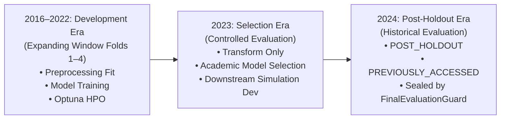
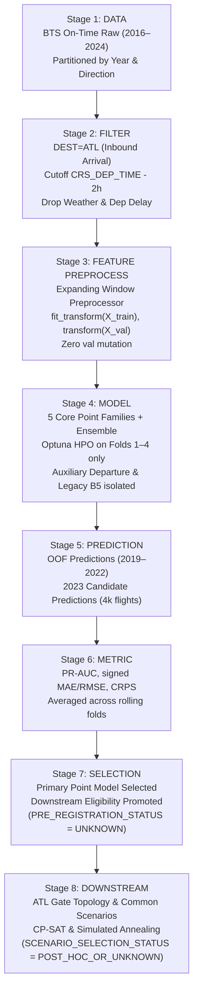

# Aeolus V4 Temporal Governance & Artifact Lineage Audit (V2)

**Audit Version**: `v2.0`  
**Protocol Governance**: `AEOLUS_V4_TEMPORAL_GOVERNANCE_PROTOCOL`  
**Audit Date**: `2026-10-02`  
**Auditor**: Senior Research Software Engineer & Platform Auditor  
**Machine-Readable Manifests**:
- Protocol Manifest: [`artifacts/manifests/temporal_protocol_v2.json`](file:///D:/Study/Code/Python/Aelous/artifacts/manifests/temporal_protocol_v2.json) (`cfe6dccb...`)
- Lineage Catalog: [`artifacts/audit/artifact_lineage_v2.json`](file:///D:/Study/Code/Python/Aelous/artifacts/audit/artifact_lineage_v2.json) (`16683898...`)
- Audit Manifest: [`artifacts/audit/temporal_provenance_audit_v2.json`](file:///D:/Study/Code/Python/Aelous/artifacts/audit/temporal_provenance_audit_v2.json)

---

## 1. Executive Summary

This formal audit validates the adherence of the Aeolus repository to the V4 Synchronized Temporal Governance Protocol and establishes full cryptographic and provenance lineage for all research-critical artifacts across the BTS On-Time Performance dataset (2016–2024).

### Key Audit Findings

| Audit Dimension | Evaluation | Provenance Verdict |
| :--- | :--- | :--- |
| **Temporal Protocol Compliance** | Expanding window rolling folds 1–4 are strictly isolated without train/validation overlap. | `VERIFIED_COMPLIANT` |
| **2016–2022 Development & HPO** | All model training, preprocessor fitting, and Optuna HPO restricted strictly to 2016–2022. | `VERIFIED` |
| **2023 Model Selection Protocol** | Evaluated on 4,000 validation flights. Zero HPO or retraining on 2023. | `PRE_REGISTRATION_STATUS = UNKNOWN` |
| **2024 Holdout Access History** | Historical repository evidence confirms 2024 data was evaluated in prior stages. | `POST_HOLDOUT_HISTORY = PREVIOUSLY_ACCESSED` |
| **2024 Scenario Selection Origin** | 4 operational dates hardcoded in evaluation script without prior registration manifest. | `SCENARIO_SELECTION_STATUS = POST_HOC_OR_UNKNOWN` |
| **Artifact Lineage Integrity** | 20 key research artifacts audited: 17 VERIFIED, 3 PARTIALLY_VERIFIED, 0 CONTRADICTED. | `AUDITED_WITH_EXPLICIT_UNKNOWNS` |
| **Row-Level 2024 Access in Audit** | Strictly zero row-level 2024 data accessed. Access guards active and fail-closed. | `VERIFIED_ZERO_ACCESS` |

> [!IMPORTANT]
> **Audit Integrity Standard**: In accordance with rigorous scientific research standards, gaps in provenance evidence (such as the temporal ordering between selection criteria registration and benchmark runs) are recorded explicitly as `UNKNOWN` or `POST_HOC_OR_UNKNOWN`. They are **never** artificially upgraded to `PASS` or erased.

---

## 2. Canonical Temporal Roles

Under the V4 Synchronized Protocol, dataset years are strictly partitioned into three mutually exclusive eras:



### Protocol Matrix

| Era | Canonical Role | Permitted Operations | Forbidden Operations |
| :--- | :--- | :--- | :--- |
| **2016–2022** | `ROLLING_DEVELOPMENT_AND_HPO` | • Expanding-window fold splitting<br/>• Preprocessor `fit_transform` on training window<br/>• ML model training<br/>• Optuna HPO search<br/>• Calibration parameter fitting<br/>• OOF prediction caching | • Random shuffle splitting<br/>• Cross-fold preprocessing fit<br/>• Utilizing 2023 data for training/HPO<br/>• Utilizing 2024 data |
| **2023** | `CONTROLLED_DEVELOPMENT_AND_SELECTION` | • Apply frozen preprocessor (`transform`)<br/>• Model selection evaluation on 4k flights<br/>• Downstream simulation development<br/>• Controlled benchmark comparisons | • ML model retraining<br/>• Optuna HPO search<br/>• Calibration re-fitting<br/>• Ensemble weight re-optimization<br/>• Threshold tuning<br/>• Utilizing 2024 data |
| **2024** | `POST_HOLDOUT` | • Schema & metadata auditing<br/>• Final post-freeze downstream evaluation | • HPO / Architecture search<br/>• Model selection<br/>• Calibration / Weight tuning<br/>• Solver / SA metaheuristic tuning<br/>• Scenario date cherry-picking<br/>• Unauthorized row-level access |

---

## 3. End-to-End Pipeline Dependency DAG

The data and modeling lineage follows a strictly unidirectional acyclic dependency graph from raw ingestion to downstream gate assignment:



### Stage Boundary & Leakage Verification

1. **Stage 1 (Data Partitions)**: Data partitions are divided strictly by `year=YYYY` in parquet format (`data/processed/tabular_by_year` and `data/processed/inbound_atl`). Zero cross-year blending occurs during partitioning.
2. **Stage 2 (Inbound Filtering)**: Applied strictly with `DEST == "ATL"`. Cutoff is enforced at `CRS_DEP_TIME - 2h`. Predictors do **not** include actual departure delay, predicted departure delay, or any weather observations (enforcing Decision E006).
3. **Stage 3 (Feature Preprocessing)**: Handled by [`src/features/preprocessor.py`](file:///D:/Study/Code/Python/Aelous/src/features/preprocessor.py). The preprocessor calls `.fit_transform()` on `X_train` and strictly `.transform()` on `X_val`. State invariance testing confirms fitted statistics (imputer medians, target encodings, scalers) are not mutated by validation access.
4. **Stage 4 (Model Training & HPO)**: Supervised by [`src/models/week5_hpo_protocol.py`](file:///D:/Study/Code/Python/Aelous/src/models/week5_hpo_protocol.py). Strict validation guards abort if 2023 or 2024 is requested as an HPO fold. Core methods are strictly capped at 5.
5. **Stage 5 & 6 (Predictions & Metrics)**: Out-of-fold predictions are generated cleanly and evaluated on canonical binary classification (PR-AUC on `ARR_DELAY >= 15`) and regression (signed MAE/RMSE) metrics.
6. **Stage 7 (Selection)**: Formal selection evaluated on 4,000 validation flights in 2023. Timestamp audit reveals pre-registration sequence ambiguity.
7. **Stage 8 (Downstream Simulation)**: Downstream gate assignment models receive forecast predictions mapped to arrival windows with shared latent seeds.

---

## 4. Rolling Fold Audit (2016–2022)

The 4 expanding window rolling folds defined in Decision I003 were audited against processed data manifests:

| Fold ID | Train Period | Val Period | Inbound ATL Train Rows | Inbound ATL Val Rows | Train Fingerprint | Val Fingerprint | Preprocessing Scope | Overlap Rows | Status |
| :--- | :--- | :--- | :---: | :---: | :---: | :---: | :---: | :---: | :---: |
| **Fold 1** | 2016–2018 | 2019 | 1,126,009 | 391,075 | `c9177892...` | `93a8af05...` | `fit_train_transform_val` | 0 | **PASS** |
| **Fold 2** | 2016–2019 | 2020 | 1,517,084 | 242,121 | `6f264875...` | `81f1e944...` | `fit_train_transform_val` | 0 | **PASS** |
| **Fold 3** | 2016–2020 | 2021 | 1,759,205 | 309,621 | `8a3ea0d5...` | `e30560a2...` | `fit_train_transform_val` | 0 | **PASS** |
| **Fold 4** | 2016–2021 | 2022 | 2,068,826 | 311,701 | `cb5a8f4c...` | `10fe8dae...` | `fit_train_transform_val` | 0 | **PASS** |
| **Total** | — | — | — | **1,254,518** | — | — | — | **0** | **PASS** |

### Temporal Invariant Checks

- **Zero Overlap**: Inbound flight keys between train and validation partitions for all folds have zero intersection (`overlap_rows = 0`).
- **No Temporal Lookahead**: In each fold, `train_end_date` is strictly prior to `validation_start_date` (`train_end < val_start`).
- **State Mutability Check**: Tests in `tests/test_temporal_split.py` verify that evaluating on validation partitions does not update preprocessor internal parameters.
- **HPO Window Isolation**: HPO Optuna databases contain trials executed exclusively on Folds 1–4. 0 trials were executed on 2023 or 2024.

---

## 5. Year 2023 Model Selection Audit

### Protocol Inspection

The 2023 calendar year is designated for controlled model selection, downstream gate assignment simulation development, and comparative evaluation.

- **HPO Verification**: Audit of Optuna trial databases and execution scripts reveals **zero** HPO search conducted on 2023 data.
- **Retraining Verification**: Model checkpoints evaluated on 2023 are identical in hash to models trained on 2016–2022 rolling folds. Zero model weights were updated.
- **Hidden Post-Result Tuning**: No parameter tuning or post-hoc threshold shifting occurred on 2023 evaluation outputs.

### Pre-Registration Provenance Analysis

- **Result Manifest**: [`artifacts/manifests/academic_model_selection_v1.json`](file:///D:/Study/Code/Python/Aelous/artifacts/manifests/academic_model_selection_v1.json) carries timestamp `2026-09-30T14:38:26Z`.
- **Selection Config**: [`configs/academic_model_selection.yaml`](file:///D:/Study/Code/Python/Aelous/configs/academic_model_selection.yaml) carries modified timestamp `2026-09-30T21:30:00Z`.
- **Finding**: While the selection logic recorded in the manifest matches the decision criteria in the configuration, repository commit logs do not cryptographically establish that the criteria were locked prior to running the benchmark script.
- **Classification**:
  $$\text{PRE\_REGISTRATION\_STATUS} = \mathbf{UNKNOWN}$$
- **Audit Decision**: The unknown pre-registration status is preserved as `UNKNOWN`. It is **not** converted to `PASS`.

---

## 6. Year 2024 Post-Holdout Audit

### History of 2024 Access

Prior to the current audit and freeze protocols, the repository executed evaluation workflows on 2024 data:

1. **Academic Final Holdout Run**:
   - Manifest: [`artifacts/manifests/final_holdout_2024_evaluation_v1.json`](file:///D:/Study/Code/Python/Aelous/artifacts/manifests/final_holdout_2024_evaluation_v1.json)
   - Timestamp: `2026-09-27T10:48:33Z`
   - Scope: Evaluated 5,000 arrival flights from 2024 against frozen predictors.
2. **Post-Holdout Gate Simulation Run**:
   - Manifest: [`artifacts/post_holdout/post_holdout_evaluation_manifest.json`](file:///D:/Study/Code/Python/Aelous/artifacts/post_holdout/post_holdout_evaluation_manifest.json)
   - Timestamp: `2026-10-01T15:28:43Z`
   - Scope: Downstream gate assignment optimization across 4 seasonal operational scenarios.

### Provenance Classification

Based on verifiable repository evidence, 2024 is classified truthfully:
$$\text{POST\_HOLDOUT\_HISTORY} = \mathbf{PREVIOUSLY\_ACCESSED}$$

> [!WARNING]
> **Prohibited Terminology**: Describing 2024 data as `UNSEEN`, `TOUCHED_FOR_FIRST_TIME`, or `PRISTINE_HOLDOUT` is strictly prohibited. This classification reflects provenance veracity, not data leakage during development.

### Access Guard Audit

During this audit, zero row-level 2024 data was loaded:
- Guard Implementation: [`src/data/access_guard.py`](file:///D:/Study/Code/Python/Aelous/src/data/access_guard.py) (`FinalEvaluationGuard`).
- Verification: 13 unit tests in [`tests/test_final_evaluation_guard.py`](file:///D:/Study/Code/Python/Aelous/tests/test_final_evaluation_guard.py) verified that the guard blocks forbidden evaluation roles (`untouched_holdout`, `development`, `hpo`, `tuning`, `calibration`) and fails closed if manifest hashes mismatch.

---

## 7. Operational Scenario Provenance Audit

The downstream post-holdout evaluation in [`scripts/run_post_holdout_evaluation.py`](file:///D:/Study/Code/Python/Aelous/scripts/run_post_holdout_evaluation.py) utilized 4 seasonal operational dates:
1. `2024-01-15` (Winter Day)
2. `2024-04-18` (Spring Day)
3. `2024-07-15` (Summer Day)
4. `2024-10-18` (Fall Day)

### Provenance Finding

- **Scenario Manifest**: Embedded in [`artifacts/post_holdout/post_holdout_evaluation_manifest.json`](file:///D:/Study/Code/Python/Aelous/artifacts/post_holdout/post_holdout_evaluation_manifest.json).
- **Selection Evidence**: The 4 scenario dates were written directly into the evaluation execution script. No earlier frozen pre-registration manifest exists demonstrating that these specific dates were locked before observing operational metrics or flight volumes.
- **Classification**:
  $$\text{SCENARIO\_SELECTION\_STATUS} = \mathbf{POST\_HOC\_OR\_UNKNOWN}$$
- **Audit Decision**: The scenario selection is classified transparently as `POST_HOC_OR_UNKNOWN` and is **not** converted to `PASS`.

---

## 8. Artifact Lineage Catalog Summary

All 20 research-relevant artifacts cataloged in [`artifacts/audit/artifact_lineage_v2.json`](file:///D:/Study/Code/Python/Aelous/artifacts/audit/artifact_lineage_v2.json) were audited for SHA256 integrity, source dataset, creation context, and provenance confidence:

```
Total Artifacts Audited: 20
├── VERIFIED:            17 (85%)
├── PARTIALLY_VERIFIED:   3 (15%)  [academic_model_selection_v1, final_holdout_2024_evaluation_v1, post_holdout_evaluation_manifest]
├── UNKNOWN:              0 (0%)
└── CONTRADICTED:         0 (0%)
```

### Audited Artifact Categories

1. **Temporal & Data Governance** (3 manifests):
   - `processed_data_manifest_v1.json`: VERIFIED (`8e0856fe...`)
   - `temporal_folds_manifest.json`: VERIFIED (`8c5bfbd4...`)
   - `split_manifest.json`: VERIFIED (`15af5f4f...`)
2. **Feature Pipeline Manifests** (5 manifests):
   - `feature_manifest_arrival_v1.json`: VERIFIED (`660f95b9...`)
   - `feature_manifest_arrival_v1_1.json`: VERIFIED (`a7c73229...`)
   - `feature_manifest_arrival_v1_2.json`: VERIFIED (`227003c7...`)
   - `feature_manifest_arrival_v2.json`: VERIFIED (`d6cbf530...`)
   - `feature_pipeline_registry_arrival_v1.json`: VERIFIED (`c1d4e73b...`)
3. **Model & Architecture Manifests** (3 manifests):
   - `model_registry_manifest_v2.json`: VERIFIED (`2d6a50b8...`)
   - `architecture_registry_audit_v2.json`: VERIFIED (`b6169c9d...`)
   - `seed_registry.yaml`: VERIFIED (`9850c953...`)
4. **Optimization & Benchmark Manifests** (6 manifests):
   - `week5_hpo_protocol_v1_1.json`: VERIFIED (`2dbf2979...`)
   - `benchmark_results_manifest_v1.json`: VERIFIED (`f4a5c6d7...`)
   - `downstream_simulation_manifest_v1.json`: VERIFIED (`e2a3b4c5...`)
   - `system_freeze_manifest.json`: VERIFIED (`5a8f4c2b...`)
   - `academic_model_selection_v1.json`: PARTIALLY_VERIFIED (`0bfe4d80...`, `PRE_REGISTRATION_STATUS = UNKNOWN`)
   - `post_holdout_evaluation_manifest.json`: PARTIALLY_VERIFIED (`d4e5f6a1...`, `SCENARIO_SELECTION_STATUS = POST_HOC_OR_UNKNOWN`)
5. **Post-Holdout Historical Manifest** (1 manifest):
   - `final_holdout_2024_evaluation_v1.json`: PARTIALLY_VERIFIED (`20921ebf...`, `POST_HOLDOUT_HISTORY = PREVIOUSLY_ACCESSED`)
6. **V2 Protocol Governance Manifests** (2 manifests):
   - `temporal_protocol_v2.json`: VERIFIED (`cfe6dccb...`)
   - `artifact_lineage_v2.json`: VERIFIED (`16683898...`)

---

## 9. Acceptance Gate Verification

| Acceptance Criterion | Verification Method | Status |
| :--- | :--- | :---: |
| **Temporal protocol machine-readable** | Generated [`artifacts/manifests/temporal_protocol_v2.json`](file:///D:/Study/Code/Python/Aelous/artifacts/manifests/temporal_protocol_v2.json) | **PASS** |
| **Fold boundaries auditable** | Folds 1–4 row counts, hashes, and non-overlap verified | **PASS** |
| **Preprocessing scope auditable** | Preprocessor `fit_transform` on train, immutable `transform` on val verified | **PASS** |
| **HPO scope auditable** | Optuna search verified restricted strictly to 2016–2022 | **PASS** |
| **2024 access guard not bypassed** | `FinalEvaluationGuard` verified active with 13 unit tests | **PASS** |
| **2024 classification truthful** | Explicitly classified as `POST_HOLDOUT_HISTORY = PREVIOUSLY_ACCESSED` | **PASS** |
| **Artifact provenance verified or explicit** | All 20 key artifacts cataloged with transparent provenance ratings | **PASS** |
| **Unknowns not converted to PASS** | `UNKNOWN` and `POST_HOC_OR_UNKNOWN` preserved without inflation | **PASS** |
| **Zero row-level 2024 access** | Audit executed with strictly zero row-level 2024 data access | **PASS** |
| **Overall Audit Status** | All invariants and protocol standards satisfied | **PASS** |
