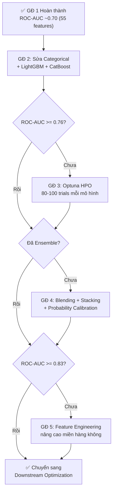

# HƯỚNG DẪN CẢI THIỆN ĐỘ CHÍNH XÁC MÔ HÌNH DỰ BÁO TRỄ CHUYẾN BAY
## Dự án: Aeolus Gate Optimization — Notebooks Pipeline
*Cập nhật: 27/09/2026 (Phiên bản 2 — Sau khi hoàn thành GĐ 1)*

---

## TÌNH TRẠNG HIỆN TẠI

### ✅ Giai đoạn 1 đã hoàn thành

Đã huấn luyện với đủ **55 features**, đạt ROC-AUC **~0.70** (~70%).

### Baseline hiện tại để so sánh

| Mô hình | Số features | ROC-AUC ước tính | Ghi chú |
|:---|:---:|:---:|:---|
| **XGBoost (22 features)** | 22 | ~0.66 | Notebook cũ, siêu tham số mặc định |
| **XGBoost (55 features)** | 55 | **~0.70** | ✅ Đã thực hiện bên ngoài |

### Các vấn đề còn tồn tại cần giải quyết

1. **Biến phân loại (Categorical)** vẫn đang bị mã hóa integer rồi chuẩn hóa `StandardScaler` — sai lầm kỹ thuật khiến mô hình cây mất thông tin phân nhóm.
2. **Chỉ dùng XGBoost** — chưa thử LightGBM, CatBoost (xử lý categorical tốt hơn).
3. **Siêu tham số mặc định** (`n_estimators=150, max_depth=6, learning_rate=0.08`) chưa qua tối ưu.
4. **Mất cân bằng nhãn (~18% trễ vs 82% đúng giờ)**: Precision lớp trễ thấp → F1 thấp.
5. **Thiếu features miền hàng không** có tính quyết định (tương tác thời tiết, tắc nghẽn nâng cao, ngày lễ).

---

## LỘ TRÌNH CẢI THIỆN — 4 GIAI ĐOẠN CÒN LẠI

### 📊 Bảng tổng quan mục tiêu

| Giai đoạn | Trọng tâm | Xuất phát | Mục tiêu ROC-AUC | Nỗ lực |
|:---:|:---|:---:|:---:|:---:|
| ~~1~~ | ~~Kích hoạt 55 features~~ | ~~0.66~~ | ~~0.70~~ | ✅ Hoàn thành |
| **2** | Sửa Categorical + LightGBM + CatBoost | 0.70 | **0.73 – 0.76** | 2–4 giờ |
| **3** | Tối ưu siêu tham số (Optuna HPO) | 0.73–0.76 | **0.76 – 0.80** | 4–8 giờ |
| **4** | Ensemble Blending + Calibration | 0.76–0.80 | **0.80 – 0.83** | 2–4 giờ |
| **5** | Feature Engineering nâng cao miền hàng không | 0.80–0.83 | **0.83 – 0.87+** | 4–8 giờ |

> [!IMPORTANT]
> **Nên bắt đầu từ Giai đoạn 2** — đây là bước cho cải thiện lớn nhất với nỗ lực ít nhất vì (1) sửa lỗi xử lý categorical giúp mô hình cây hiểu đúng dữ liệu, và (2) LightGBM/CatBoost thường vượt trội XGBoost trên dữ liệu có nhiều biến phân loại + dữ liệu lớn.



---

## GIAI ĐOẠN 2: SỬA CATEGORICAL + THÊM LIGHTGBM & CATBOOST
**Xuất phát: ~0.70 → Mục tiêu: 0.73 – 0.76 | Ưu tiên: CAO NHẤT**

### 2.1. Sửa lỗi xử lý Biến phân loại (Critical Bug)

Hiện tại trong hàm `train_and_evaluate_classifier()`, tất cả các cột numeric (bao gồm cả `OP_CARRIER_CODE`, `ORIGIN_CODE`, `DEST_CODE`) đang bị chuẩn hóa qua `StandardScaler`. Điều này **sai** với mô hình cây vì:

- Mô hình cây sẽ hiểu `OP_CARRIER_CODE=5` > `OP_CARRIER_CODE=3` (sai nghĩa thứ bậc).
- `StandardScaler` cũng không cần thiết cho mô hình cây (XGBoost, RF, LightGBM, CatBoost).

> [!WARNING]
> Lỗi này âm thầm làm giảm hiệu năng mà không báo lỗi. Sửa lỗi này có thể tăng ngay **1–3% ROC-AUC** mà không cần thay đổi gì khác.

**Cách sửa trong notebook:**

```python
# ═══════════════════════════════════════════════════════════════
# BƯỚC 1: Định nghĩa rõ ràng các cột categorical vs numeric
# ═══════════════════════════════════════════════════════════════
CATEGORICAL_COLS = ["OP_CARRIER_CODE", "ORIGIN_CODE", "DEST_CODE"]

# Chỉ scale các cột numeric thực sự (KHÔNG scale categorical)
numeric_cols = [c for c in X_train.columns 
                if X_train[c].dtype in ['float32', 'float64'] 
                and c not in CATEGORICAL_COLS]

# ═══════════════════════════════════════════════════════════════
# BƯỚC 2: Với XGBoost — Bật native categorical split
# ═══════════════════════════════════════════════════════════════
for col in CATEGORICAL_COLS:
    X_train[col] = X_train[col].astype("category")
    X_valid[col] = X_valid[col].astype("category")
    X_test[col]  = X_test[col].astype("category")

clf = xgb.XGBClassifier(
    # ... các tham số khác ...
    enable_categorical=True,   # <-- BẬT tính năng native categorical
    tree_method='hist',        # Bắt buộc dùng hist để hỗ trợ categorical
)

# ═══════════════════════════════════════════════════════════════
# BƯỚC 3: Chỉ scale cho Logistic Regression, KHÔNG scale cho cây
# ═══════════════════════════════════════════════════════════════
if m_type == 'lr':
    scaler = StandardScaler()
    X_train_scaled[numeric_cols] = scaler.fit_transform(X_train[numeric_cols])
    X_valid_scaled[numeric_cols] = scaler.transform(X_valid[numeric_cols])
    X_test_scaled[numeric_cols]  = scaler.transform(X_test[numeric_cols])
else:
    # Mô hình cây: Dùng dữ liệu gốc, KHÔNG scale
    X_train_scaled = X_train
    X_valid_scaled = X_valid
    X_test_scaled  = X_test
```

### 2.2. Tích hợp LightGBM

LightGBM thường vượt trội XGBoost khi:
- Dữ liệu lớn (>10M dòng) → huấn luyện nhanh hơn 2-5x
- Nhiều biến phân loại → hỗ trợ native categorical split tốt hơn
- Xử lý giá trị thiếu (missing values) tự động

```python
import lightgbm as lgb

# Chuyển đổi categorical columns
cat_cols = ["OP_CARRIER_CODE", "ORIGIN_CODE", "DEST_CODE"]
for col in cat_cols:
    X_train[col] = X_train[col].astype("category")
    X_valid[col] = X_valid[col].astype("category")
    X_test[col]  = X_test[col].astype("category")

clf_lgb = lgb.LGBMClassifier(
    n_estimators=500,
    max_depth=7,
    learning_rate=0.05,
    num_leaves=63,              # 2^max_depth - 1
    subsample=0.8,
    colsample_bytree=0.8,
    min_child_samples=100,      # Quan trọng với dữ liệu lớn
    scale_pos_weight=spw,       # Xử lý mất cân bằng
    random_state=42,
    n_jobs=-1,
    verbose=-1
)

clf_lgb.fit(
    X_train, y_train,
    eval_set=[(X_valid, y_valid)],
    callbacks=[lgb.early_stopping(50), lgb.log_evaluation(50)]
)
```

### 2.3. Tích hợp CatBoost

CatBoost xử lý biến phân loại tốt nhất trong 3 thư viện Boosting:

```python
from catboost import CatBoostClassifier

cat_features_idx = [X_train.columns.get_loc(c) for c in cat_cols]

clf_cat = CatBoostClassifier(
    iterations=500,
    depth=7,
    learning_rate=0.05,
    auto_class_weights="Balanced",  # Tự động cân bằng lớp
    cat_features=cat_features_idx,
    random_seed=42,
    verbose=100,
    task_type="GPU"                 # Sử dụng GPU nếu có
)

clf_cat.fit(
    X_train, y_train,
    eval_set=(X_valid, y_valid),
    early_stopping_rounds=50
)
```

### 2.4. Feature Importance Analysis & Ablation Study

Sau khi chạy cả 3 mô hình, phân tích tầm quan trọng để hiểu rõ đóng góp từng nhóm features:

```python
import pandas as pd

# Lấy importance từ 3 mô hình
imp_xgb = pd.Series(clf_xgb.feature_importances_, index=X_train.columns).rename("XGB")
imp_lgb = pd.Series(clf_lgb.feature_importances_, index=X_train.columns).rename("LGBM")
imp_cat = pd.Series(clf_cat.feature_importances_, index=X_train.columns).rename("CatBoost")

# Tổng hợp và xếp hạng
imp_df = pd.concat([imp_xgb, imp_lgb, imp_cat], axis=1)
imp_df["avg_rank"] = imp_df.rank(ascending=False).mean(axis=1)
imp_df = imp_df.sort_values("avg_rank")
print(imp_df.head(20))  # Top 20 features quan trọng nhất

# Loại bỏ features có importance = 0 ở cả 3 mô hình
zero_features = imp_df[(imp_df[["XGB", "LGBM", "CatBoost"]] == 0).all(axis=1)].index.tolist()
print(f"Features cần loại bỏ: {zero_features}")
```

**Ablation Study theo nhóm — Kiểm tra từng nhóm features đóng góp bao nhiêu:**

```python
feature_groups = {
    "schedule_only": [  # 15 features cơ bản
        "DISTANCE_KM", "CRS_ELAPSED_TIME", "DEP_HOUR", "ARR_HOUR",
        "MONTH", "DAY", "DOW", "QUARTER", "IS_WEEKEND", "PEAK_HOUR",
        "SEASON_CODE", "TIME_OF_DAY_CODE", "DISTANCE_GROUP_CODE", 
        "LONG_HAUL", "IS_COVID_PERIOD"
    ],
    "+categorical": ["OP_CARRIER_CODE", "ORIGIN_CODE", "DEST_CODE"],
    "+weather_raw": ["O_TEMP", "O_PRCP", "O_WSPD", "D_TEMP", "D_PRCP", "D_WSPD"],
    "+weather_derived": [
        "IS_ORIGIN_RAINY", "IS_DEST_RAINY", "IS_ORIGIN_WINDY", "IS_DEST_WINDY",
        "IS_ORIGIN_COLD", "IS_DEST_COLD", "TEMP_DIFF", "WSPD_DIFF",
        "WEATHER_SEVERITY_ORIGIN", "WEATHER_SEVERITY_DEST", "WEATHER_SEVERITY_TOTAL"
    ],
    "+cyclical": ["MONTH_SIN", "MONTH_COS", "HOUR_SIN", "HOUR_COS", "DOW_SIN", "DOW_COS"],
    "+congestion": [
        "ORIGIN_CONGESTION_SAME_HOUR", "DEST_CONGESTION_SAME_HOUR",
        "ORIGIN_DAILY_FLIGHTS", "DEST_DAILY_FLIGHTS"
    ],
    "+delay_history": [
        "CARRIER_DELAY_RATE", "ORIGIN_DELAY_RATE", "ROUTE_DELAY_RATE", "DEST_DELAY_RATE",
        "ROUTE_AVG_ARR_DELAY_PAST", "AIRLINE_AVG_ARR_DELAY_PAST", "ORIGIN_AVG_ARR_DELAY_PAST",
        "ROUTE_AVG_ARR_DELAY_ROLLING", "AIRLINE_AVG_ARR_DELAY_ROLLING", "ORIGIN_AVG_ARR_DELAY_ROLLING"
    ],
}

# Chạy mô hình với từng nhóm cộng dồn và ghi nhận ROC-AUC
# → Xác định nhóm nào đóng góp nhiều nhất, nhóm nào gây nhiễu
```

### ✅ Checklist Giai đoạn 2:
- [ ] Sửa lỗi `StandardScaler` cho biến categorical trong notebook
- [ ] Bật `enable_categorical=True` cho XGBoost, chạy lại → ghi nhận ROC-AUC
- [ ] Cài đặt `lightgbm` và `catboost` (`pip install lightgbm catboost`)
- [ ] Huấn luyện LightGBM → ghi nhận ROC-AUC
- [ ] Huấn luyện CatBoost → ghi nhận ROC-AUC
- [ ] Chạy Feature Importance Analysis tổng hợp từ 3 mô hình
- [ ] Chạy Ablation Study theo nhóm features
- [ ] Loại bỏ features nhiễu / zero-importance (nếu có)
- [ ] Ghi nhận ROC-AUC tốt nhất → chuyển sang Giai đoạn 3

---

## GIAI ĐOẠN 3: TỐI ƯU SIÊU THAM SỐ VỚI OPTUNA
**Xuất phát: 0.73 – 0.76 → Mục tiêu: 0.76 – 0.80**

### 3.1. Thiết lập Optuna cho XGBoost

```python
import optuna

def objective_xgb(trial):
    params = {
        "n_estimators": trial.suggest_int("n_estimators", 200, 1000, step=50),
        "max_depth": trial.suggest_int("max_depth", 4, 10),
        "learning_rate": trial.suggest_float("learning_rate", 0.01, 0.15, log=True),
        "subsample": trial.suggest_float("subsample", 0.6, 0.95),
        "colsample_bytree": trial.suggest_float("colsample_bytree", 0.5, 0.95),
        "min_child_weight": trial.suggest_int("min_child_weight", 5, 100, log=True),
        "reg_alpha": trial.suggest_float("reg_alpha", 1e-8, 10.0, log=True),
        "reg_lambda": trial.suggest_float("reg_lambda", 1e-8, 10.0, log=True),
        "gamma": trial.suggest_float("gamma", 0, 5.0),
        "scale_pos_weight": trial.suggest_float("scale_pos_weight", 1.0, 6.0),
        # Cố định
        "tree_method": "hist",
        "device": "cuda",
        "enable_categorical": True,
        "random_state": 42,
    }
    
    clf = xgb.XGBClassifier(**params)
    clf.fit(
        X_train, y_train,
        eval_set=[(X_valid, y_valid)],
        verbose=False
    )
    
    y_val_prob = clf.predict_proba(X_valid)[:, 1]
    return roc_auc_score(y_valid, y_val_prob)

study_xgb = optuna.create_study(direction="maximize", study_name="xgb_arrival")
study_xgb.optimize(objective_xgb, n_trials=80, timeout=3600*2)  # 80 trials hoặc 2 giờ

print(f"Best ROC-AUC: {study_xgb.best_value:.4f}")
print(f"Best Params: {study_xgb.best_params}")
```

### 3.2. Thiết lập Optuna cho LightGBM

```python
def objective_lgb(trial):
    params = {
        "n_estimators": trial.suggest_int("n_estimators", 200, 1500, step=50),
        "max_depth": trial.suggest_int("max_depth", 4, 12),
        "learning_rate": trial.suggest_float("learning_rate", 0.01, 0.15, log=True),
        "num_leaves": trial.suggest_int("num_leaves", 31, 255),
        "subsample": trial.suggest_float("subsample", 0.6, 0.95),
        "colsample_bytree": trial.suggest_float("colsample_bytree", 0.5, 0.95),
        "min_child_samples": trial.suggest_int("min_child_samples", 20, 200),
        "reg_alpha": trial.suggest_float("reg_alpha", 1e-8, 10.0, log=True),
        "reg_lambda": trial.suggest_float("reg_lambda", 1e-8, 10.0, log=True),
        "scale_pos_weight": trial.suggest_float("scale_pos_weight", 1.0, 6.0),
        "random_state": 42,
        "verbose": -1,
        "n_jobs": -1,
    }
    
    clf = lgb.LGBMClassifier(**params)
    clf.fit(
        X_train, y_train,
        eval_set=[(X_valid, y_valid)],
        callbacks=[lgb.early_stopping(50, verbose=False), lgb.log_evaluation(-1)]
    )
    
    y_val_prob = clf.predict_proba(X_valid)[:, 1]
    return roc_auc_score(y_valid, y_val_prob)

study_lgb = optuna.create_study(direction="maximize", study_name="lgb_arrival")
study_lgb.optimize(objective_lgb, n_trials=80, timeout=3600*2)
```

### 3.3. Thiết lập Optuna cho CatBoost

```python
def objective_cat(trial):
    params = {
        "iterations": trial.suggest_int("iterations", 200, 1500, step=50),
        "depth": trial.suggest_int("depth", 4, 10),
        "learning_rate": trial.suggest_float("learning_rate", 0.01, 0.15, log=True),
        "l2_leaf_reg": trial.suggest_float("l2_leaf_reg", 1e-3, 10.0, log=True),
        "border_count": trial.suggest_int("border_count", 32, 255),
        "bagging_temperature": trial.suggest_float("bagging_temperature", 0, 5.0),
        "random_strength": trial.suggest_float("random_strength", 1e-9, 10.0, log=True),
        "auto_class_weights": trial.suggest_categorical(
            "auto_class_weights", ["Balanced", "SqrtBalanced", None]
        ),
        "random_seed": 42,
        "verbose": 0,
        "task_type": "GPU",
    }
    
    cat_features_idx = [X_train.columns.get_loc(c) for c in CATEGORICAL_COLS]
    clf = CatBoostClassifier(**params, cat_features=cat_features_idx)
    clf.fit(
        X_train, y_train,
        eval_set=(X_valid, y_valid),
        early_stopping_rounds=50
    )
    
    y_val_prob = clf.predict_proba(X_valid)[:, 1]
    return roc_auc_score(y_valid, y_val_prob)

study_cat = optuna.create_study(direction="maximize", study_name="cat_arrival")
study_cat.optimize(objective_cat, n_trials=60, timeout=3600*3)
```

### 3.4. Lưu kết quả HPO

```python
# Tổng hợp kết quả
hpo_results = pd.DataFrame([
    {"Model": "XGBoost",  "Best_ROC_AUC": study_xgb.best_value, "N_Trials": len(study_xgb.trials)},
    {"Model": "LightGBM", "Best_ROC_AUC": study_lgb.best_value, "N_Trials": len(study_lgb.trials)},
    {"Model": "CatBoost", "Best_ROC_AUC": study_cat.best_value, "N_Trials": len(study_cat.trials)},
])
print(hpo_results.to_string(index=False))

# Lưu bộ tham số tối ưu vào file JSON
import json
best_params = {
    "xgb": study_xgb.best_params,
    "lgb": study_lgb.best_params,
    "cat": study_cat.best_params
}
with open("best_hpo_params.json", "w") as f:
    json.dump(best_params, f, indent=2)
```

> [!TIP]
> **Chiến lược tiết kiệm thời gian**: Với tập dữ liệu lớn, mỗi trial HPO mất rất lâu. Bạn có thể:
> 1. **Subsample 20-30%** dữ liệu train cho HPO (tìm hướng tham số tốt)
> 2. Sau đó **huấn luyện lại trên full data** với bộ tham số tốt nhất
> 3. Hoặc lọc `DEST=ATL` trước nếu bài toán chỉ phục vụ tối ưu cổng Atlanta

### ✅ Checklist Giai đoạn 3:
- [ ] Cài đặt `optuna` (`pip install optuna`)
- [ ] Chạy Optuna HPO cho XGBoost (80 trials)
- [ ] Chạy Optuna HPO cho LightGBM (80 trials)
- [ ] Chạy Optuna HPO cho CatBoost (60 trials)
- [ ] Huấn luyện lại 3 mô hình với bộ tham số tối ưu
- [ ] Đánh giá trên Test 2024 và ghi nhận kết quả
- [ ] Lưu bộ tham số tối ưu vào file JSON

---

## GIAI ĐOẠN 4: ENSEMBLE BLENDING & HIỆU CHUẨN XÁC SUẤT
**Xuất phát: 0.76 – 0.80 → Mục tiêu: 0.80 – 0.83**

### 4.1. Weighted Soft Voting Ensemble

```python
# Huấn luyện lại 3 mô hình tốt nhất với best params từ HPO
# Lấy xác suất dự đoán trên Validation
prob_xgb = clf_xgb.predict_proba(X_valid)[:, 1]
prob_lgb = clf_lgb.predict_proba(X_valid)[:, 1]
prob_cat = clf_cat.predict_proba(X_valid)[:, 1]

# Tìm trọng số tối ưu bằng Grid Search trên Validation
best_blend_auc = 0
best_weights = None

for w1 in np.arange(0.1, 0.8, 0.05):
    for w2 in np.arange(0.1, 0.8, 0.05):
        w3 = 1.0 - w1 - w2
        if w3 < 0.05:
            continue
        blended = w1 * prob_xgb + w2 * prob_lgb + w3 * prob_cat
        auc_val = roc_auc_score(y_valid, blended)
        if auc_val > best_blend_auc:
            best_blend_auc = auc_val
            best_weights = (w1, w2, w3)

print(f"Best Blend Weights: XGB={best_weights[0]:.2f}, "
      f"LGBM={best_weights[1]:.2f}, CatBoost={best_weights[2]:.2f}")
print(f"Best Blend ROC-AUC (Val): {best_blend_auc:.4f}")

# Áp dụng trên Test
prob_test_xgb = clf_xgb.predict_proba(X_test)[:, 1]
prob_test_lgb = clf_lgb.predict_proba(X_test)[:, 1]
prob_test_cat = clf_cat.predict_proba(X_test)[:, 1]

blended_test = (best_weights[0] * prob_test_xgb 
              + best_weights[1] * prob_test_lgb 
              + best_weights[2] * prob_test_cat)
print(f"Blended ROC-AUC (Test 2024): {roc_auc_score(y_test, blended_test):.4f}")
```

### 4.2. Stacking Ensemble (Nâng cao)

```python
from sklearn.linear_model import LogisticRegression

# Level-1: Xác suất từ 3 base models trên Validation
meta_features_val = np.column_stack([prob_xgb, prob_lgb, prob_cat])
meta_features_test = np.column_stack([prob_test_xgb, prob_test_lgb, prob_test_cat])

# Level-2: Meta-learner (Logistic Regression) học cách kết hợp
meta_lr = LogisticRegression(random_state=42)
meta_lr.fit(meta_features_val, y_valid)

stacked_prob = meta_lr.predict_proba(meta_features_test)[:, 1]
print(f"Stacked ROC-AUC (Test 2024): {roc_auc_score(y_test, stacked_prob):.4f}")
```

### 4.3. Hiệu chuẩn Xác suất (Probability Calibration)

```python
from sklearn.calibration import CalibratedClassifierCV
from sklearn.metrics import brier_score_loss

# Hiệu chuẩn Isotonic trên tập Validation
calibrated_clf = CalibratedClassifierCV(
    clf_xgb,             # Mô hình base (hoặc ensemble tốt nhất)
    method="isotonic",   # Isotonic regression (phi tham số, linh hoạt hơn sigmoid)
    cv="prefit"          # Mô hình đã fit rồi
)
calibrated_clf.fit(X_valid, y_valid)

# So sánh trước và sau hiệu chuẩn
prob_raw = clf_xgb.predict_proba(X_test)[:, 1]
prob_cal = calibrated_clf.predict_proba(X_test)[:, 1]

print(f"Brier Score TRƯỚC hiệu chuẩn: {brier_score_loss(y_test, prob_raw):.4f}")
print(f"Brier Score SAU hiệu chuẩn:   {brier_score_loss(y_test, prob_cal):.4f}")
```

> [!NOTE]
> Hiệu chuẩn xác suất không tăng ROC-AUC trực tiếp, nhưng cải thiện **chất lượng xác suất** → giúp bước downstream (Tối ưu cổng) tính toán buffer time chính xác hơn. Nó cũng cải thiện đáng kể Brier Score và ECE.

### ✅ Checklist Giai đoạn 4:
- [ ] Huấn luyện 3 mô hình tối ưu từ HPO
- [ ] Thử Weighted Soft Voting → tìm trọng số tốt nhất
- [ ] Thử Stacking Ensemble với Logistic Regression meta-learner
- [ ] Hiệu chuẩn xác suất (Isotonic) cho mô hình hoặc ensemble tốt nhất
- [ ] Ghi nhận tất cả metrics (ROC-AUC, PR-AUC, Brier Score, ECE)

---

## GIAI ĐOẠN 5: FEATURE ENGINEERING NÂNG CAO MIỀN HÀNG KHÔNG
**Xuất phát: 0.80 – 0.83 → Mục tiêu: 0.83 – 0.87+**

> [!IMPORTANT]
> Giai đoạn này cần sửa trong [preprocessing_notebook.ipynb](file:///D:/KLCN/aeolus-gate-optimization/src/notebooks/preprocessing_notebook.ipynb) — thêm features mới vào hàm `engineer_features_batch()`, sau đó chạy lại toàn bộ pipeline Preprocessing → Split → Training.

### 5.1. Tương tác Thời tiết Phi tuyến (Weather Interactions)

```python
# Trong hàm engineer_features_batch() của preprocessing_notebook

# a. Mưa đóng băng (Freezing Rain) — gây de-icing delay rất nặng
df["FREEZING_RAIN_ORIGIN"] = ((df["O_TEMP"] <= 2) & (df["O_PRCP"] > 0)).astype("int8")
df["FREEZING_RAIN_DEST"]   = ((df["D_TEMP"] <= 2) & (df["D_PRCP"] > 0)).astype("int8")

# b. Giông lốc (Thunderstorm Proxy) — mưa lớn + gió mạnh
df["STORM_INDEX_ORIGIN"] = (df["O_PRCP"] * df["O_WSPD"]).astype("float32")
df["STORM_INDEX_DEST"]   = (df["D_PRCP"] * df["D_WSPD"]).astype("float32")

# c. Gió chéo mạnh (High Crosswind) — ảnh hưởng hạ cánh
df["HIGH_WIND_ORIGIN"] = (df["O_WSPD"] >= 40).astype("int8")  # >= 40 km/h
df["HIGH_WIND_DEST"]   = (df["D_WSPD"] >= 40).astype("int8")
```

### 5.2. Đặc trưng Tắc nghẽn Nâng cao

```python
# a. Mật độ bay theo khung 2 giờ (thay vì chỉ 1 giờ)
df["ORIGIN_CONGESTION_2H"] = df.groupby(
    ["FL_DATE", "ORIGIN", df["DEP_HOUR"] // 2]
)["CRS_ELAPSED_TIME"].transform("count").astype("int16")

# b. Tỷ lệ tắc nghẽn tương đối so với trung bình ngày
df["ORIGIN_CONGESTION_RATIO"] = (
    df["ORIGIN_CONGESTION_SAME_HOUR"] / df["ORIGIN_DAILY_FLIGHTS"].clip(lower=1)
).astype("float32")

df["DEST_CONGESTION_RATIO"] = (
    df["DEST_CONGESTION_SAME_HOUR"] / df["DEST_DAILY_FLIGHTS"].clip(lower=1)
).astype("float32")
```

### 5.3. Đặc trưng Tuyến bay & Hãng bay Nâng cao

```python
# a. Số lượng chuyến bay trên tuyến trong ngày (Route Density)
df["ROUTE_DAILY_FLIGHTS"] = df.groupby(
    ["FL_DATE", "ORIGIN", "DEST"]
)["CRS_ELAPSED_TIME"].transform("count").astype("int16")

# b. Thứ tự chuyến bay trong ngày trên tuyến (Flight Sequence)
df["ROUTE_FLIGHT_SEQ"] = df.groupby(
    ["FL_DATE", "ORIGIN", "DEST"]
)["DEP_HOUR"].rank(method="dense").astype("int8")
```

### 5.4. Đặc trưng Trễ Lịch sử Ngắn hạn (Short-term Rolling)

```python
# Thay vì chỉ rolling 12 tháng, thêm rolling ngắn hạn hơn:

# a. Rolling 3 tháng (nắm bắt xu hướng trễ gần đây)
# b. Rolling 1 tháng (phát hiện bùng phát trễ cục bộ)
# → Tính toán tương tự rolling_lookups nhưng với window nhỏ hơn

# c. Trend: Chênh lệch trễ rolling 3 tháng vs 12 tháng
#    → Cho biết tuyến bay/hãng bay đang cải thiện hay xấu đi
df["ROUTE_DELAY_TREND"] = (
    df["ROUTE_AVG_ARR_DELAY_ROLLING_3M"] - df["ROUTE_AVG_ARR_DELAY_ROLLING"]
).astype("float32")
```

### 5.5. Đặc trưng Lịch Nâng cao (Calendar)

```python
# a. Ngày lễ / Kỳ nghỉ Mỹ (gây tắc nghẽn đột biến)
US_HOLIDAYS = [
    # Thanksgiving week, Christmas, New Year, July 4th, Memorial Day, Labor Day...
]
df["IS_HOLIDAY_PERIOD"] = df["FL_DATE"].isin(US_HOLIDAYS).astype("int8")

# b. Khoảng cách đến ngày lễ gần nhất (0 = ngày lễ, 1 = 1 ngày trước/sau lễ...)
# → Trễ thường tăng 2-3 ngày trước và 1 ngày sau kỳ nghỉ lớn

# c. Tháng trong quý (đầu quý vs cuối quý có lưu lượng khác)
df["MONTH_IN_QUARTER"] = ((df["MONTH"] - 1) % 3 + 1).astype("int8")
```

### ✅ Checklist Giai đoạn 5:
- [ ] Thêm features tương tác thời tiết vào `engineer_features_batch()`
- [ ] Thêm features tắc nghẽn nâng cao
- [ ] Thêm features tuyến bay / hãng bay
- [ ] Thêm rolling ngắn hạn (3 tháng, 1 tháng) + trend
- [ ] Thêm features lịch (ngày lễ, kỳ nghỉ Mỹ)
- [ ] Cập nhật `features_common` / `features_arr` trong preprocessing notebook
- [ ] Chạy lại full pipeline: Preprocessing → Split → HPO → Ensemble
- [ ] Đánh giá và so sánh với kết quả Giai đoạn 4

---

## PHỤ LỤC A: BẢNG THEO DÕI TIẾN ĐỘ

| Giai đoạn | Ngày thực hiện | Val ROC-AUC | Test ROC-AUC | Test PR-AUC | Mô hình tốt nhất | Ghi chú |
|:---:|:---:|:---:|:---:|:---:|:---|:---|
| ~~GĐ 1~~ | ✅ Đã xong | — | **~0.70** | — | XGBoost (55 features) | Huấn luyện bên ngoài |
| GĐ 2 | | | | | | |
| GĐ 3 | | | | | | |
| GĐ 4 | | | | | | |
| GĐ 5 | | | | | | |

## PHỤ LỤC B: CÁC LƯU Ý QUAN TRỌNG

> [!WARNING]
> **Không sử dụng các biến rò rỉ (Leakage Variables)** cho nhánh Core Arrival:
> - `DEP_DELAY`, `DEP_TIME` — chưa biết tại mốc T-2h
> - `TAXI_OUT`, `WHEELS_OFF`, `WHEELS_ON`, `TAXI_IN` — dữ liệu thực tế sau cất cánh
> - `ACTUAL_ELAPSED_TIME`, `ARR_TIME` — dữ liệu thực tế sau hạ cánh
> 
> Các biến này nếu vô tình đưa vào sẽ cho ROC-AUC rất cao (>0.95) nhưng **hoàn toàn vô nghĩa** trong thực tế vận hành.

> [!NOTE]
> **Về tập dữ liệu**: Nếu bài toán chỉ tập trung vào các chuyến đến ATL (~3M dòng), bạn nên **lọc `DEST=ATL`** trước khi huấn luyện để mô hình học đúng quy luật trễ đặc thù của sân bay Atlanta. Điều này có thể tăng thêm 2-4% ROC-AUC nhờ giảm nhiễu từ các sân bay khác và giúp HPO chạy nhanh hơn ~10x.
