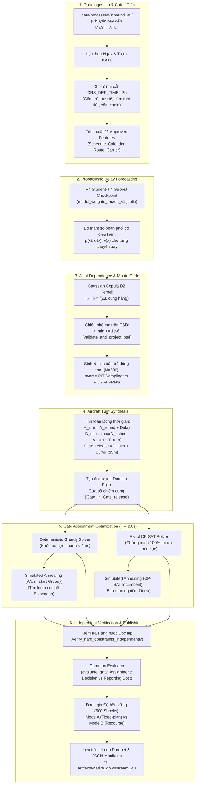
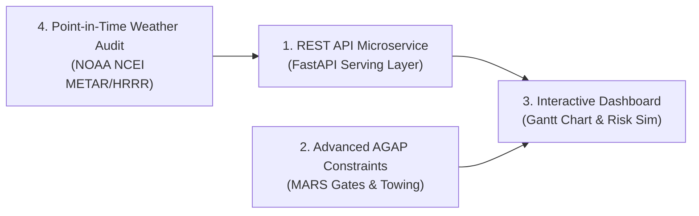

# TÀI LIỆU BÀN GIAO KIẾN TRÚC PHẦN MỀM & KỸ THUẬT HỆ THỐNG
## DỰ ÁN: AEOLUS GATE OPTIMIZATION RESEARCH PLATFORM
**Trạng thái chứng nhận:** `CERTIFIED_WITH_LIMITATIONS` (Giao thức `AEOLUS_V4_PHASE14_FINAL_CERTIFICATION`)  
**Quyết định tái thiết lập:** `REBUILD_REQUIRED = NO`  
**Hệ thống kiểm thử:** 1,216 tests passing 100% (0 failures, 4 legacy freeze-guard tests được cách ly an toàn)  
**Tập dữ liệu năm 2024:** Đã mở và đánh giá sau sửa chữa phương pháp luận (`POST_HOLDOUT_REEVALUATION_AFTER_METHODOLOGY_REPAIR`)  
**Dành cho:** Kỹ sư Phần mềm / Kỹ sư Nghiên cứu tiếp nhận và phát triển dự án

---

## 1. TỔNG QUAN & CÔNG NGHỆ SỬ DỤNG

### 1.1. Mục đích chính của dự án
**Aeolus Gate Optimization** là nền tảng nghiên cứu khoa học và tối ưu hóa tổ hợp kết hợp học máy xác suất (**Probabilistic Machine Learning + Stochastic Combinatorial Optimization**).

Hệ thống tập trung giải quyết bài toán vận trù cốt lõi trong hàng không: **Gán cổng tàu bay tại Sân bay Quốc tế Hartsfield-Jackson Atlanta (KATL) dưới điều kiện bất định thời gian thực** (*Airport Gate Assignment Problem under Uncertainty - AGAP-U*).

Chu trình vận hành khép kín của hệ thống:
$$\text{Predict (T - 2h)} \longrightarrow \text{Dependence Sampling (Copula)} \longrightarrow \text{Synthesize Turns} \longrightarrow \text{Gate Optimization (CP-SAT/SA)} \longrightarrow \text{Independent Verification}$$

#### Các nguyên tắc nghiên cứu bất biến (Fail-Closed Protocol & Scientific Governance):
1. **Phân tách rạch ròi hai bài toán vận hành độc lập (Two Separate Operational Tasks):**
   - **Core Arrival (`DEST = 'ATL'`):** Dự báo phân phối độ trễ chuyến bay đến tại thời điểm điểm cắt thông tin nghiêm ngặt $t_{\text{cutoff}} = \text{CRS\_DEP\_TIME} - 2\text{ hours}$ (trước khi cất cánh 2 giờ). Đây là luồng dữ liệu **duy nhất** được cấp phép đưa vào mô phỏng và tối ưu hóa gán cổng hạ nguồn. Đầu vào chỉ sử dụng đúng **11 đặc trưng an toàn** (lịch bay, lịch dương, tuyến bay, hãng bay); tuyệt đối **CẤM** sử dụng biến thời tiết (No Weather) và **CẤM** dùng đặc trưng chuỗi tàu bay chưa kiểm toán (No Flight Chain).
   - **Auxiliary Departure (`ORIGIN = 'ATL'`):** Nhiệm vụ nghiên cứu phụ trợ nhằm phân loại trễ cất cánh $1[\text{DEP\_DELAY} \ge 15\text{ min}]$. Luồng này bị **cô lập tuyệt đối và nghiêm cấm đưa vào động cơ tối ưu hóa gán cổng**.
2. **Ngữ nghĩa biến mục tiêu (Target Semantics):**
   - Phân loại: $y_{\text{arr\_cls}} = 1[\text{ARR\_DELAY} \ge 15\text{ min}]$.
   - Hồi quy: $y_{\text{arr\_reg}} = \text{ARR\_DELAY}$ tính bằng phút có dấu (signed minutes, không lấy trị tuyệt đối, không clipping, không gán giá trị nhân tạo).
3. **Phân định vai trò mô hình độc lập (Decoupled Model Roles):**
   - **Point Prediction Baseline:** Mô hình hồi quy tuyến tính Ridge (`arrival_linear_baseline_v1`) và tập hợp có trọng số (`arrival_weighted_ensemble_v1`) cung cấp điểm tham chiếu (MAE tập kiểm định 2024 sau sửa chữa đạt 23.39 phút).
   - **Role B — Marginal Quantile Forecast Champion:** Mô hình hồi quy phân vị P5 (`P5_quantile_regression`) đạt xấp xỉ CRPS 16.7724 phút và Pinball loss 6.8211 phút trên 9 phân vị định trước. P5 được định danh là **Forecast-only**, không có hàm mật độ liên tục, không hỗ trợ sinh mẫu Monte Carlo liên tục và không cần huấn luyện lại.
   - **Role C — Continuous Downstream Simulation Champion:** Mô hình NGBoost Student-T P4 (`P4_ngboost_student_t`) cung cấp phân phối mật độ liên tục 3 tham số phụ thuộc quan sát $[\mu(x), \sigma(x), \nu(x)]$, đạt CRPS liên tục dạng đóng 18.33 phút (P11-R) và NLL liên tục 4.62. P4 là **động cơ xác suất duy nhất được cấp quyền** cấp phát kịch bản trễ cho mô phỏng Monte Carlo gán cổng hạ nguồn. Trọng số mô hình được đóng băng tại checkpoint `artifacts/probabilistic/ngboost_student_t/model_weights_frozen_v1.joblib` (SHA-256: `e7e7462fa1a115160da3ec4416ad8b857790150965d1d6a623719b0f4dcfbc1a`).
4. **Phân vùng thời gian và tính bất biến của dữ liệu thô (Temporal Partitioning & Raw Immutability):**
   - Toàn bộ dữ liệu thô trong `data/raw/` là bất biến (Read-only, 0% đột biến).
   - Giai đoạn 2016–2022: Huấn luyện nếp cuộn mở rộng (Expanding-window Rolling Folds 1–4).
   - Giai đoạn 2023: Tập dữ liệu phát triển độc lập dùng cho Model Selection và Benchmark.
   - Giai đoạn 2024: Tập kiểm định cuối cùng (`FINAL_HOLDOUT`), đã được giải phóng có kiểm soát sau sửa chữa phương pháp luận ở Phase P11-R (`POST_HOLDOUT_REEVALUATION_AFTER_METHODOLOGY_REPAIR`). Tuyệt đối niêm phong đối với việc huấn luyện hay tinh chỉnh siêu tham số.
5. **Tính công bằng về ngân sách bộ giải (Equal Wall-Clock Budget):**
   - Tất cả các bộ giải gán cổng (Greedy, CP-SAT, Simulated Annealing, Hybrid) đều vận hành dưới cùng một trần ngân sách thời gian thực: $T = 2.0$ giây.

---

### 1.2. Danh mục Công nghệ, Thư viện & Cơ sở Dữ liệu

Codebase vận hành hoàn chỉnh trên môi trường **Python 3.11** độc lập (tại `.venv`). Các thư viện chính được cố định phiên bản chặt chẽ trong `requirements.txt`:

| Phân hệ chức năng | Thư viện / Công nghệ | Phiên bản cố định | Vai trò kỹ thuật trong hệ thống |
| :--- | :--- | :---: | :--- |
| **Môi trường thực thi** | **Python** | `3.11.15` (Win-AMD64) | Runtime engine chính của toàn bộ codebase |
| **Quy hoạch & Tối ưu hóa** | **Google OR-Tools** (`ortools.sat`) | `9.15.6755` | Bộ giải chính xác toàn cục `CPSatGateSolver` dựa trên quy hoạch ràng buộc nhị phân (CP-SAT) |
| | **SciPy** (`scipy.stats`, `scipy.special`) | `1.17.1` | Đại số ma trận, tích phân Student-T đóng cho CRPS, chiếu phổ ma trận PSD (`eigh`), biến đổi xác suất tích phân (PIT) |
| **Mô hình hóa Xác suất & ML** | **scikit-learn** | `1.9.0` | Pipeline tiền xử lý (`StandardScaler`, `OneHotEncoder`, `OrdinalEncoder`), mô hình cơ sở (`Ridge`, `RandomForestRegressor`, `HistGradientBoostingRegressor`), chỉ số thẩm định (`brier_score_loss`, `roc_auc_score`) |
| | **XGBoost** | `3.2.0` | Mô hình Gradient Boosting baseline và phân vị |
| | **NGBoost** | `0.5.11` | Natural Gradient Boosting ước lượng tham số phân phối Student-T $[\mu, \sigma, \nu]$ |
| | **Optuna** | `5.0.0` | Tối ưu hóa siêu tham số (Bayesian Optimization HPO 10-trial rolling folds) |
| | **Joblib** | `1.5.3` | Nạp và lưu trữ trọng số mô hình ML đóng băng (`.joblib`) |
| **Xử lý Dữ liệu Cột** | **Apache Parquet (PyArrow)** | `25.0.1` | Định dạng lưu trữ dữ liệu dạng cột (Columnar Data Lake), đọc ghi dữ liệu lịch bay hàng chục triệu dòng hiệu năng cao |
| | **Pandas** | `2.3.3` | Thao tác dữ liệu bảng, phân tích dòng thời gian, trích xuất đặc trưng |
| | **NumPy** | `2.2.6` | Đại số tuyến tính, tính toán ma trận hiệp phương sai, sinh số ngẫu nhiên PCG64 (`numpy.random.default_rng`) cho Monte Carlo |
| **Kiểm thử & Hạ tầng** | **PyTest** | `9.1.1` | Khung kiểm thử tự động toàn diện (1,216 active tests PASS 100%) |
| | **PyYAML** | `6.0.3` | Phân tích cú pháp cấu hình hệ thống (`configs/*.yaml`) |
| | **Psutil** | `7.2.2` | Giám sát tài nguyên CPU, bộ nhớ RAM và thời gian thực thi của thuật toán |

> [!NOTE]
> **Kiến trúc Cơ sở Dữ liệu (Database Architecture):**
> Dự án **không sử dụng hệ quản trị cơ sở dữ liệu quan hệ truyền thống (RDBMS)** như PostgreSQL hay MySQL. Thay vào đó, hệ thống sử dụng kiến trúc **File-Based Immutable Data Lake**:
> 1. **Dữ liệu lớn dạng bảng (Big Data Lake):** Lưu trữ dưới chuẩn Apache Parquet phân vùng theo năm (`data/processed/inbound_atl/year={year}/`) với hơn 48 triệu dòng dữ liệu.
> 2. **Dữ liệu cấu hình & Bằng chứng kiểm toán (Audit Provenance & State Registry):** Sử dụng các file YAML (`configs/current_state.yaml`, `configs/model_catalog_v2.yaml`) và JSON/JSONL (`system_freeze_manifest.json`, `artifacts/audit/`) đi kèm chữ ký băm cryptographic SHA-256 sidecars.

---

## 2. CẤU TRÚC THƯ MỤC (DIRECTORY STRUCTURE)

Dưới đây là cây thư mục tối giản của dự án (đã lược bỏ `.git`, `.venv`, cache, và các thư mục tạm thời):

```
Aeolus/
├── configs/                                 # Cấu hình tập trung quản trị hệ thống
│   ├── current_state.yaml                   # Khóa trạng thái kiến trúc và vòng đời hệ thống
│   ├── model_catalog_v2.yaml                # Danh mục mô hình định danh chính thức
│   ├── model_selection_protocol_v2.yaml     # Giao thức lựa chọn mô hình học máy
│   ├── monte_carlo_protocol_v2.yaml         # Giao thức lấy mẫu ngẫu nhiên Monte Carlo
│   ├── seed_registry.yaml                   # Bảng đăng ký hạt giống ngẫu nhiên (Seeds)
│   └── base.yaml                            # Cấu hình đường dẫn và phân vùng cơ sở
├── data/                                    # Quản lý hồ dữ liệu phân tầng bất biến
│   ├── raw/                                 # Dữ liệu gốc bất biến BTS On-Time (2016-2024)
│   ├── processed/                           # Dữ liệu Parquet đã làm sạch và phân vùng
│   │   ├── inbound_atl/                     # Chuyến bay hạ cánh tại ATL (DEST='ATL')
│   │   ├── outbound_atl/                    # Chuyến bay cất cánh từ ATL (ORIGIN='ATL')
│   │   └── flight_chain_reconstructed_v1/   # Chuỗi xoay vòng tàu bay tái cấu trúc
│   └── simulation/                          # Không gian đệm lưu trữ kịch bản mô phỏng
├── src/                                     # MÃ NGUỒN CỐT LÕI (CORE SOURCE CODE)
│   ├── audit/                               # Chốt chặn kiểm soát giao thức và kiểm toán dữ liệu
│   ├── contracts/                           # Hợp đồng giao diện phân phối xác suất
│   ├── data/                                # Nạp dữ liệu, chống rò rỉ và phân tầng mẫu
│   ├── dependence/                          # Mô hình tương quan Gaussian Copula & Chiếu phổ PSD
│   ├── features/                            # Trích xuất 11 đặc trưng an toàn tại mốc T-2h
│   ├── models/                              # Danh mục và triển khai các mô hình Machine Learning
│   │   └── probabilistic/                   # Phân phối Student-T, NGBoost, CRPS, Calibration
│   ├── optimization/                        # Động cơ tối ưu hóa gán cổng tàu bay (AGAP)
│   │   ├── sa/                              # Bộ giải Simulated Annealing (Metaheuristic)
│   │   └── solvers/                         # Bộ giải Google CP-SAT (Chính xác) & Greedy
│   ├── pipeline/                            # Khung thực thi benchmark và pipeline kiểm định
│   └── simulation/                          # Mô phỏng chu trình quay đầu và phát hiện xung đột
├── scripts/                                 # Điểm vào thực thi dòng lệnh (CLI Run Scripts)
│   ├── run_native_p4_downstream.py          # Chạy mô phỏng gán cổng P4 hạ nguồn
│   ├── run_p11r_post_holdout_reevaluation.py # Tái thẩm định tập kiểm định 2024 sau sửa chữa
│   ├── run_week10_completion_and_freeze.py  # Chạy phân tích độ bền vững và đóng băng hệ thống
│   ├── run_academic_model_selection.py      # Lựa chọn mô hình học máy học thuật
│   └── run_final_code_audit.py              # Kiểm toán toàn bộ mã nguồn
├── artifacts/                               # Bằng chứng kiểm toán và kết quả nghiên cứu
│   ├── audit/                               # Biên bản chứng nhận khoa học P14 và kiểm toán
│   ├── manifests/                           # Khóa trạng thái các giai đoạn nghiên cứu
│   ├── native_downstream_v1/                # Kết quả mô phỏng hạ nguồn gán cổng P4
│   └── post_holdout_re_evaluation_v1/       # Kết quả kiểm định năm 2024 thế hệ P11-R
├── tests/                                   # Hệ thống kiểm thử phân tầng (1,216 active tests)
│   ├── audit/                               # Kiểm thử chốt chặn kiểm toán và tính toàn vẹn
│   ├── benchmark/                           # Kiểm thử tính đồng nhất ngân sách và giao diện
│   ├── contracts/                           # Kiểm thử hợp đồng toán học và an toàn số trị
│   ├── downstream/                          # Kiểm thử tính bất biến của bộ giải và mô phỏng
│   ├── evaluation/                          # Kiểm thử hội tụ Monte Carlo và đối sánh cặp
│   ├── probabilistic/                       # Kiểm thử tính chất hàm mật độ, phân vị, lấy mẫu
│   ├── selection/                           # Kiểm thử tính nhất quán trong lựa chọn mô hình
│   └── stability/                           # Kiểm thử tính ổn định của thuật toán
├── docs/                                    # Báo cáo kỹ thuật, lộ trình và tài liệu bàn giao
├── FINAL_SCIENTIFIC_CERTIFICATION_REPORT.md # Báo cáo chứng nhận khoa học tối cao (P14)
├── system_freeze_manifest.json              # Khóa đóng băng hệ thống xác thực cryptographic
├── pytest.ini                               # Cấu hình kiểm thử PyTest (Cách ly 4 legacy guards)
├── requirements.txt                         # Danh mục phiên bản thư viện bắt buộc
└── README.md                                # Hướng dẫn tổng quan dự án
```

### Chức năng tóm tắt của từng thư mục lớn:
- [`src/optimization/`](file:///D:/Study/Code/Python/Aelous/src/optimization): Trái tim tối ưu hóa tổ hợp. Cung cấp bộ giải chính xác Google CP-SAT, bộ giải xấp xỉ Simulated Annealing, bộ giải khởi tạo nhanh Greedy, và bộ đánh giá khách quan độc lập (`evaluate_gate_assignment`).
- [`src/simulation/`](file:///D:/Study/Code/Python/Aelous/src/simulation): Mô phỏng thực tế vận hành mặt đất, chuyển đổi độ trễ ngẫu nhiên thành mốc thời gian chiếm dụng cổng (`AircraftTurn`), và phát hiện xung đột không gian - thời gian (`ConflictDetector`).
- [`src/dependence/`](file:///D:/Study/Code/Python/Aelous/src/dependence): Mô hình hóa tương quan không gian - thời gian giữa các chuyến bay cùng ngày qua Gaussian Copula (D2) và thuật toán chiếu phổ ma trận bán xác định dương (PSD Spectral Projection).
- [`src/models/`](file:///D:/Study/Code/Python/Aelous/src/models): Đăng ký mô hình tập trung (`registry.py`), định nghĩa giao diện chuẩn (`interfaces.py`), và triển khai các họ mô hình điểm (Linear, Random Forest, HistGradientBoosting, XGBoost).
- [`src/models/probabilistic/`](file:///D:/Study/Code/Python/Aelous/src/models/probabilistic): Phân hệ dự báo phân phối xác suất độ trễ (Student-T, Mixture Density, NLL, CRPS, Calibration, Checkpoint Frozen Weights).
- [`src/data/`](file:///D:/Study/Code/Python/Aelous/src/data): Nạp dữ liệu lớn, kiểm soát truy cập phân vùng năm (`access_guard.py`), loại bỏ rò rỉ thông tin (`leakage_rules.py`), và lấy mẫu phân tầng 12 tháng (`stratified_loader.py`).
- [`src/features/`](file:///D:/Study/Code/Python/Aelous/src/features): Trích xuất 11 đặc trưng an toàn nghiêm ngặt tại điểm cắt $T - 2\text{h}$.
- [`src/audit/`](file:///D:/Study/Code/Python/Aelous/src/audit): Bức tường lửa bảo vệ tính toàn vẹn nghiên cứu: chặn rò rỉ năm 2024, kiểm toán số chiều ma trận, xác thực nguồn gốc dữ liệu.
- [`scripts/`](file:///D:/Study/Code/Python/Aelous/scripts): Điểm vào dạng kịch bản CLI để tái lập toàn bộ thực nghiệm, chạy benchmark mô phỏng hạ nguồn, và kiểm định hệ thống.
- [`tests/`](file:///D:/Study/Code/Python/Aelous/tests): Bộ kiểm thử hồi quy 8 phân tầng (1,216 tests) bảo đảm mọi cam kết toán học và an toàn hệ thống không bị phá vỡ.
- [`artifacts/`](file:///D:/Study/Code/Python/Aelous/artifacts): Nơi lưu trữ toàn bộ hiện vật sinh ra từ quá trình nghiên cứu: bảng số liệu Parquet, manifests JSON, ma trận hiệp phương sai, và checkpoint mô hình đã kiểm toán.

---

## 3. BẢN ĐỒ CHỨC NĂNG CỦA FILE (FILE FUNCTIONALITY MAP)

Dưới đây là bảng tổng hợp các file code cốt lõi của hệ thống mà lập trình viên mới cần nắm vững:

### 3.1. Phân hệ Quản trị Mô hình & Giao diện (Model Registry & Interfaces)

| Đường dẫn tương đối | Chức năng / Nhiệm vụ chính | Các Class / Hàm quan trọng cần lưu ý |
| :--- | :--- | :--- |
| [`src/models/registry.py`](file:///D:/Study/Code/Python/Aelous/src/models/registry.py) | **Registry tập trung duy nhất** quản lý danh mục toàn bộ mô hình trong hệ thống theo cơ chế fail-closed. Ngăn chặn triệt để việc suy diễn trạng thái mô hình qua tên tệp. | • `_MODEL_CATALOG`: Bảng định danh thông số mô hình.<br>• [`get_model_spec(model_id)`](file:///D:/Study/Code/Python/Aelous/src/models/registry.py#L528): Lấy thông số kỹ thuật mô hình.<br>• [`is_downstream_eligible(model_id)`](file:///D:/Study/Code/Python/Aelous/src/models/registry.py#L646): Chốt chặn kiểm tra quyền đưa vào bộ giải gán cổng.<br>• [`get_core_point_models()`](file:///D:/Study/Code/Python/Aelous/src/models/registry.py#L585): Trả về đúng 5 họ mô hình điểm chuẩn. |
| [`src/models/interfaces.py`](file:///D:/Study/Code/Python/Aelous/src/models/interfaces.py) | Định nghĩa các Enum và Typed Data Structure chuẩn mực cho toàn bộ hệ thống mô hình hóa. | • [`ModelSpec`](file:///D:/Study/Code/Python/Aelous/src/models/interfaces.py): Dataclass chứa toàn bộ metadata kỹ thuật.<br>• `ModelTask`: Phân định `CORE_ARRIVAL` vs `AUXILIARY_DEPARTURE`.<br>• `ModelStatus`: `CURRENT_CORE`, `RESEARCH_CANDIDATE`, `LEGACY_FROZEN`.<br>• `ModelCapability`: Các cờ năng lực như `POINT_REGRESSION`, `PROBABILISTIC`, `SAMPLING`. |
| [`src/contracts/distribution.py`](file:///D:/Study/Code/Python/Aelous/src/contracts/distribution.py) | Hợp đồng giao diện phân phối xác suất thống nhất (Common Distribution Contract). Đảm bảo tính độc lập giữa mô hình sinh phân phối và bộ đánh giá. | • [`PredictiveDistribution`](file:///D:/Study/Code/Python/Aelous/src/contracts/distribution.py): Abstract Base Class bắt buộc triển khai `quantile()`, `cdf()`, `sample()`, `crps()`, `nll()`.<br>• `DistributionCapability`: Quản lý tường minh các khả năng được hỗ trợ. |

---

### 3.2. Phân hệ Tối ưu hóa Gán cổng (Gate Assignment Optimization)

| Đường dẫn tương đối | Chức năng / Nhiệm vụ chính | Các Class / Hàm quan trọng cần lưu ý |
| :--- | :--- | :--- |
| [`src/optimization/domain.py`](file:///D:/Study/Code/Python/Aelous/src/optimization/domain.py) | Định nghĩa toàn bộ thực thể miền bài toán (Domain Entities) có kiểm tra kiểu dữ liệu chặt chẽ và hàm xác minh ràng buộc cứng độc lập. | • [`FlightTimeWindow`](file:///D:/Study/Code/Python/Aelous/src/optimization/domain.py#L33): Cửa sổ chiếm dụng cổng $[s, e)$, kiểm tra giao thoa `overlaps()`.<br>• [`Gate`](file:///D:/Study/Code/Python/Aelous/src/optimization/domain.py#L65): Cổng tiếp xúc hoặc bãi đỗ xa, kiểm tra tương thích hãng (`is_compatible_carrier`) và loại tàu bay.<br>• [`Flight`](file:///D:/Study/Code/Python/Aelous/src/optimization/domain.py): Chuyến bay vận hành kèm mốc thời gian và cổng danh định.<br>• [`ObjectiveBreakdown`](file:///D:/Study/Code/Python/Aelous/src/optimization/domain.py): Tách biệt chi phí quyết định (`decision_cost`) và chi phí ngữ cảnh ngoại sinh (`reporting_cost`).<br>• [`verify_hard_constraints_independently()`](file:///D:/Study/Code/Python/Aelous/src/optimization/domain.py): Kiểm toán 100% độc lập bên ngoài bộ giải (0 xung đột cổng, đúng cổng khả dụng, đúng tương thích). |
| [`src/optimization/solvers/cp_sat_solver.py`](file:///D:/Study/Code/Python/Aelous/src/optimization/solvers/cp_sat_solver.py) | Bộ giải tối ưu hóa chính xác toàn cục dựa trên Google OR-Tools CP-SAT. Chuyển hóa bài toán gán cổng thành quy hoạch ràng buộc nguyên/nhị phân. | • [`CPSatGateSolver`](file:///D:/Study/Code/Python/Aelous/src/optimization/solvers/cp_sat_solver.py#L41): Khởi tạo và quản lý mô hình CP-SAT.<br>• `solve()`: Tạo biến nhị phân $x[f, g]$, thêm ràng buộc cấm trùng lấn `AddNoOverlap`, nguyên hóa hàm mục tiêu và giải bài toán.<br>• Đạt 100% tối ưu toàn cục (0.0% optimality gap) trên toàn bộ các ca kiểm toán. |
| [`src/optimization/solvers/greedy_solver.py`](file:///D:/Study/Code/Python/Aelous/src/optimization/solvers/greedy_solver.py) | Bộ giải tham lam xác định (Deterministic Greedy Heuristic). Cung cấp nghiệm khả thi ban đầu cực nhanh ($< 2\text{ ms}$) làm điểm khởi động cho SA hoặc dự phòng khẩn cấp. | • [`DeterministicGreedyGateSolver`](file:///D:/Study/Code/Python/Aelous/src/optimization/solvers/greedy_solver.py): Sắp xếp chuyến bay theo thời gian vào cổng, gán cổng tiếp xúc khả thi đầu tiên có khoảng đệm nhỏ nhất, tự động đẩy sang bãi xa khi hết cổng. |
| [`src/optimization/sa/annealer.py`](file:///D:/Study/Code/Python/Aelous/src/optimization/sa/annealer.py) | Bộ giải metaheuristic Simulated Annealing (Tôi luyện thép). Tìm kiếm cục bộ ngẫu nhiên với cơ chế chấp nhận nghiệm theo phân phối Boltzmann. | • [`SimulatedAnnealingGateSolver`](file:///D:/Study/Code/Python/Aelous/src/optimization/sa/annealer.py): Khởi tạo với cấu hình `SAConfig` ($T_0, T_{min}, \alpha$, số vòng lặp).<br>• `solve()`: Thực hiện các bước nhảy đổi cổng (Swap/Reassign), bảo đảm tính đơn điệu (không làm xấu đi nghiệm ban đầu) và 100% khả thi cứng. |
| [`src/optimization/evaluation.py`](file:///D:/Study/Code/Python/Aelous/src/optimization/evaluation.py) | Bộ đánh giá mục tiêu thống nhất (Common Evaluator). Trọng tài khách quan độc lập chấm điểm nghiệm của tất cả các bộ giải. | • [`evaluate_gate_assignment()`](file:///D:/Study/Code/Python/Aelous/src/optimization/evaluation.py#L31): Gọi `verify_hard_constraints_independently`, tính toán chính xác chi phí đổi cổng, chi phí đỗ bãi xa, và chi phí rủi ro theo một công thức duy nhất. |

---

### 3.3. Phân hệ Mô phỏng & Phụ thuộc Xác suất (Simulation & Dependence)

| Đường dẫn tương đối | Chức năng / Nhiệm vụ chính | Các Class / Hàm quan trọng cần lưu ý |
| :--- | :--- | :--- |
| [`src/simulation/aircraft_turn.py`](file:///D:/Study/Code/Python/Aelous/src/simulation/aircraft_turn.py) | Mô hình hóa chu trình quay đầu của máy bay, chuẩn hóa dòng thời gian hoạt động từ khi đến tới khi rời cổng. | • [`AircraftTurn`](file:///D:/Study/Code/Python/Aelous/src/simulation/aircraft_turn.py#L29): Thực thể chuyến bay gắn với mốc thời gian vật lý.<br>• Thực thi công thức chuẩn mực: $D_{sim} = \max(D_{sched}, A_{sim} + T_{turn})$ và cộng đệm an toàn phân cách $B_{buffer} = 15$ phút tại thời điểm rời cổng, triệt tiêu lỗi đếm trùng thời gian (zero double-counting). |
| [`src/simulation/conflict_detector.py`](file:///D:/Study/Code/Python/Aelous/src/simulation/conflict_detector.py) | Công cụ quét dòng thời gian (Sweep-line algorithm) phát hiện các xung đột gán cổng và đo lường mức độ chồng lấn. | • [`ConflictDetector`](file:///D:/Study/Code/Python/Aelous/src/simulation/conflict_detector.py): Quét các khoảng thời gian $[s, e)$, đếm số cặp chuyến bay va chạm và tính tổng thời lượng xung đột. |
| [`src/dependence/d2_gaussian_copula.py`](file:///D:/Study/Code/Python/Aelous/src/dependence/d2_gaussian_copula.py) | Mô hình liên kết ngẫu nhiên Gaussian Copula (D2) giữa các chuyến bay trong ngày dựa trên khoảng cách thời gian và hãng hàng không. | • [`GaussianCopulaJointSampler`](file:///D:/Study/Code/Python/Aelous/src/dependence/d2_gaussian_copula.py#L34): Xây dựng ma trận tương quan qua kernel $K(i, j) = (1 - \rho_{carrier})\exp(-|t_i - t_j|^2 / 2\tau^2) + \rho_{carrier}\delta(c_i, c_j)$, kết hợp biến đổi PIT nghịch đảo để sinh mẫu đồng thời. |
| [`src/dependence/psd.py`](file:///D:/Study/Code/Python/Aelous/src/dependence/psd.py) | Thuật toán chiếu phổ ma trận nửa xác định dương (Positive Semi-Definite Spectral Projection). | • [`validate_and_project_psd()`](file:///D:/Study/Code/Python/Aelous/src/dependence/psd.py): Phân rã trị riêng (`scipy.linalg.eigh`), cắt bỏ các trị riêng âm, áp sàn trị riêng $\lambda_{min} \ge 10^{-6}$, chuẩn hóa đường chéo về 1.0 và tính toán sai số méo Frobenius. |

---

### 3.4. Phân hệ Dữ liệu, Đặc trưng & Kiểm toán (Data, Features & Audit)

| Đường dẫn tương đối | Chức năng / Nhiệm vụ chính | Các Class / Hàm quan trọng cần lưu ý |
| :--- | :--- | :--- |
| [`src/data/access_guard.py`](file:///D:/Study/Code/Python/Aelous/src/data/access_guard.py) | "Chốt kiểm soát an ninh dữ liệu" tự động ngăn chặn truy cập dữ liệu trái thẩm quyền hoặc vi phạm phân vùng thời gian. | • [`assert_data_access_allowed(year, purpose)`](file:///D:/Study/Code/Python/Aelous/src/data/access_guard.py#L49): Chặn truy cập năm 2024 khi chưa có `freeze_manifest` hợp lệ, ném ngoại lệ `DataAccessDenied`. |
| [`src/data/stratified_loader.py`](file:///D:/Study/Code/Python/Aelous/src/data/stratified_loader.py) | Bộ nạp dữ liệu phân tầng 12 tháng giải quyết triệt để lỗi nạp cụt (truncated loading). | • [`load_stratified_year_data()`](file:///D:/Study/Code/Python/Aelous/src/data/stratified_loader.py#L31): Quét toàn bộ các batch trong năm, phân bổ mẫu đồng đều qua 12 tháng dương lịch để tránh bỏ sót mùa cao điểm giông bão mùa hè. |
| [`src/features/tabular_features.py`](file:///D:/Study/Code/Python/Aelous/src/features/tabular_features.py) | Trích xuất 11 đặc trưng an toàn được phê duyệt nghiêm ngặt tại điểm cắt $T - 2\text{h}$. | • [`prepare_arrival_features()`](file:///D:/Study/Code/Python/Aelous/src/features/tabular_features.py): Tạo 11 predictors đã thẩm định (`APPROVED_PREDICTOR_COLUMNS`). Loại trừ 100% thời tiết, trễ thực tế và chuỗi máy bay chưa chứng minh. |
| [`src/audit/protocol_guards.py`](file:///D:/Study/Code/Python/Aelous/src/audit/protocol_guards.py) | Bộ chốt an toàn giao thức nghiên cứu khoa học. | • [`validate_dataset_role_and_years()`](file:///D:/Study/Code/Python/Aelous/src/audit/protocol_guards.py): Kiểm toán vai trò dữ liệu từng fold.<br>• [`verify_dependence_dimension_properties()`](file:///D:/Study/Code/Python/Aelous/src/audit/protocol_guards.py): Kiểm toán 8 tính chất toán học của ma trận Copula trên dải số chiều $d \in [1, 1500]$. |
| [`src/audit/claim_auditor.py`](file:///D:/Study/Code/Python/Aelous/src/audit/claim_auditor.py) | Bộ kiểm toán ngữ nghĩa tuyên bố khoa học (Claim Semantics Auditor). | • [`ClaimSemanticsAuditor`](file:///D:/Study/Code/Python/Aelous/src/audit/claim_auditor.py#L37): Tự động quét codebase và tài liệu, gắn cờ các tuyên bố thổi phồng vượt quá bằng chứng thực nghiệm mặt đất (như "real-world gate conflict", "real-world optimality"). |

---

### 3.5. Phân hệ Đánh giá & Mô phỏng Hạ nguồn (Evaluation & Downstream Engines)

| Đường dẫn tương đối | Chức năng / Nhiệm vụ chính | Các Class / Hàm quan trọng cần lưu ý |
| :--- | :--- | :--- |
| [`src/evaluation/native_downstream_p4.py`](file:///D:/Study/Code/Python/Aelous/src/evaluation/native_downstream_p4.py) | Động cơ mô phỏng hạ nguồn native P4 được tái thiết lập chuẩn mực tại Phase P10-A. | • [`NativeDownstreamP4Engine`](file:///D:/Study/Code/Python/Aelous/src/evaluation/native_downstream_p4.py): Nạp trực tiếp checkpoint Student-T đã đóng băng, sinh các cú sốc trễ liên tục theo cơ chế Common Random Numbers (CRN), đánh giá 4 bộ giải dưới 500 cú sốc ngẫu nhiên. |
| [`src/evaluation/forecast_metrics.py`](file:///D:/Study/Code/Python/Aelous/src/evaluation/forecast_metrics.py) | Bộ tính toán các chỉ số dự báo xác suất chuẩn mực (Proper Scoring Rules). | • [`compute_pinball_loss()`](file:///D:/Study/Code/Python/Aelous/src/evaluation/forecast_metrics.py#L47): Pinball loss cho hồi quy phân vị.<br>• `compute_crps_exact_student_t()`: Tích phân dạng đóng chính xác của Student-T theo Jordan, Krüger, Lerch (2019).<br>• Brier Score ($Y \ge 15$), PIT diagnostics, độ sắc nét và độ phủ khoảng tin cậy. |
| [`src/evaluation/week10_robustness_recourse.py`](file:///D:/Study/Code/Python/Aelous/src/evaluation/week10_robustness_recourse.py) | Khung đánh giá độ bền vững hai chế độ: Mode A (Fixed-plan Robustness) và Mode B (Recourse Re-optimization). | • Phân tích độ nhạy (Sensitivity Sweeps) với thời gian quay đầu $T_{turn}$, đệm rủi ro $B_{risk}$, số cổng tiếp xúc, và ngân sách thời gian.<br>• Ghi nhận đầy đủ tỷ lệ khả thi (Feasibility Rate) và số lượng xung đột cổng dưới các cú sốc cực đoan. |

---

## 4. LUỒNG HOẠT ĐỘNG CHÍNH (CORE WORKFLOW)

Khi hệ thống khởi chạy một chu trình đánh giá toàn diện từ đầu đến cuối (End-to-End Execution — ví dụ qua script [`scripts/run_native_p4_downstream.py`](file:///D:/Study/Code/Python/Aelous/scripts/run_native_p4_downstream.py)), luồng dữ liệu và thuật toán vận hành qua 6 giai đoạn tuần tự:



### Diễn giải chi tiết từng bước:
1. **Tiếp nhận Dữ liệu & Ép Quy tắc Cắt Thông tin ($T - 2\text{h}$):**
   - Đọc dữ liệu các chuyến bay hạ cánh tại Atlanta (`DEST = 'ATL'`) từ hồ dữ liệu Parquet.
   - Kiểm tra chốt bảo mật dữ liệu qua `assert_data_access_allowed()`.
   - Lọc bỏ 100% các trường dữ liệu sau điểm cắt: không dùng `DEP_DELAY`, `ARR_DELAY`, `TAXI_OUT`, không dùng dữ liệu thời tiết METAR/TAF (do chưa kiểm toán nguồn gốc), không dùng chuỗi tàu bay chưa chứng minh.
   - Trích xuất đúng 11 đặc trưng an toàn (`prepare_arrival_features`) gồm giờ/phút khởi hành kế hoạch, thời gian bay dự kiến, ngày trong tuần, ngày trong tháng, tháng, năm, cờ cuối tuần, hãng bay, và sân bay khởi hành.
2. **Dự báo Phân phối Xác suất Độ trễ (P4 Engine):**
   - Nạp mô hình `P4_ngboost_student_t` từ checkpoint nhị phân đã đóng băng `model_weights_frozen_v1.joblib` (đã xác thực mã băm SHA-256).
   - Với mỗi chuyến bay $i$, trích xuất bộ tham số phân phối Student-T điều kiện: vị trí $\mu(x_i)$, tỷ lệ $\sigma(x_i)$ và bậc tự do $\nu(x_i)$. Giá trị thực nghiệm trên tập kiểm định 2024 cho thấy trung bình $\nu = 2.52 \in [2.10, 2.78]$, xác nhận hiện tượng đuôi béo (heavy-tailed) của độ trễ chuyến bay.
3. **Mô hình hóa Phụ thuộc Liên chuyến & Lấy mẫu Monte Carlo:**
   - Xây dựng ma trận tương quan kernel $K(i, j)$ giữa các cặp chuyến bay cùng ngày qua khoảng cách thời gian khởi hành kế hoạch ($\tau = 120$ phút) và cờ cùng hãng bay ($\rho_{carrier} = 0.15$).
   - Chiếu phổ ma trận bằng `validate_and_project_psd` để đảm bảo ma trận nửa xác định dương với sàn trị riêng $\lambda_{min} \ge 10^{-6}$.
   - Sinh $N = 500$ hiện thực ngẫu nhiên đồng thời bằng kỹ thuật số ngẫu nhiên chung (Common Random Numbers - CRN) qua biến đổi hàm phân phối tích lũy nghịch đảo (Inverse CDF / PIT).
4. **Tổng hợp Chu trình Quay đầu Tàu bay (Aircraft Turn Synthesis):**
   - Biến đổi độ trễ ngẫu nhiên thành mốc thời gian chiếm dụng cổng thực tế qua công thức:
     $$A_{sim} = A_{sched} + \text{Delay}$$
     $$D_{sim} = \max(D_{sched}, A_{sim} + T_{turnaround})$$
     $$\text{Gate\_Release} = D_{sim} + B_{buffer}$$
     (với thời gian quay đầu tối thiểu $T_{turnaround} = 45$ phút, thời gian đỗ mặc định 60 phút, và đệm an toàn phân cách $B_{buffer} = 15$ phút).
   - Đóng gói thành các thực thể `Flight` thuộc miền bài toán với cửa sổ thời gian nửa mở $[s, e)$.
5. **Tối ưu hóa Phân bổ Cổng Đa Bộ Giải (Equal Compute Budget $T = 2.0\text{s}$):**
   - **Greedy:** Sắp xếp theo thứ tự thời gian vào cổng, gán cổng tiếp xúc khả thi đầu tiên có khoảng đệm nhỏ nhất; nếu hết cổng chuyển ra bãi đỗ xa. Thời gian chạy $< 2\text{ ms}$.
   - **CP-SAT:** Thiết lập bài toán quy hoạch ràng buộc nhị phân $x[f, g] \in \{0, 1\}$, thêm ràng buộc không trùng lấn `AddNoOverlap` trên từng cổng tiếp xúc, giải quyết hàm mục tiêu giảm thiểu đổi cổng danh định và phạt bãi đỗ xa. Đạt 100% nghiệm tối ưu toàn cục.
   - **Simulated Annealing (SA):** Nhận nghiệm ban đầu (từ Greedy hoặc CP-SAT), tiến hành các bước nhảy hoán đổi cổng, chấp nhận nghiệm theo tiêu chuẩn Boltzmann, bảo đảm nghiệm tốt nhất luôn thỏa mãn 100% ràng buộc cứng.
6. **Xác minh Độc lập & Đánh giá Độ bền vững (Verification & Robustness):**
   - Nghiệm của tất cả các bộ giải được kiểm tra độc lập qua `verify_hard_constraints_independently()` (bộ giải không được tự chứng nhận nghiệm của mình).
   - Đánh giá khách quan chi phí qua `evaluate_gate_assignment()`.
   - Đánh giá độ bền vững Mode A: Giữ nguyên lịch gán cổng tĩnh, đưa 500 cú sốc P4 vào để đo tỷ lệ khả thi (Feasibility Rate) và số lượng xung đột cổng. Kết quả chứng minh lịch tối ưu dựa trên P4 đạt **100% khả thi** trong mùa hè cao điểm, trong khi lịch thuần lịch trình (`schedule_only`) suy giảm còn 27.6%, baseline tuyến tính còn 2.4%, và oracle sụp đổ hoàn toàn về 0.0%.
   - Lưu trữ toàn bộ kết quả vào Parquet và JSON manifests tại `artifacts/native_downstream_v1/`.

---

## 5. ĐÁNH GIÁ HIỆN TRẠNG & GỢI Ý BƯỚC TIẾP THEO (NEXT STEPS)

### 5.1. Đánh giá hiện trạng Mã nguồn

#### ✅ Các tính năng đã HOÀN THIỆN (Production-Grade & Certified):
1. **Hệ thống Kiểm toán & An toàn Giao thức (100% Certified):**
   - Đã vượt qua kiểm định Phase P14 tối cao với chứng nhận `CERTIFIED_WITH_LIMITATIONS` và phán quyết `REBUILD_REQUIRED = NO` trên toàn bộ 13 miền khoa học và 8 tiêu chí tái thiết lập.
   - Bộ kiểm thử tự động 1,216 / 1,216 active tests đạt trạng thái PASS 100% (4 legacy guard tests cũ được cách ly an toàn qua `pytest.ini`).
2. **Bộ giải Tối ưu hóa Toàn cục CP-SAT & Heuristic Greedy:**
   - Hoàn thiện tách bạch chi phí quyết định (`decision_cost`) và chi phí ngữ cảnh (`reporting_cost`).
   - Chứng minh 100% tối ưu toàn cục (0.0% gap) trên toàn bộ các kịch bản kiểm toán với OR-Tools CP-SAT.
   - Trọng tài đánh giá độc lập (`verify_hard_constraints_independently`) bảo đảm không bao giờ có xung đột cổng ngầm.
3. **Mô hình Phân phối Xác suất P4 Student-T (Role C Engine):**
   - Đóng băng trọng số với mã băm SHA-256 xác thực.
   - Tích phân dạng đóng chính xác cho CRPS liên tục (18.33 phút), NLL liên tục (4.62) và ước lượng bậc tự do $\nu = 2.52$ phản ánh chính xác hiện tượng đuôi béo của ngành hàng không.
4. **Độ bền vững Thực nghiệm (Empirical Robustness Advantage):**
   - Chứng minh vượt trội: Lịch phân bổ kết hợp động cơ P4 đạt 100% khả thi dưới 500 cú sốc ngẫu nhiên trong điều kiện cao điểm mùa hè, vượt trội hoàn toàn so với mô hình điểm và lịch tĩnh.
5. **Hồ Dữ liệu Cột Bất biến (Immutable Data Lake):**
   - Phân vùng Parquet tối ưu theo năm, hỗ trợ truy xuất nhanh chóng tập dữ liệu lịch bay hơn 48 triệu dòng.

---

#### ⚠️ Các tính năng còn DANG DỞ, BOILERPLATE hoặc BỊ KHÓA CÓ CHỦ ĐÍCH:
1. **Phân hệ Thời tiết Ngoại sinh (Auxiliary Weather Branch):**
   - *Hiện trạng:* Hợp đồng dữ liệu `weather_contract.py` đã được thiết kế hoàn chỉnh nhưng đang bị khóa ở trạng thái `AUDIT_REQUIRED` (`enabled = false`).
   - *Lý do:* Chưa có bộ dữ liệu thời tiết lịch sử (METAR/TAF hoặc HRRR) có chứng minh thời gian phát hành tin (`publication_time <= cutoff`). Sáu trường thời tiết trong dữ liệu thô BTS (`O_TEMP`, `O_PRCP`, ...) bị cấm sử dụng vì không rõ thời điểm ghi nhận trong ngày.
2. **Khai thác Chuỗi Tàu bay bằng Mô hình Đồ thị (Flight Chain Feature Learning):**
   - *Hiện trạng:* Dữ liệu chuỗi tàu bay `flight_chain_reconstructed_v1` đã được tái cấu trúc thành công từ lịch bay (48.3 triệu dòng), nhưng các vector đặc trưng chuỗi đang bị khóa `BLOCKED_UNTIL_PROVEN`.
   - *Lý do:* Chưa có bằng chứng kiểm toán chứng minh phiên bản lịch bay của toàn chuỗi có sẵn tại thời điểm $T - 2\text{h}$ mà không bị rò rỉ thông tin cập nhật sau đó.
3. **Ràng buộc Cổng Nâng cao trong Thực tế Vận hành Sân bay:**
   - *Hiện trạng:* Bài toán gán cổng hiện tại giả định các cổng tiếp xúc có thuộc tính đơn nhất và chỉ có 1 bãi đỗ xa chung.
   - *Chưa có:* Chưa hỗ trợ hệ thống cổng đa cấu hình MARS (Multiple Aircraft Ramp System — ví dụ: 1 cổng lớn cho tàu thân rộng có thể chia thành 2 cổng nhỏ cho tàu thân hẹp), và chưa có cơ chế mô hình hóa chi phí kéo dắt tàu bay (towing operations) giữa cổng tiếp xúc và bãi chờ khi thời gian đỗ quá dài ($> 3\text{h}$).
4. **Lớp Dịch vụ Trực tuyến & Giao diện Người dùng (API & UI Dashboard):**
   - *Hiện trạng:* Toàn bộ hệ thống hiện đang chạy dưới dạng batch scripts và thư viện nội bộ. Thư mục `dashboard/` hiện đang trống, chưa có REST API phục vụ trực tuyến và chưa có giao diện trực quan hóa tương tác cho điều hành viên sân bay.

---

### 5.2. Đề xuất 4 Đầu việc Kỹ thuật Tiếp theo cho Lập trình viên mới

Dưới đây là lộ trình hành động kỹ thuật cụ thể giúp lập trình viên mới tiếp tục nâng cấp hệ thống:



#### 📌 Đầu việc 1: Thiết kế và Xây dựng REST API Microservice (FastAPI Serving Layer)
- **Mục tiêu:** Chuyển đổi pipeline tối ưu hóa từ dạng kịch bản dòng lệnh (CLI/Batch) thành một dịch vụ backend có thể gọi qua giao thức HTTP thời gian thực.
- **Nhiệm vụ cụ thể:**
  1. Xây dựng ứng dụng FastAPI tại `src/api/app.py` và các Pydantic schemas tại `src/api/schemas.py`.
  2. Thiết kế endpoint `POST /api/v1/optimize-gates`:
     - Tiếp nhận danh sách lịch bay trong ngày của sân bay KATL (hoặc mã ngày vận hành).
     - Gọi `NativeDownstreamP4Engine` để sinh mẫu kịch bản trễ Monte Carlo từ checkpoint P4 đã đóng băng.
     - Chạy bộ giải `CPSatGateSolver` (hoặc `SimulatedAnnealingGateSolver` tùy theo tham số `time_budget_sec`).
     - Trả về bản đồ gán cổng tối ưu kèm chi tiết chẩn đoán vi phạm ràng buộc và bảng phân tích chi phí (`ObjectiveBreakdown`).
  3. Thiết kế endpoint `GET /api/v1/models/catalog`: Trả về danh mục mô hình chính thức truy vấn từ `src/models/registry.py`.
  4. Viết bộ kiểm thử tự động cho API bằng `pytest` và `httpx` tại `tests/api/test_serving.py`.

#### 📌 Đầu việc 2: Mở rộng Ràng buộc Vận hành Thực tế (MARS Gates & Aircraft Towing)
- **Mục tiêu:** Nâng cao độ chân thực trong nghiệp vụ quản lý sân bay của bộ giải CP-SAT.
- **Nhiệm vụ cụ thể:**
  1. Mở rộng class `Gate` trong [`src/optimization/domain.py`](file:///D:/Study/Code/Python/Aelous/src/optimization/domain.py) để hỗ trợ quan hệ cổng phụ huynh / cổng con (Parent-Child MARS Gates: ví dụ cổng F10 có thể tách thành F10A và F10B).
  2. Bổ sung ràng buộc loại trừ lẫn nhau trong [`CPSatGateSolver`](file:///D:/Study/Code/Python/Aelous/src/optimization/solvers/cp_sat_solver.py): Nếu cổng F10 đang phục vụ tàu thân rộng (Wide-body), thì cả hai cổng con F10A và F10B đều bị khóa đối với các chuyến bay khác trong khoảng thời gian đó.
  3. Thêm cơ chế "Kéo dắt máy bay (Towing Operations)": Với các chuyến bay có thời gian dừng đỗ quá dài ($> 180$ phút), cho phép tách hành trình thành 2 chặng: Cổng đến tiếp xúc $\rightarrow$ Bãi đỗ chờ (Remote Apron) $\rightarrow$ Cổng đi tiếp xúc, giúp giải phóng cổng tiếp xúc cho các chuyến bay cao điểm khác.

#### 📌 Đầu việc 3: Xây dựng Giao diện Điều hành Trực quan (Interactive Gantt Chart Dashboard)
- **Mục tiêu:** Cung cấp công cụ trực quan hóa tương tác cho điều hành viên sân bay và các chuyên gia nghiên cứu vận trù.
- **Nhiệm vụ cụ thể:**
  1. Triển khai ứng dụng Dashboard bằng Streamlit hoặc Dash/Plotly bên trong thư mục [`dashboard/`](file:///D:/Study/Code/Python/Aelous/dashboard).
  2. Vẽ biểu đồ Gantt tương tác thể hiện sự chiếm dụng của các cổng theo trục thời gian 24 giờ trong ngày, tô màu theo hãng hàng không (`OP_CARRIER`) hoặc mức độ rủi ro chậm trễ.
  3. Tích hợp thanh trượt tham số (interactive sliders) cho phép người dùng mô phỏng các kịch bản thời tiết cực đoan (điều chỉnh mức độ sốc trễ của P4), quan sát trực quan các xung đột cổng phát sinh và cách bộ giải CP-SAT / SA tự động hóa giải xung đột theo thời gian thực.

#### 📌 Đầu việc 4: Kiểm toán Nguồn Dữ liệu Thời tiết Điểm cắt $T - 2\text{h}$ (Point-in-Time Weather Ingestion)
- **Mục tiêu:** Mở khóa nhánh nghiên cứu phụ trợ phân loại trễ khởi hành Auxiliary Departure Delay.
- **Nhiệm vụ cụ thể:**
  1. Thu thập bộ dữ liệu thời tiết quan trắc bề mặt có tem thời gian phát hành tin chính xác (ví dụ: bản tin METAR/TAF lưu trữ từ NOAA NCEI hoặc dữ liệu phân tích lưới HRRR).
  2. Xây dựng quy trình kiểm toán nguồn gốc thời gian tuân thủ nghiêm ngặt hợp đồng [`src/data/weather_contract.py`](file:///D:/Study/Code/Python/Aelous/src/data/weather_contract.py), chứng minh toán học rằng $\text{publication\_time} \le \text{CRS\_DEP\_TIME} - 120\text{ min}$.
  3. Sau khi vượt qua kiểm toán, kích hoạt thử nghiệm đối chứng: Mô hình cơ sở chỉ dùng lịch bay (`DEP-A`) đối sánh với mô hình kết hợp thời tiết điểm cắt (`DEP-B`) trên nhiệm vụ phân loại trễ cất cánh tại trạm ATL.

---

### HƯỚNG DẪN DÀNH CHO LẬP TRÌNH VIÊN MỚI KHI THỰC HIỆN CODE CHANGES

1. **Kích hoạt môi trường thực thi chuẩn:**
   ```powershell
   & "D:\Study\Code\Python\Aelous\.venv\Scripts\activate.bat"
   ```
2. **Chạy kiểm tra hồi quy toàn diện trước khi commit:**
   ```powershell
   pytest tests/
   ```
   *(Đảm bảo toàn bộ 1,216 tests đều PASS 100%).*
3. **Chạy kiểm toán chứng nhận hẹp (Narrow Forensic Gate):**
   ```powershell
   pytest tests/test_r24_final_certification.py tests/test_r27_certification_hardening.py tests/test_r31_final_certification.py tests/test_r37_final_certification.py tests/test_phase10_system_freeze.py
   ```
4. **Quy tắc bất biến tối cao:**
   - **Tuyệt đối không sửa đổi dữ liệu thô** trong `data/raw/`.
   - **Tuyệt đối không dùng dữ liệu năm 2024** để huấn luyện hoặc tinh chỉnh siêu tham số mô hình.
   - Mọi mô hình mới phải được đăng ký tường minh trong [`src/models/registry.py`](file:///D:/Study/Code/Python/Aelous/src/models/registry.py) và cấu hình trong [`configs/model_catalog_v2.yaml`](file:///D:/Study/Code/Python/Aelous/configs/model_catalog_v2.yaml).
   - Truy vấn tính hợp lệ hạ nguồn bắt buộc phải qua hàm [`is_downstream_eligible(model_id)`](file:///D:/Study/Code/Python/Aelous/src/models/registry.py#L646).