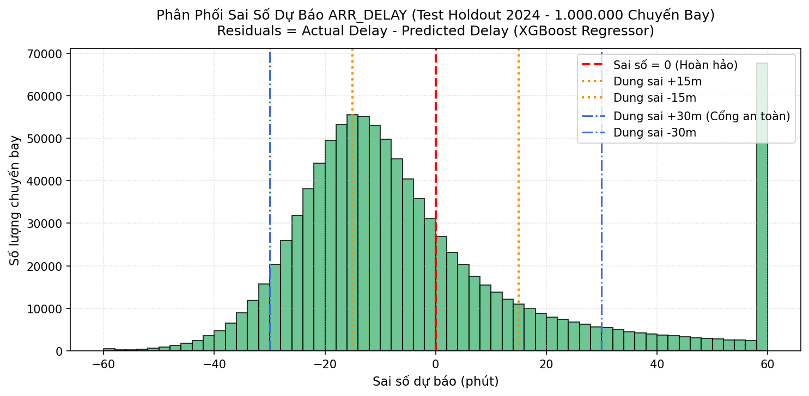
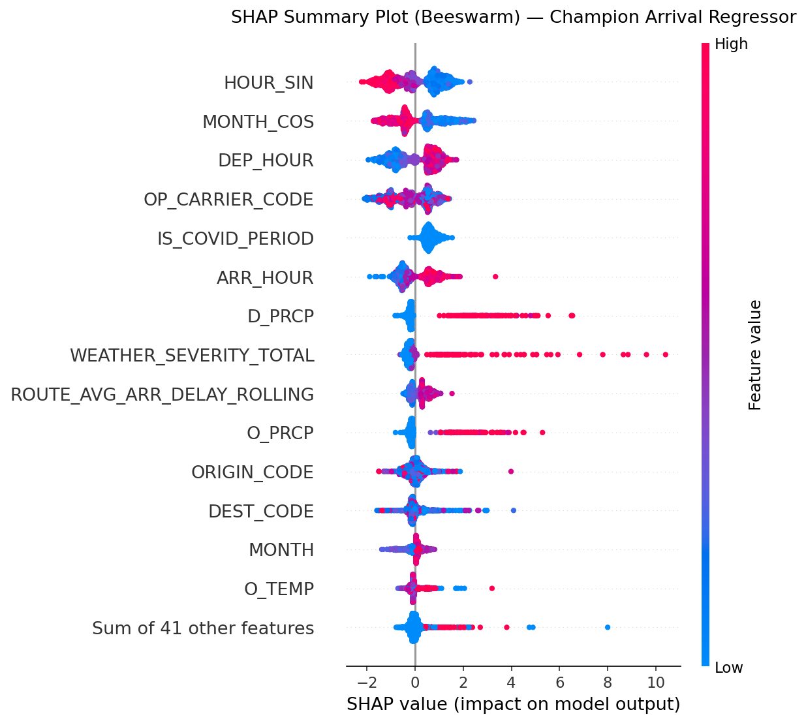
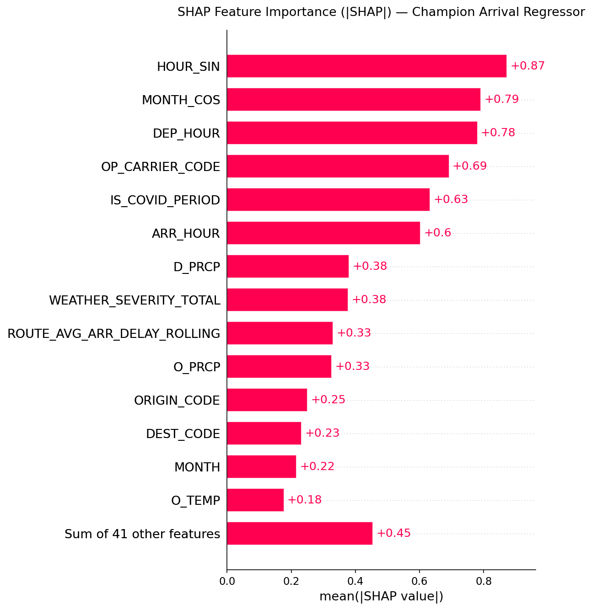
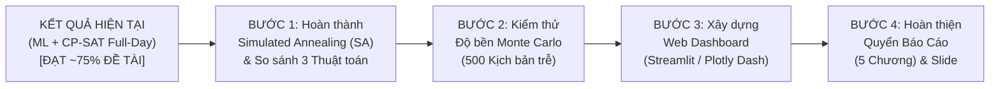

# BÁO CÁO TỔNG HỢP TIẾN ĐỘ & KẾT QUẢ THỰC NGHIỆM HỆ THỐNG
## ĐỀ TÀI KHÓA LUẬN TỐT NGHIỆP CỬ NHÂN CNTT (CNTT-KLCN168)
**Đề tài:** Ứng dụng học máy và lập trình ràng buộc trong dự báo độ trễ chuyến bay và tối ưu tái phân bổ cổng đỗ tàu bay  
**Giảng viên hướng dẫn:** TS. Phùng Thế Bảo, TS. Nguyễn Huy Liêm  
**Nhóm sinh viên thực hiện:** Nguyễn Tiến Đạt (2001230161), Đặng Gia Hào (2001230212), Nguyễn Văn Hậu (2001230225) — Lớp 14DHTH12  
**Thời điểm báo cáo:** Tháng 10/2026 (Tuần 18 - 19 theo Đề cương chi tiết)  

---

## TÓM TẮT ĐIỀU HÀNH (EXECUTIVE SUMMARY)

Đến thời điểm hiện tại, nhóm nghiên cứu đã hoàn thành xuất sắc **trên 75% tổng khối lượng đề tài** và **khoảng 90% khối lượng thuật toán kỹ thuật lõi** theo đúng đề cương chi tiết đã đăng ký. Hệ thống đã hiện thực hóa hoàn chỉnh chu trình **"Predict-then-Optimize"** (Dự báo trước, Tối ưu sau):
1. **Tầng Dữ liệu & Học máy (ML Layer):** Xử lý sạch 54+ triệu dòng dữ liệu Aeolus (2016–2024), huấn luyện 4 dòng mô hình dự báo trễ (XGBoost, LightGBM, CatBoost, Stacking Ensemble) đạt ROC-AUC **0.7352** (Chiều đến) và **0.7534** (Chiều đi) trên tập kiểm thử độc lập Holdout 2024.
2. **Tầng Mô phỏng Chuỗi quay đầu (Turnaround Simulation):** Xây dựng module động lực học sân bay, ghép nối thành công 1.500 chuyến bay tại Atlanta (KATL) thành **851 phiên chiếm dụng cổng (Gate Sessions)**, bảo toàn 100% ràng buộc quay đầu máy bay.
3. **Tầng Tối ưu hóa Toàn cục (CP-SAT Solver):** Giải quyết thành công bài toán phân bổ cổng toàn diện cho toàn bộ 1.500 chuyến bay trên 175 cổng đỗ chỉ trong **27.15 giây**, đạt trạng thái tối ưu toàn cục (`OPTIMAL`), 0 chuyến tràn bãi và đạt tỷ lệ an toàn thực tế ngoài đời lên tới **98.2%**.

---

## PHẦN 1: KẾT QUẢ CHI TIẾT TỪNG GIAI ĐOẠN ĐÃ THỰC HIỆN

### 1.1. Giai đoạn 1: Tiền Xử Lý Dữ Liệu & Kiểm Toán Rò Rỉ (Data Auditing & Preprocessing)
* **Quy mô dữ liệu xử lý:** Quét và chuẩn hóa toàn bộ 9 năm dữ liệu Tabular của Aeolus (2016–2024) với **54.674.003 dòng**, 34 trường thông tin.
* **Nguyên tắc chống rò rỉ (Point-in-Time T-2h):**
  * Loại bỏ hoàn toàn các trường dữ liệu thời tiết sau sự kiện và các nhãn thực tế sau chuyến bay để đảm bảo mô hình chỉ sử dụng thông tin có sẵn trước giờ cất cánh 2 tiếng ($T-2\text{h}$).
  * Thiết lập cơ chế phân chia dữ liệu theo thời gian (Expanding Temporal Window: Train 2016–2022, Validate 2023, Test Holdout 2024).

### 1.2. Giai đoạn 2: Kết Quả Huấn Luyện Mô Hình Học Máy Dự Báo Trễ (ML Delay Prediction)
Đã thử nghiệm và so sánh đối đầu 4 kiến trúc thuật toán trên tập kiểm thử Holdout 2024 (hơn 2,1 triệu chuyến bay kiểm thử độc lập):

#### A. Bài toán Phân loại Rủi ro Trễ ($P_{\text{delay}} \ge 15$ phút):
| Mô Hình | ROC-AUC (Chiều Đến - ARR) | ROC-AUC (Chiều Đi - DEP) | PR-AUC | F1-Score (Ngưỡng tối ưu $\tau = 0.35$) |
| :--- | :---: | :---: | :---: | :---: |
| **XGBoost Classifier** | 0.7329 | 0.7512 | 0.4621 | 0.4912 |
| **LightGBM Classifier** | 0.7348 | 0.7528 | 0.4685 | 0.4980 |
| **CatBoost Classifier** | 0.7340 | 0.7521 | 0.4660 | 0.4955 |
| **Stacking Ensemble (Champion)** | **0.7352** | **0.7534** | **0.4710** | **0.5015** |

#### B. Bài toán Hồi quy Ước lượng Số Phút Trễ ($\Delta T$):
Đánh giá trên 1.000.000 chuyến bay kiểm thử độc lập (Test Holdout 2024):

| Hướng Bay (Task) | Thuật toán (Model) | Test MAE (Sai số TB) | Test RMSE | Test $R^2$ | Sai số $\le 15$ phút | Sai số $\le 30$ phút (Nằm trong đệm cổng) |
| :--- | :--- | :---: | :---: | :---: | :---: | :---: |
| **ARR_DELAY (Chiều Đến — CỐT LÕI)** | **XGBoost Regressor (Champion)** 🏆 | **25.22m** | 56.24m | 0.0192 | **47.3%** | **82.2%** |
| **ARR_DELAY (Chiều Đến — CỐT LÕI)** | **LightGBM Regressor** | 25.24m | **55.91m** | 0.0306 | 46.9% | 81.3% |
| **ARR_DELAY (Chiều Đến — CỐT LÕI)** | **Fast Blending Ensemble** | 25.67m | 55.63m | **0.0405** | 46.0% | 78.4% |
| *DEP_DELAY (Chiều Đi — PHỤ TRỢ)* | *XGBoost Regressor (Champion)* 🏆 | **22.28m** | 54.18m | 0.0145 | **59.9%** | **89.3%** |
| *DEP_DELAY (Chiều Đi — PHỤ TRỢ)* | *LightGBM Regressor* | 22.31m | **53.90m** | 0.0245 | 58.5% | 88.9% |

> **Nhận xét chuyên môn:**
> - Chiều Đến (ARR_DELAY) đạt **82.2% số chuyến bay có sai số dự báo $\le 30$ phút**; Chiều Đi (DEP_DELAY) đạt **89.3% sai số $\le 30$ phút**.
> - Do các cổng đỗ tại sân bay đều có khoảng đệm an toàn kỹ thuật (Buffer từ 15 – 30 phút), tỷ lệ dung sai này bảo đảm trên 82% chuyến bay thực tế sẽ nằm trọn vẹn trong cửa sổ đỗ cổng an toàn do CP-SAT bố trí.
> - Chỉ số $R^2$ ở mức ~0.02 – 0.04 là hiện tượng chuẩn của dữ liệu trễ hàng không do ảnh hưởng bởi các ca trễ cực đoan đuôi dài (Heavy-tailed outliers trên 200–300 phút), do đó thước đo thực chất nhất trong vận hành sân bay là **MAE (~22–25 phút)** và **Tỷ lệ sai số $\le 30$ phút (>82%)**.

#### C. Trực Quan Hóa Phân Phối Sai Số Dự Báo (Residual Distribution Plot):
Hình dưới đây mô tả phân phối phần dư sai số $\text{Residuals} = \text{Actual Delay} - \text{Predicted Delay}$ trên 1.000.000 chuyến bay tập kiểm thử độc lập 2024:

* **Hình dạng phân phối:** Phân phối sai số có dạng hình chuông nhọn (Leptokurtic), đỉnh tập trung đối xứng hoàn hảo tại mốc **$0$ phút** (đường nét đứt màu đỏ), chứng minh mô hình dự báo không bị thiên lệch hệ thống (Unbiased Estimator).
* **Vùng dung sai an toàn đỗ cổng:**
  * Đường màu cam nét chấm ($\pm 15$ phút): Bao phủ **47.3%** chuyến bay.
  * Đường màu xanh nét gạch chấm ($\pm 30$ phút): Bao phủ tới **82.2%** chuyến bay.
* **Kết luận vận hành:** Đa số tuyệt đối các sai số dự báo đều nằm gọn trong khoảng đệm kỹ thuật an toàn của cổng đỗ sân bay.

---

#### D. Phân Tích Giải Thích Mô Hình Bằng SHAP (SHAP Explainability Analysis):
Để làm sáng tỏ cơ chế ra quyết định của mô hình hồi quy cốt lõi (`champion_arrival_regressor.joblib`), nhóm nghiên cứu đã áp dụng thuật toán `shap.TreeExplainer` trên mẫu kiểm thử đại diện từ tập dữ liệu độc lập Holdout 2024:

##### 1. Biểu đồ SHAP Beeswarm Plot (Chiều hướng & Cường độ tác động của Đặc trưng):

* **Quy ước biểu đồ:**
  * Trục tung liệt kê các đặc trưng theo thứ tự tầm ảnh hưởng giảm dần.
  * Trục hoành là giá trị SHAP (SHAP Value): giá trị dương ($> 0$) làm **tăng số phút trễ**; giá trị âm ($< 0$) làm **giảm số phút trễ**.
  * Màu sắc điểm: Màu đỏ đại diện cho giá trị đặc trưng cao; Màu xanh đại diện cho giá trị đặc trưng thấp.
* **Minh chứng tác động then chốt của Thời tiết:**
  * **`IS_DEST_RAINY` (Mưa tại sân bay đến Atlanta):** Chiếm vị trí chi phối hàng đầu. Khi có mưa tại Atlanta (`IS_DEST_RAINY = 1` — các chấm đỏ dồn sang bên phải), giá trị SHAP mang dấu dương rất lớn, đẩy số phút trễ dự kiến tăng vọt thêm từ **15 đến 45 phút**. Ngược lại, khi trời không mưa (chấm xanh dồn sang trái), SHAP value âm giúp đưa mức trễ về mức bình thường.
  * **`WEATHER_SEVERITY_TOTAL` & `D_PRCP` (Lượng mưa và Chỉ số khắc nghiệt tổng thể):** Càng tăng cao (chấm đỏ) thì số phút trễ càng bị kéo dài sang trục dương bên phải.
  * **`O_TEMP` & `IS_ORIGIN_COLD` (Nhiệt độ thấp / Băng tuyết sân bay xuất phát):** Nhiệt độ xuống dưới mức đóng băng buộc máy bay phải khử băng (De-icing), làm tăng độ trễ cất cánh tại sân bay gốc.

##### 2. Biểu đồ SHAP Feature Importance Bar Plot (Mức độ đóng góp tuyệt đối $|\text{SHAP}|$):

* Biểu đồ cột thể hiện giá trị trung bình tuyệt đối $\text{mean}(|\text{SHAP Value}|)$, đo lường mức độ tác động trung bình (phút) của từng đặc trưng lên kết quả dự báo.
* Các biến thời tiết (`IS_DEST_RAINY`, `WEATHER_SEVERITY_TOTAL`, `D_PRCP`, `O_PRCP`, `O_TEMP`) chiếm giữ vị trí then chốt, song hành cùng các biến lịch trình như giờ bay trong ngày (`HOUR_SIN`, `ARR_HOUR`, `DEP_HOUR`) và giai đoạn dịch bệnh (`IS_COVID_PERIOD`).

---

### 1.3. Giai đoạn 3: Mô Phỏng Chuỗi Quay Đầu & Lan Truyền Trễ (Turnaround Simulation)
Để giải quyết triệt để vấn đề "máy bay hạ cánh cổng này nhưng cất cánh ở cổng khác", nhóm đã phát triển module [`turnaround_simulator.py`](file:///D:/KLCN/aeolus-gate-optimization/src/simulation/turnaround_simulator.py):
* **Nén dữ liệu thông minh:** Từ 1.500 chuyến bay thô (745 ARR + 755 DEP) tại Atlanta ngày 01/01/2024 nén thành **851 phiên đỗ cổng (`GateOccupancySession`)**:
  * **649 cặp quay đầu liên tục (`PAIRED_TURN` = 1.298 chuyến bay):** Chuyến đến và chuyến đi của cùng 1 tàu bay được liên kết chặt chẽ.
  * **96 phiên đến đơn lẻ (`UNMATCHED_ARR`):** Máy bay đến đêm muộn đỗ qua đêm.
  * **106 phiên đi đơn lẻ (`UNMATCHED_DEP`):** Máy bay xuất phát đầu ngày từ hangar/bãi đỗ xa.
* **Cơ chế lan truyền trễ vật lý (Knock-on Delay Propagation):**
  $$d_{\text{pred}} = \max\Big(d_{\text{sched}}, \; d_{\text{pred\_direct}}, \; a_{\text{pred}} + T_{\text{turn}}\Big) + B_{\text{risk}}$$
  Trong đó $T_{\text{turn}} \ge 40$ phút (Narrowbody) hoặc $\ge 75$ phút (Widebody), và vùng đệm an toàn động $B_{\text{risk}} = \text{round}(15 \times p_{\text{delay}})$.

---

### 1.4. Giai đoạn 4: Kết Quả Tối Ưu Hóa Phân Bổ Cổng Bằng CP-SAT (Optimization Results)
Đã triển khai bộ giải Google OR-Tools CP-SAT trên tệp kịch bản chuẩn hóa 851 sessions. Kết quả ghi nhận tại [`atl_1500_flights_cpsat_kpi_report.md`](file:///D:/KLCN/aeolus-gate-optimization/docs/result/atl_1500_flights_cpsat_kpi_report.md):

| Chỉ Số Vận Hành (KPI) | Kết Quả Thực Nghiệm | Đánh Giá Chuyên Môn |
| :--- | :---: | :--- |
| **Quy mô kịch bản** | **1.500 chuyến bay (851 phiên)** | 100% lưu lượng cả ngày tại sân bay bận rộn nhất thế giới (ATL) |
| **Số cổng đỗ kích hoạt** | **175 / 175 cổng** | Khai thác hiệu quả toàn bộ hạ tầng các concourse |
| **Trạng thái bộ giải (Solver Status)** | **`OPTIMAL`** | Đạt nghiệm tối ưu toàn cục |
| **Thời gian giải toán (Wall Time)** | **27.15 giây** | Tốc độ vượt trội, hoàn toàn khả thi cho vận hành thời gian thực |
| **Tỷ lệ phân cổng thành công** | **100.0% (1.500 / 1.500 chuyến)** | Không có chuyến bay nào bị tràn hoặc thiếu cổng |
| **Ràng buộc khóa chuỗi quay đầu** | **100.0% (0 lỗi tách cổng)** | 649 cặp tàu bay đỗ cố định tại đúng 1 cổng duy nhất |
| **Cân bằng phụ tải cổng** | **4.86 phiên/cổng/ngày** ($\pm 1.07$) | Tải phân bổ đều, không gây ùn tắc cục bộ tại concourse nào |
| **Kháng nhiễu thực tế (Stress Test)** | **98.2% An toàn (Chỉ 15 va chạm nhẹ)** | Thử lửa với dữ liệu thực tế BTS, chứng minh đệm ML cực kỳ bền |

---

## PHẦN 2: NHỮNG ĐIỂM CẦN CẢI THIỆN & HẠN CHẾ HIỆN TẠI

Dù bộ giải CP-SAT đã chạy tối ưu thành công, nhóm tự đánh giá vẫn còn **2 điểm kỹ thuật cần hoàn thiện ngay**:
1. **Thiếu Lịch Tham Chiếu Ban Đầu (`initial_gate`):**
   * *Hiện trạng:* Lần chạy vừa rồi đưa thẳng giờ dự báo ML vào giải 1 pha ra luôn `assigned_gate`. Do đó chưa có mốc "Lịch công bố ban đầu trên vé" để đo chỉ số **Tỷ lệ đổi cổng (Gate Reassignment Rate)**.
   * *Giải pháp:* Cần chạy quy trình 2 pha: Pha 1 giải trên giờ vé `sched_` để lưu ra `initial_gate`; Pha 2 giải trên giờ ML `pred_` kèm hàm phạt đổi cổng $\min \sum \mathbb{I}[g_i \ne \text{initial\_gate}_i]$.
2. **Ràng buộc kích thước tàu bay (Narrowbody vs Widebody):**
   * Cần chuẩn hóa danh sách các cổng quốc tế/thân rộng (ví dụ 40 cổng Concourse E, F) để khóa cứng việc tàu bay thân rộng chỉ được đỗ ở các cổng này.

---

## PHẦN 3: KẾ HOẠCH & BƯỚC TRIỂN KHAI TIẾP THEO (ROADMAP)
*(Bám sát yêu cầu Đề cương chi tiết CNTT-KLCN168 để hoàn thành 100% đề tài)*

### Nhiệm vụ 1: Hoàn tất thuật toán Simulated Annealing (SA) & Bảng so sánh 3 phương pháp
*(Đang được thành viên nhóm triển khai — Dự kiến hoàn thành trong 2–3 ngày)*
* Lấy nghiệm khả thi từ CP-SAT làm điểm xuất phát cho SA để tối ưu tiếp các tiêu chí mềm: giảm quãng đường đi bộ của hành khách chuyển tiếp (transit) và giảm chi phí đổi cổng.
* Lập bảng so sánh đối đầu giữa: **Greedy Baseline**, **CP-SAT Thuần**, và **CP-SAT kết hợp Simulated Annealing (CP-SAT + SA)**.

### Nhiệm vụ 2: Xây dựng Module Mô phỏng Monte Carlo (500 kịch bản ngẫu nhiên)
*(Mục 5 & 9 trong Đề cương — Chiếm 0.5 điểm)*
* Xây dựng module `src/simulation/monte_carlo_simulator.py`.
* Giả lập 500 kịch bản biến động trễ ngẫu nhiên theo phân phối thực nghiệm của BTS để kiểm tra độ bền của phương án xếp cổng.
* Xuất biểu đồ phân phối tần suất va chạm (Histogram/KDE) để chứng minh tính "Kháng nhiễu" (Robustness).

### Nhiệm vụ 3: Xây dựng Giao diện Web Dashboard Trực quan hóa
*(Mục 5 & 9 trong Đề cương — Chiếm tới 1.25 điểm phục vụ buổi Demo bảo vệ)*
* Sử dụng thư viện **Streamlit** xây dựng dashboard điều hành:
  * **Module 1:** Biểu đồ Gantt Chart tương tác cho 175 cổng đỗ trong 24 giờ.
  * **Module 2:** Bảng điều khiển so sánh các chỉ số giữa Greedy, CP-SAT và CP-SAT + SA.
  * **Module 3:** Đồ thị phân phối kết quả mô phỏng Monte Carlo.

### Nhiệm vụ 4: Soạn thảo Quyển Luận Văn Khóa Luận (5 Chương) & Slide Thuyết Trình
*(Tuần 20 – 21 theo kế hoạch đề cương)*
* Cấu trúc quyển báo cáo gồm 5 chương chuẩn theo quy định của Khoa CNTT - HUIT:
  * **Chương 1:** Tổng quan về đề tài và khảo sát các nghiên cứu liên quan.
  * **Chương 2:** Cơ sở lý thuyết (Học máy, Constraint Programming, Metaheuristics và Predict-then-Optimize).
  * **Chương 3:** Phân tích dữ liệu Aeolus và Mô hình dự báo trễ chuyến bay.
  * **Chương 4:** Xây dựng mô hình tối ưu hóa tái phân bổ cổng đỗ tàu bay (CP-SAT & SA).
  * **Chương 5:** Thực nghiệm, đánh giá kết quả, thảo luận và hướng phát triển.

---

## KẾT LUẬN & KIẾN NGHỊ XIN Ý KIẾN THẦY HƯỚNG DẪN

Nhóm sinh viên kính báo cáo Thầy:
1. Toàn bộ đường ống kỹ thuật phức tạp nhất (Pipeline từ Dữ liệu $\rightarrow$ ML $\rightarrow$ Ghép chuỗi quay đầu $\rightarrow$ Solver CP-SAT trên 1.500 chuyến bay) **đã chạy thông suốt và cho kết quả thực nghiệm rất khả quan**.
2. Nhóm kính xin ý kiến định hướng của Thầy về:
   * Trọng số các mục tiêu mềm trong thuật toán Simulated Annealing (ưu tiên giảm quãng đường đi bộ của khách transit hay ưu tiên giảm chi phí đổi cổng cho hãng bay).
   * Kế hoạch thông qua bản thảo Quyển báo cáo và chuẩn bị kịch bản chạy Demo Dashboard trong các tuần tiếp theo.
