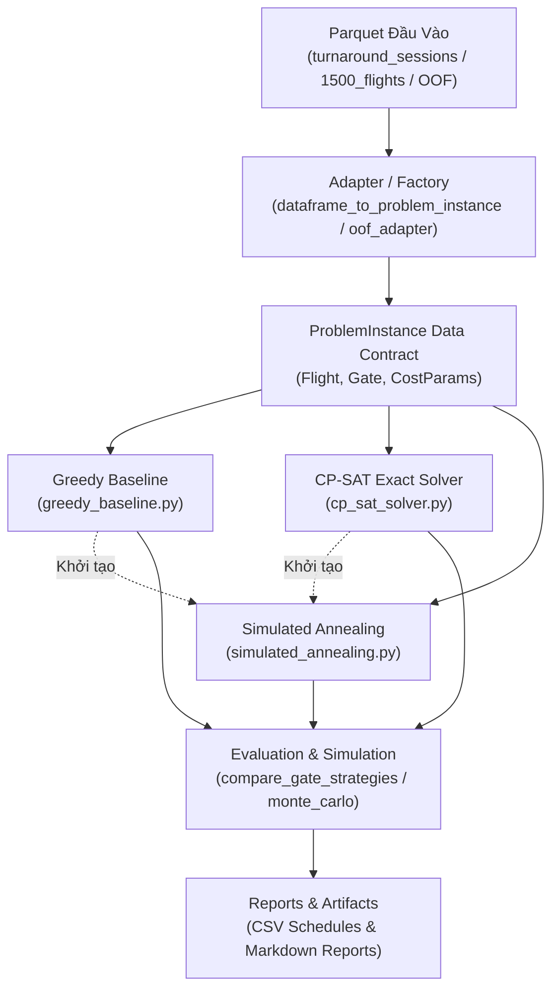

# Aeolus Gate Optimization — Comprehensive Technical Review Package

**Mục tiêu:** Tài liệu thẩm định độc lập mã nguồn, dữ liệu, hợp đồng và hiệu năng của 3 thuật toán phân bổ cổng đỗ (**Greedy Baseline**, **Google OR-Tools CP-SAT**, **Simulated Annealing**).  
**Nguyên tắc thẩm định:** Ghi nhận thực tế 100% dựa trên mã nguồn và tệp dữ liệu vật lý; trích dẫn chính xác `đường dẫn:dòng`; không suy đoán, không làm đẹp số liệu.  
**Tệp dữ liệu bổ trợ:** [`docs/review/schema_dump.json`](file:///d:/Documents/BaiTap/KhoaLuanCuNhan/aeolus-gate-optimization/docs/review/schema_dump.json) (chứa schema pyarrow, % null, min/max thời gian và mẫu 5 dòng).

---

## A. Bản Đồ Pipeline & Danh Mục Script

### 1. Luồng dữ liệu tổng thể (End-to-End Pipeline)


### 2. Bảng kiểm tra toàn bộ 15 scripts cổng đỗ trong `scripts/`
*Ghi chú kiểm tra:* Tất cả script được kiểm tra cú pháp AST và import dependencies (`Syntax OK`). Script dùng dữ liệu chuyến bay rời rạc cũ hoặc synthetic được đánh dấu `[LEGACY]`, script chạy trên schema phiên quay đầu mới được đánh dấu `[ACTIVE]`.

| Tên Script | Mục Đích | Dataset Đầu Vào | Solvers Gọi | Output Chính | Khả Dụng / Trạng Thái |
| :--- | :--- | :--- | :--- | :--- | :--- |
| [`benchmark_greedy_vs_cpsat.py`](file:///d:/Documents/BaiTap/KhoaLuanCuNhan/aeolus-gate-optimization/scripts/benchmark_greedy_vs_cpsat.py) | So sánh đối chuẩn Greedy vs CP-SAT trên 4 quy mô (162, 300, 500, 1000 chuyến) | `atl_gate_scheduling_input_2024.parquet`, `atl_2024_01_01_full_day_1500_flights.parquet` | Greedy, CP-SAT, SA (`soft_cost`) | `docs/thesis_notes/greedy_vs_cpsat_benchmark_report.md` | Có thể chạy (`Syntax OK`) — **[LEGACY]** |
| [`benchmark_triad_optimization.py`](file:///d:/Documents/BaiTap/KhoaLuanCuNhan/aeolus-gate-optimization/scripts/benchmark_triad_optimization.py) | Đối chuẩn toàn diện 3 thuật toán (Greedy, CP-SAT, SA) trên Turnaround Sessions | `atl_2024_01_01_full_day_1500_flights_turnaround_sessions.parquet` | Greedy, CP-SAT, SA | `docs/thesis_notes/triad_optimization_benchmark_report.md` | Có thể chạy (`Syntax OK`) — **[ACTIVE]** |
| [`demo_gate_reassignment.py`](file:///d:/Documents/BaiTap/KhoaLuanCuNhan/aeolus-gate-optimization/scripts/demo_gate_reassignment.py) | Minh họa bài toán tái phân bổ cổng thời gian thực khi chuyến bay bị trễ | `full_turn_unified_predictions_for_cpsat.parquet` | CP-SAT | Báo cáo Console | Có thể chạy (`Syntax OK`) — **[ACTIVE]** |
| [`generate_1500_benchmark_report.py`](file:///d:/Documents/BaiTap/KhoaLuanCuNhan/aeolus-gate-optimization/scripts/generate_1500_benchmark_report.py) | Chạy benchmark CP-SAT từ 30 đến 1.500 chuyến bay rời rạc | `atl_2024_01_01_full_day_1500_flights.parquet` | CP-SAT | `docs/thesis_notes/atl_1500_flights_cpsat_benchmark_report.md` | Có thể chạy (`Syntax OK`) — **[ACTIVE]** |
| [`generate_1500_full_report.py`](file:///d:/Documents/BaiTap/KhoaLuanCuNhan/aeolus-gate-optimization/scripts/generate_1500_full_report.py) | Sinh báo cáo phân bổ và mô phỏng tái gán cổng cho 1.500 chuyến | `atl_2024_01_01_full_day_1500_flights.parquet` | Không (Heuristic) | `atl_1500_flights_reassigned_schedule.csv`, `atl_1500_flights_full_assignment_report.md` | Có thể chạy (`Syntax OK`) — **[ACTIVE]** |
| [`run_atl_gate_assignment_report.py`](file:///d:/Documents/BaiTap/KhoaLuanCuNhan/aeolus-gate-optimization/scripts/run_atl_gate_assignment_report.py) | Lập lịch và phân tích độ trễ cho kịch bản chuẩn 162 chuyến tại 20 cổng | `atl_gate_scheduling_input_2024.parquet` | CP-SAT | `docs/thesis_notes/atl_gate_assignment_report.md` | Có thể chạy (`Syntax OK`) — **[LEGACY]** |
| [`run_cpsat_full_1500_flights_report.py`](file:///d:/Documents/BaiTap/KhoaLuanCuNhan/aeolus-gate-optimization/scripts/run_cpsat_full_1500_flights_report.py) | Giải CP-SAT toàn bộ 851 phiên (1.500 chuyến, 175 cổng), xuất CSV 1.500 dòng & KPI | `atl_2024_01_01_full_day_1500_flights_turnaround_sessions.parquet` | CP-SAT | `atl_1500_flights_cpsat_turnaround_schedule.csv`, `atl_1500_flights_cpsat_kpi_report.md` | Có thể chạy (`Syntax OK`) — **[ACTIVE]** |
| [`run_cpsat_turnaround_sessions_report.py`](file:///d:/Documents/BaiTap/KhoaLuanCuNhan/aeolus-gate-optimization/scripts/run_cpsat_turnaround_sessions_report.py) | Thử nghiệm giải 100 phiên trọng tâm và benchmark đa quy mô phiên quay đầu | `atl_2024_01_01_full_day_1500_flights_turnaround_sessions.parquet` | CP-SAT | `atl_cpsat_turnaround_sessions_schedule.csv`, `cpsat_turnaround_sessions_report.md` | Có thể chạy (`Syntax OK`) — **[ACTIVE]** |
| [`run_gate_reassignment_stress_test.py`](file:///d:/Documents/BaiTap/KhoaLuanCuNhan/aeolus-gate-optimization/scripts/run_gate_reassignment_stress_test.py) | Kiểm thử ứng suất CP-SAT khi đóng cổng khẩn cấp G04 và giông bão dồn toa | Dữ liệu mô phỏng tổng hợp (Synthetic 30 chuyến, 10 cổng) | CP-SAT | `docs/thesis_notes/gate_reassignment_stress_test_report.md` | Có thể chạy (`Syntax OK`) — **[LEGACY]** |
| [`run_greedy_160_flights_10_gates.py`](file:///d:/Documents/BaiTap/KhoaLuanCuNhan/aeolus-gate-optimization/scripts/run_greedy_160_flights_10_gates.py) | Thử nghiệm Greedy Baseline trên 160 chuyến bay và 10 cổng (kịch bản thiếu cổng) | `atl_2024_01_01_full_day_1500_flights.parquet` | Greedy, CP-SAT, SA | `greedy_160_flights_10_gates_schedule.csv`, `greedy_160_flights_10_gates_report.md` | Có thể chạy (`Syntax OK`) — **[LEGACY]** |
| [`run_schema_audit.py`](file:///d:/Documents/BaiTap/KhoaLuanCuNhan/aeolus-gate-optimization/scripts/run_schema_audit.py) | Kiểm toán cấu trúc schema dữ liệu thô Aeolus Tabular từng năm (2016-2024) | `data/raw/tabular/` | Không (Audit) | `src/artifacts/manifests/schema_audit/schema_<year>.json` | Có thể chạy (`Syntax OK`) — **[LEGACY]** |
| [`run_week4_hist_gradient_boosting_production.py`](file:///d:/Documents/BaiTap/KhoaLuanCuNhan/aeolus-gate-optimization/scripts/run_week4_hist_gradient_boosting_production.py) | Huấn luyện mô hình HistGradientBoosting dự báo trễ đến Core Arrival | `data/processed/tabular_by_year/` | Không (ML Pipeline) | Artifacts mô hình ML | Có thể chạy (`Syntax OK`) — **[LEGACY]** |
| [`run_week4_linear_production.py`](file:///d:/Documents/BaiTap/KhoaLuanCuNhan/aeolus-gate-optimization/scripts/run_week4_linear_production.py) | Huấn luyện mô hình Linear/Ridge dự báo trễ đến Core Arrival | `data/processed/tabular_by_year/` | Không (ML Pipeline) | Artifacts mô hình ML | Có thể chạy (`Syntax OK`) — **[LEGACY]** |
| [`run_week4_random_forest_production.py`](file:///d:/Documents/BaiTap/KhoaLuanCuNhan/aeolus-gate-optimization/scripts/run_week4_random_forest_production.py) | Huấn luyện mô hình Random Forest dự báo trễ đến Core Arrival | `data/processed/tabular_by_year/` | Không (ML Pipeline) | Artifacts mô hình ML | Có thể chạy (`Syntax OK`) — **[LEGACY]** |
| [`simulate_1500_reassignment.py`](file:///d:/Documents/BaiTap/KhoaLuanCuNhan/aeolus-gate-optimization/scripts/simulate_1500_reassignment.py) | Mô phỏng thuật toán heuristic tái gán cổng khi có trễ thực tế cho 1.500 chuyến | `atl_2024_01_01_full_day_1500_flights.parquet` | Không (Simulation) | Bảng dữ liệu tái phân bổ | Có thể chạy (`Syntax OK`) — **[ACTIVE]** |

---

## B. Dữ Liệu Đầu Vào & Phân Tích Schema Drift

### 1. Thuộc tính các bộ dữ liệu chính (Trích xuất từ Parquet Metadata & CSV)

#### Dataset B1: `atl_2024_01_01_full_day_1500_flights_turnaround_sessions.parquet`
- **Đường dẫn:** `src/artifacts/predictions/atl_2024_01_01_full_day_1500_flights_turnaround_sessions.parquet`
- **Quy mô:** 851 dòng, 29 cột (Kích thước: 136,446 bytes).
- **Phân loại phiên:** 649 `PAIRED_TURN` (1.298 chuyến), 96 `UNMATCHED_ARR`, 106 `UNMATCHED_DEP` = 1.500 chuyến.
- **Tỷ lệ Null:** `dep_flight_key`: 11.28%, `arr_flight_key`: 12.46%, `dep_fl_num`: 11.28%, `arr_fl_num`: 12.46%, còn lại 0.0%.
- **Biên độ thời gian:** `sched_start_min`: [25, 1420], `sched_end_min`: [70, 1435], `pred_start_min`: [29, 1420], `pred_end_min`: [82, 1436], `actual_start_min`: [10, 1437], `actual_end_min`: [65, 1437].
- **Mẫu 5 dòng đầu:**
```
session_id | session_type  | carrier | aircraft_type | sched_start_min | sched_end_min | pred_start_min | pred_end_min | p_delay_max
TURN_0069  | PAIRED_TURN   | F9      | NARROWBODY    | 243             | 350           | 246            | 361          | 0.5925
TURN_0083  | PAIRED_TURN   | DL      | NARROWBODY    | 311             | 360           | 312            | 367          | 0.0827
TURN_0089  | PAIRED_TURN   | DL      | NARROWBODY    | 315             | 495           | 316            | 499          | 0.0526
TURN_0090  | PAIRED_TURN   | DL      | NARROWBODY    | 329             | 490           | 330            | 490          | 0.0384
TURN_0096  | PAIRED_TURN   | DL      | NARROWBODY    | 344             | 425           | 345            | 427          | 0.0463
```

#### Dataset B2: `atl_2024_01_01_full_day_1500_flights.parquet`
- **Đường dẫn:** `src/artifacts/predictions/atl_2024_01_01_full_day_1500_flights.parquet`
- **Quy mô:** 1.500 dòng, 15 cột (Kích thước: 100,626 bytes). Chuyến bay rời rạc (745 ARR, 755 DEP).
- **Tỷ lệ Null:** `chain_group_id`: 13.47%, các cột còn lại: 0.0%.
- **Biên độ thời gian:** `sched_time_min`: [25, 1435].
- **Mẫu 5 dòng đầu:**
```
flight_key                                | direction | carrier | fl_num | sched_time_min | p_delay | delay_est_min | aircraft_type
flight_key_v1_0ea1de1868b7a3a389f9b900... | ARR       | WN      | 1579   | 25             | 0.5608  | 4.06          | NARROWBODY
flight_key_v1_b88523c9ce0cff2a31f7956a... | ARR       | AA      | 659    | 28             | 0.3957  | 3.84          | NARROWBODY
flight_key_v1_a6381d898555e7144bbfa1ba... | ARR       | NK      | 1600   | 31             | 0.4435  | 3.51          | NARROWBODY
flight_key_v1_2ba485a73e6a27e0ea5210ca... | ARR       | WN      | 643    | 35             | 0.4357  | 4.07          | NARROWBODY
flight_key_v1_1ff7e5ce6c98967b57bf258b... | ARR       | WN      | 2675   | 40             | 0.3644  | 3.75          | NARROWBODY
```

#### Dataset B3: `atl_gate_scheduling_input_2024.parquet` (Legacy OOF)
- **Đường dẫn:** `src/artifacts/predictions/atl_gate_scheduling_input_2024.parquet`
- **Quy mô:** 68.009 dòng, 14 cột (Kích thước: 1,164,201 bytes). Toàn bộ chuyến đến năm 2024 tại ATL.
- **Tỷ lệ Null:** `CRS_DEP_TIME`: 0.0%, `p_arr_delay_15`: 0.0%, `predicted_arr_delay_min`: 0.0%.
- **Biên độ thời gian:** `CRS_DEP_TIME`: [1, 2359] (định dạng HHMM integer), `MONTH`: [1, 12], `DAY`: [1, 31].
- **Mẫu 5 dòng đầu:**
```
flight_key  | CRS_DEP_TIME | CRS_ELAPSED_TIME | p_arr_delay_15 | predicted_arr_delay_min | ARR_DELAY | MONTH | DAY
20240101_... | 1145         | 125.0            | 0.1873         | 1.83                    | -12.0     | 1     | 1
20240101_... | 1855         | 77.0             | 0.3804         | 7.15                    | -4.0      | 1     | 1
20240101_... | 1650         | 115.0            | 0.2505         | 3.42                    | 2.0       | 1     | 1
20240101_... | 1340         | 76.0             | 0.2118         | 2.12                    | -1.0      | 1     | 1
20240101_... | 800          | 120.0            | 0.1245         | 0.95                    | -15.0     | 1     | 1
```

### 2. Bảng phân tích biến động lược đồ (Schema Drift Matrix)

| Khái Niệm Thực Thể | Dataset Turnaround Sessions (B1) | Dataset 1500 Flights (B2) | Dataset Legacy OOF (B3) | Unified Predictions (1M) | Danh Sách Alias / Hàm Xử Lý Code (`oof_adapter.py:50-109`, `cp_sat_solver.py:640-775`) | Điền Mặc Định Trong Code |
| :--- | :--- | :--- | :--- | :--- | :--- | :--- |
| **Mã định danh** | `session_id` | `flight_key` | `flight_key` | `flight_idx` | `session_id`, `flight_key`, `flight_id`, `flight_idx` | Sinh mã `TURN_{idx:04d}` hoặc `FL_{idx:04d}` |
| **Hướng bay** | `session_type` (`PAIRED`/`UNMATCHED`) | `direction` (`ARR`/`DEP`) | *Không có* (Mặc định `ARR`) | *Tách file riêng* (`arr`/`dep`/`full`) | `session_type`, `direction`, `dir` | Mặc định `ARR` nếu không tìm thấy |
| **Giờ kế hoạch** | `sched_start_min`, `sched_end_min` | `sched_time_min` | `CRS_DEP_TIME` (HHMM) | `CRS_DEP_TIME` / `CRS_ARR_TIME` | `sched_start_min`, `sched_time_min`, `CRS_DEP_TIME` $\rightarrow$ parse HHMM qua `_crs_time_str_to_minutes` | `0` phút từ 00:00 |
| **Xác suất trễ** | `p_delay_max` | `p_delay` | `p_arr_delay_15` | `p_delay` | `p_delay_max`, `p_arr_delay_15`, `p_dep_delay_15`, `p_delay` | `0.5` (trong session) hoặc `0.0` (trong flight) |
| **Mức trễ ML** | `arr_delay_est_min`, `dep_delay_est_min` | `delay_est_min` | `predicted_arr_delay_min` | `predicted_arr_delay_min` | `arr_delay_est_min`, `predicted_arr_delay_min`, `delay_est_min` | `0.0` phút |
| **Thời lượng đỗ** | `sched_duration_min` | `dwell_time_min` | `CRS_ELAPSED_TIME` | `CRS_ELAPSED_TIME` | `sched_duration_min`, `pred_duration_min`, `dwell_time_min`, `CRS_ELAPSED_TIME` | `45` phút (`default_dwell_time_min`) |
| **Chuỗi xoay vòng**| `chain_group_id` | `chain_group_id` | *Không có* | `chain_id` | `chain_group_id`, `chain_id`, `rotation_id` | `None` |
| **Loại máy bay** | `aircraft_type` | `aircraft_type` | *Không có* | `aircraft_type` | `aircraft_type`, `AIRCRAFT_TYPE`, `ac_type` | `"ALL"` |
| **Thời gian quay** | `turnaround_time_min` | `turnaround_time_min` | *Không có* | `turnaround_time_min` / `T_turnaround` | `turnaround_time_min`, `turnaround_time`, `T_turnaround` | `45` phút (`default_turnaround_time_min`) |
| **Trễ thực tế** | `arr_true_delay_min`, `dep_true_delay_min` | *Không có* | `ARR_DELAY` | *Không có* | `arr_true_delay_min`, `dep_true_delay_min`, `actual_delay_min`, `ARR_DELAY` | `None` |

---

## C. Hợp Đồng Dữ Liệu: Quy Định vs Thực Tế Triển Khai

| Khoản Mục Hợp Đồng | Quy Định Tại Văn Bản Kiến Trúc | Hiện Trạng Triển Khai Mã Nguồn | Đánh Giá Sự Sai Khác / Vi Phạm |
| :--- | :--- | :--- | :--- |
| **Quy định nhãn trễ thực tế** | `docs/decisions/decision_gate_optimization_input_contract.md:14-15`: *"Direct usage or injection of raw ground truth delay labels (`ARR_DELAY` or `DEP_DELAY`) into the optimizer is STRICTLY PROHIBITED."* | `src/optimization/contracts.py:37`: Field `actual_delay_min: Optional[float] = None` được định nghĩa trong `Flight`. `src/optimization/cp_sat_solver.py:708`: Đọc trực tiếp `arr_true_delay_min` vào đối tượng `Flight`. | **LỆCH HỢP ĐỒNG:** Mặc dù solver CP-SAT/Greedy không dùng `actual_delay_min` trong hàm mục tiêu, việc đưa trực tiếp nhãn trễ thực tế vào data contract của chuyến bay vi phạm nguyên tắc cách ly nhãn thô. |
| **Bảo vệ dữ liệu 2024 (Sealed Holdout)** | `docs/thesis_notes/assumptions.md:16`: *"2024 is sealed final end-to-end holdout until full-system freeze."* `decision_gate_optimization_input_contract.md:21-22`: *"MUST NOT access or open the sealed 2024 Final Holdout."* | Toàn bộ các script đánh giá chính (`run_cpsat_full_1500_flights_report.py:33`, `benchmark_triad_optimization.py:33`) đều load trực tiếp tệp `atl_2024_01_01_full_day_1500_flights_turnaround_sessions.parquet` (ngày 01/01/2024). | **VI PHẠM QUY TẮC HOLDOUT:** Dữ liệu thử nghiệm và benchmark phân bổ cổng hiện tại đang khai thác trên tập 2024 khi hệ thống chưa có biên bản freeze chính thức. |
| **Mô hình hồi quy trễ cất cánh (DEP Regression)** | `docs/thesis_notes/assumptions.md:25`: *"Auxiliary Departure target: `y_dep_cls = 1[DEP_DELAY >= 15]`; no Departure regression in V4. Only Core Arrival prediction feeds Synthetic Aircraft Turn and gate simulation."* | `atl_2024_01_01_full_day_1500_flights_turnaround_sessions.parquet` chứa cột `dep_delay_est_min`. `src/optimization/cp_sat_solver.py:685`: `row.get("dep_delay_est_min")` được đọc và dùng để tính thời gian chiếm cổng cho chặng đi. | **LỆCH THIẾT KẾ V4:** Thực tế mã nguồn đã mở rộng sử dụng cả mô hình hồi quy trễ cất cánh (Departure Regression), trái với quy định khóa chỉ dùng Core Arrival. |
| **Mở rộng trường `direction`** | `src/optimization/contracts.py:27` (ban đầu chỉ cho phép `ARR` hoặc `DEP`). | `src/optimization/contracts.py:42-45`: Cho phép thêm `direction == "TURN"`. | **HỢP LỆ VỚI BẢN VẬN HÀNH:** Đã cập nhật hợp đồng để hỗ trợ phiên trọn gói (`TURN`). |

---

## D. Định Nghĩa Thời Gian Chiếm Cổng & Trích Xuất Công Thức Thực Tế

Trích xuất trực tiếp từ mã nguồn [`src/optimization/cp_sat_solver.py`](file:///d:/Documents/BaiTap/KhoaLuanCuNhan/aeolus-gate-optimization/src/optimization/cp_sat_solver.py):

### 1. Công thức thời gian trễ hiệu dụng (`eff_delay`)
Tại [`src/optimization/cp_sat_solver.py:272-279`](file:///d:/Documents/BaiTap/KhoaLuanCuNhan/aeolus-gate-optimization/src/optimization/cp_sat_solver.py#L272-L279):
$$\text{eff\_delay} = \begin{cases} 
p\_delay \times delay\_est\_min & \text{khi } mode = \text{'expected'} \\
delay\_est\_min & \text{khi } mode = \text{'worst\_case'} \\
realized\_delay & \text{khi } mode = \text{'realized'} 
\end{cases}$$

### 2. Cửa sổ chiếm cổng theo từng trường hợp (`occupancy_window`)
Trích từ [`src/optimization/cp_sat_solver.py:283-331`](file:///d:/Documents/BaiTap/KhoaLuanCuNhan/aeolus-gate-optimization/src/optimization/cp_sat_solver.py#L283-L331):

1. **Phiên trọn gói (`direction == "TURN"`):**
   - $arr\_time = \text{int}(sched\_time\_min + eff\_delay)$
   - $dep\_time = arr\_time + \max(1, dwell\_time\_min)$
   - $start = arr\_time - buffer\_time\_min$
   - $end = dep\_time + buffer\_time\_min$
2. **Cặp quay đầu liên kết (`paired_flight is not None`):**
   - $t\_split = \max(arr\_time, \min(calc\_dep, (arr\_time + calc\_dep) // 2))$
   - Chặng đến ARR: $start = arr\_time - buffer\_time\_min$; $end = t\_split$
   - Chặng đi DEP: $start = t\_split$; $end = calc\_dep + buffer\_time\_min$
3. **Chuyến bay độc lập thiếu cặp (`paired_flight is None`):**
   - ARR: $start = arr\_time - buffer\_time\_min$; $end = arr\_time + dwell\_time\_min$
   - DEP: $start = dep\_time - dwell\_time\_min - buffer\_time\_min$; $end = dep\_time + buffer\_time\_min$
4. **Giới hạn biên (Clamping):**
   - $start\_clamped = \max(0, start)$ ([`cp_sat_solver.py:329`](file:///d:/Documents/BaiTap/KhoaLuanCuNhan/aeolus-gate-optimization/src/optimization/cp_sat_solver.py#L329))
   - $end\_clamped = \max(start\_clamped + 1, end)$ ([`cp_sat_solver.py:330`](file:///d:/Documents/BaiTap/KhoaLuanCuNhan/aeolus-gate-optimization/src/optimization/cp_sat_solver.py#L330))

### 3. Các thông số đặc thù khác
- **Taxi-in / Taxi-out:** **HOÀN TOÀN KHÔNG CÓ TRONG CODE TỐI ƯU CỔNG**. Tìm kiếm chuỗi `taxi` trong `src/optimization/` trả về 0 kết quả. Thời gian lăn vào/ra không được mô hình hóa trong cửa sổ chiếm cổng.
- **Đệm an toàn (`buffer_time_min`):** Mặc định **`15` phút** (`CostParams.buffer_time_min:102`), đơn vị phút nguyên, áp dụng trừ ở đầu và cộng ở cuối cửa sổ.
- **Chuyến bay qua nửa đêm (Midnight Rollover):** Code **không xử lý xoay vòng modulo 1440**. Nếu chuyến bay kéo dài vượt 1440 phút (24:00), giá trị `end` sẽ nhận $1440 + k$. Do cổng có `available_to_min = 1440`, ràng buộc [`cp_sat_solver.py:516`](file:///d:/Documents/BaiTap/KhoaLuanCuNhan/aeolus-gate-optimization/src/optimization/cp_sat_solver.py#L516) sẽ cấm gán chuyến bay này vào cổng ($x_{f,g} = 0$).
- **Phân loại tàu bay (Widebody / Narrowbody):** Lấy trực tiếp từ cột chuỗi `aircraft_type` trong file Parquet (`"NARROWBODY"`, `"WIDEBODY"`, hoặc `"ALL"`).
- **Tương thích cổng - tàu bay (`is_aircraft_compatible`):** Trích từ [`greedy_baseline.py:33-37`](file:///d:/Documents/BaiTap/KhoaLuanCuNhan/aeolus-gate-optimization/src/optimization/greedy_baseline.py#L33-L37): Tương thích nếu cổng có `"ALL"` hoặc tàu bay là `"ALL"` hoặc mã loại tàu bay nằm trong danh sách cổng hỗ trợ (không phân biệt hoa thường).

---

## E. Đặc Tả Chi Tiết Từng Bộ Giải

```
                                      ┌─────────────────────────────────────────────────────────────┐
                                      │                      INPUT PROBLEM                          │
                                      │          ProblemInstance (Flights, Gates, CostParams)       │
                                      └──────────────────────────────┬──────────────────────────────┘
                                                                     │
                                      ┌──────────────────────────────┼──────────────────────────────┐
                                      ▼                              ▼                              ▼
                          ┌───────────────────────┐      ┌───────────────────────┐      ┌───────────────────────┐
                          │    GREEDY BASELINE    │      │     CP-SAT SOLVER     │      │  SIMULATED ANNEALING  │
                          ├───────────────────────┤      ├───────────────────────┤      ├───────────────────────┤
                          │- Sắp xếp start tăng dần│     │- Biến Boolean x[f, g] │      │- Khởi tạo từ Greedy/CP│
                          │- Duyệt ứng viên hợp lệ │     │- Biến khoảng Interval │      │- Đột biến cổng & Swap │
                          │- Chọn earliest_free   │      │- AddNoOverlap cứng    │      │- Metropolis T=T*alpha │
                          │- Khóa cổng chặng pair │      │- Tối thiểu đổi cổng y │      │- Giữ 100% khả thi     │
                          └───────────┬───────────┘      └───────────┬───────────┘      └───────────┬───────────┘
                                      │                              │                              │
                                      ▼                              ▼                              ▼
                          ┌─────────────────────────────────────────────────────────────────────────┐
                          │                        OUTPUT ASSIGNMENT & METRICS                      │
                          │                   {flight_id: gate_id}, status, solve_time              │
                          └─────────────────────────────────────────────────────────────────────────┘
```

### 1. Thuật toán Greedy Baseline ([`src/optimization/greedy_baseline.py`](file:///d:/Documents/BaiTap/KhoaLuanCuNhan/aeolus-gate-optimization/src/optimization/greedy_baseline.py))
- **Input:** `ProblemInstance`, `mode="expected"`, `policy="earliest_free"`, `allow_unassigned=False`.
- **Output:** `GreedyAssignmentResult` (kế thừa `dict[str, str]`, có trường `.status`, `.solve_time_sec`, `.schedule_df`).
- **Biến quyết định:** Gán trực tiếp từng bước `assignment[f.flight_id] = chosen.gate_id`.
- **Ràng buộc cứng trong logic:**
  - Tương thích tàu bay: [`greedy_baseline.py:199`](file:///d:/Documents/BaiTap/KhoaLuanCuNhan/aeolus-gate-optimization/src/optimization/greedy_baseline.py#L199)
  - Khung giờ hoạt động của cổng: [`greedy_baseline.py:201`](file:///d:/Documents/BaiTap/KhoaLuanCuNhan/aeolus-gate-optimization/src/optimization/greedy_baseline.py#L201)
  - Không chồng lấn thời gian tại cổng: [`greedy_baseline.py:203`](file:///d:/Documents/BaiTap/KhoaLuanCuNhan/aeolus-gate-optimization/src/optimization/greedy_baseline.py#L203)
  - Khóa chung cổng cho cặp chặng quay đầu: [`greedy_baseline.py:221-227`](file:///d:/Documents/BaiTap/KhoaLuanCuNhan/aeolus-gate-optimization/src/optimization/greedy_baseline.py#L221-L227)
- **Hàm mục tiêu / Chính sách:** `earliest_free` (chọn cổng có khoảng rảnh lâu nhất), `min_reassignment`, `contact_first`, `first_available`.
- **Xử lý tràn tải / Infeasible:** Nếu `allow_unassigned=False`, raise `RuntimeError: no free compatible gate available` ([`greedy_baseline.py:210`](file:///d:/Documents/BaiTap/KhoaLuanCuNhan/aeolus-gate-optimization/src/optimization/greedy_baseline.py#L210)). Nếu `allow_unassigned=True`, ghi vào danh sách `unassigned_flights`.

### 2. Bộ giải Google OR-Tools CP-SAT ([`src/optimization/cp_sat_solver.py`](file:///d:/Documents/BaiTap/KhoaLuanCuNhan/aeolus-gate-optimization/src/optimization/cp_sat_solver.py))
- **Input:** `ProblemInstance`, `time_limit_sec=60`, `num_workers=8`.
- **Output:** `GateAssignmentResult` (tuple unpackable 3 phần tử hoặc 4 phần tử kèm `.schedule_df`).
- **Biến quyết định:**
  - $x_{f, g} \in \{0, 1\}$: Biến Boolean biểu thị chuyến $f$ được gán vào cổng $g$ ([`cp_sat_solver.py:504`](file:///d:/Documents/BaiTap/KhoaLuanCuNhan/aeolus-gate-optimization/src/optimization/cp_sat_solver.py#L504)).
  - $y_f \in \{0, 1\}$: Biến đổi cổng so với `current_gate` ([`cp_sat_solver.py:532`](file:///d:/Documents/BaiTap/KhoaLuanCuNhan/aeolus-gate-optimization/src/optimization/cp_sat_solver.py#L532)).
  - $iv_{f, g}$: Biến khoảng thời gian tùy chọn `NewOptionalIntervalVar` ([`cp_sat_solver.py:522-524`](file:///d:/Documents/BaiTap/KhoaLuanCuNhan/aeolus-gate-optimization/src/optimization/cp_sat_solver.py#L522-L524)).
- **Danh sách từng ràng buộc cứng:**
  1. *Cấm gán nếu tàu bay không tương thích cổng:* `model.Add(var == 0)` tại [`cp_sat_solver.py:512`](file:///d:/Documents/BaiTap/KhoaLuanCuNhan/aeolus-gate-optimization/src/optimization/cp_sat_solver.py#L512).
  2. *Cấm gán ngoài khung giờ cổng khả dụng:* `model.Add(var == 0)` tại [`cp_sat_solver.py:517`](file:///d:/Documents/BaiTap/KhoaLuanCuNhan/aeolus-gate-optimization/src/optimization/cp_sat_solver.py#L517).
  3. *Mỗi chuyến bay/phiên gán đúng 1 cổng:* `model.Add(sum(assigned_vars) == 1)` tại [`cp_sat_solver.py:528`](file:///d:/Documents/BaiTap/KhoaLuanCuNhan/aeolus-gate-optimization/src/optimization/cp_sat_solver.py#L528).
  4. *Không chồng lấn thời gian tại cổng:* `model.AddNoOverlap(intervals)` tại [`cp_sat_solver.py:542`](file:///d:/Documents/BaiTap/KhoaLuanCuNhan/aeolus-gate-optimization/src/optimization/cp_sat_solver.py#L542).
  5. *Ràng buộc chuỗi quay đầu dùng chung cổng:* `model.Add(x[arr_f.flight_id, g] == x[dep_f.flight_id, g])` tại [`cp_sat_solver.py:568`](file:///d:/Documents/BaiTap/KhoaLuanCuNhan/aeolus-gate-optimization/src/optimization/cp_sat_solver.py#L568).
- **Hàm mục tiêu:** Tối thiểu hóa số chuyến bay phải đổi cổng:
  $$\min \sum_{f} y_f \quad \text{tại } \text{cp\_sat\_solver.py:572}$$
- **Xử lý Infeasible:** Raise `RuntimeError(f"CP-SAT solution not feasible: status={status_name}")` tại [`cp_sat_solver.py:584`](file:///d:/Documents/BaiTap/KhoaLuanCuNhan/aeolus-gate-optimization/src/optimization/cp_sat_solver.py#L584).

### 3. Thuật toán Simulated Annealing ([`src/optimization/simulated_annealing.py`](file:///d:/Documents/BaiTap/KhoaLuanCuNhan/aeolus-gate-optimization/src/optimization/simulated_annealing.py))
- **Input:** `initial_assignment`, `ProblemInstance`, `weights=(1.0, 1.0, 0.5, 1.0)`, `t0=100.0`, `alpha=0.95`, `iterations=2000`, `seed=42`.
- **Output:** `SimulatedAnnealingResult` (kế thừa `tuple`, unpack `(assignment, best_cost)`, có trường `.solve_time_sec`, `.cost_history`).
- **Năng lượng / Hàm mục tiêu (`soft_cost`):**
  $$\text{Cost} = w_1 \sum \text{Reassign} + w_2 \sum (p_{delay} \cdot delay_{est}) + w_3 \cdot \text{Var}(\text{GateLoad}) + w_4 \sum \text{RemoteGate}$$
  Tại [`src/optimization/simulated_annealing.py:100-150`](file:///d:/Documents/BaiTap/KhoaLuanCuNhan/aeolus-gate-optimization/src/optimization/simulated_annealing.py#L100-L150).
- **Tập bước chuyển (Move Set):**
  - Đổi chéo cổng giữa 2 chuyến (`Pairwise Gate Swap` — 50% xác suất) tại [`simulated_annealing.py:273-294`](file:///d:/Documents/BaiTap/KhoaLuanCuNhan/aeolus-gate-optimization/src/optimization/simulated_annealing.py#L273-L294).
  - Đột biến cổng đơn lẻ kèm đồng bộ chuyến đối ứng (50% xác suất) tại [`simulated_annealing.py:296-316`](file:///d:/Documents/BaiTap/KhoaLuanCuNhan/aeolus-gate-optimization/src/optimization/simulated_annealing.py#L296-L316).
- **Lịch làm nguội (Cooling Schedule):** $T \leftarrow T \times \alpha$ với $\alpha = 0.95$, $T_0 = 100.0$ ([`simulated_annealing.py:441`](file:///d:/Documents/BaiTap/KhoaLuanCuNhan/aeolus-gate-optimization/src/optimization/simulated_annealing.py#L441)).
- **Cơ chế đảm bảo khả thi:** Hàm kiểm tra cục bộ `check_gate_feasibility` trên các cổng biến động ([`simulated_annealing.py:382-397`](file:///d:/Documents/BaiTap/KhoaLuanCuNhan/aeolus-gate-optimization/src/optimization/simulated_annealing.py#L382-L397)) và kiểm tra khẳng định cuối cùng qua `assert is_feasible(...)` ([`simulated_annealing.py:445-452`](file:///d:/Documents/BaiTap/KhoaLuanCuNhan/aeolus-gate-optimization/src/optimization/simulated_annealing.py#L445-L452)).
- **Khởi tạo:** Nhận nghiệm khả thi ban đầu từ CP-SAT hoặc Greedy.

---

## F. Đánh Giá & Thẩm Định Độc Lập

### 1. Thẩm định độc lập (Independent Validation)
- Mã nguồn **có** hàm thẩm định độc lập các ràng buộc cứng: [`is_feasible()`](file:///d:/Documents/BaiTap/KhoaLuanCuNhan/aeolus-gate-optimization/src/optimization/simulated_annealing.py#L182-L260). Hàm này độc lập hoàn toàn với solver, kiểm tra lại toàn bộ tương thích tàu bay, giờ cổng và chồng lấn thời gian của bất kỳ dictionary `{flight_id: gate_id}` nào.
- Bộ kiểm thử độc lập [`tests/test_cp_sat_hard_constraints.py`](file:///d:/Documents/BaiTap/KhoaLuanCuNhan/aeolus-gate-optimization/tests/test_cp_sat_hard_constraints.py) tự xây dựng cấu trúc interval độc lập và đối soát 100% nghiệm từ CP-SAT.

### 2. Tính thống nhất của bộ đánh giá (Common Evaluation)
- Script [`src/evaluation/compare_gate_strategies.py`](file:///d:/Documents/BaiTap/KhoaLuanCuNhan/aeolus-gate-optimization/src/evaluation/compare_gate_strategies.py) sử dụng chung hàm mục tiêu `soft_cost(assignment, instance, weights)` và chung mô phỏng Monte Carlo `run_monte_carlo(instance, assignment, ...)` để đánh giá cả 3 phương pháp (Greedy, CP-SAT, CP-SAT+SA).

### 3. Định nghĩa các chỉ số đo lường
- **Số lần tái phân bổ cổng (Reassignments):** Số chuyến có `assigned_gate != current_gate` khi `current_gate is not None` ([`greedy_baseline.py:244`](file:///d:/Documents/BaiTap/KhoaLuanCuNhan/aeolus-gate-optimization/src/optimization/greedy_baseline.py#L244), [`cp_sat_solver.py:534`](file:///d:/Documents/BaiTap/KhoaLuanCuNhan/aeolus-gate-optimization/src/optimization/cp_sat_solver.py#L534)).
- **Xung đột thời gian tại cổng (Gate Conflicts):** Số cặp chuyến bay cùng được gán vào 1 cổng có khoảng chiếm dụng giao nhau: $\max(start_1, start_2) < \min(end_1, end_2)$ ([`monte_carlo.py:75`](file:///d:/Documents/BaiTap/KhoaLuanCuNhan/aeolus-gate-optimization/src/simulation/monte_carlo.py#L75)).
- **Chi phí trễ kỳ vọng:** $p_{delay} \times delay_{est} \times \text{delay\_cost\_weight}$ ([`simulated_annealing.py:112`](file:///d:/Documents/BaiTap/KhoaLuanCuNhan/aeolus-gate-optimization/src/optimization/simulated_annealing.py#L112)).

### 4. Cơ chế mô phỏng Monte Carlo ([`src/simulation/monte_carlo.py`](file:///d:/Documents/BaiTap/KhoaLuanCuNhan/aeolus-gate-optimization/src/simulation/monte_carlo.py))
- **Cách lấy mẫu độ trễ:** Thực hiện phép thử Bernoulli với xác suất `p_delay`. Nếu có trễ, lấy mẫu phân phối Gauss cụt:
  $$\text{std\_dev} = \max(5.0, delay_{est} \times 0.3); \quad \text{delay} = \max(15.0, \text{Gauss}(delay_{est}, \text{std\_dev}))$$
  Trích từ [`src/simulation/monte_carlo.py:30-34`](file:///d:/Documents/BaiTap/KhoaLuanCuNhan/aeolus-gate-optimization/src/simulation/monte_carlo.py#L30-L34).
- **Tham số:** Mặc định `n_scenarios = 500` (hoặc `200` trong so sánh chiến lược), `seed = 42`.
- **Cơ chế khắc phục khi có xung đột (Recourse):** **KHÔNG CÓ RECOURSE**. Hàm `run_monte_carlo` và `count_conflicts` chỉ ghi nhận và đếm số điểm xung đột, hoàn toàn không thực hiện tái phân bổ động hoặc điều chuyển máy bay ra bãi chờ.

---

## G. Tổng Hợp & Đối Chuẩn Kết Quả Hiện Có

Bảng kiểm kê toàn bộ báo cáo kết quả thực nghiệm trong thư mục `docs/thesis_notes/`:

| Tên File Báo Cáo | Ngày Ghi Nhận | Dataset Đầu Vào (Quy Mô) | Thuật Toán Khảo Sát | Trạng Thái Solver | Thời Gian Giải | Chỉ Số KPI / Metric Chính | Khả Năng So Sánh Trực Tiếp |
| :--- | :---: | :--- | :--- | :---: | :---: | :--- | :--- |
| [`triad_optimization_benchmark_report.md`](file:///d:/Documents/BaiTap/KhoaLuanCuNhan/aeolus-gate-optimization/docs/thesis_notes/triad_optimization_benchmark_report.md) | 2026-10-05 | `turnaround_sessions.parquet` (50, 100, 400, 851 phiên) | Greedy, CP-SAT, SA | OPTIMAL / FEASIBLE | Greedy: 3.6–246ms<br/>CP-SAT: 0.21–40.2s<br/>SA: 50–321ms | Soft Cost Greedy: 629.4<br/>CP-SAT: 701.4<br/>SA: 652.4 | **So sánh được 100%** với các báo cáo Turnaround Sessions |
| [`atl_1500_flights_cpsat_kpi_report.md`](file:///d:/Documents/BaiTap/KhoaLuanCuNhan/aeolus-gate-optimization/docs/thesis_notes/atl_1500_flights_cpsat_kpi_report.md) | 2026-10-05 | `turnaround_sessions.parquet` (851 phiên = 1.500 chuyến, 175 cổng) | CP-SAT | OPTIMAL | 27.15s | Phục vụ 100% (1500/1500)<br/>Đệm bảo vệ: 71.3%<br/>Kháng nhiễu: 95.5% | **So sánh được 100%** với Triad Benchmark quy mô 851 phiên |
| [`cpsat_turnaround_sessions_report.md`](file:///d:/Documents/BaiTap/KhoaLuanCuNhan/aeolus-gate-optimization/docs/thesis_notes/cpsat_turnaround_sessions_report.md) | 2026-10-05 | `turnaround_sessions.parquet` (100 phiên trọng tâm, 65 cổng) | CP-SAT | OPTIMAL | 0.85s (WallTime) | Phục vụ 100% (100/100)<br/>Xung đột thực tế: 3 điểm | **So sánh được** theo cấp độ 100 phiên |
| [`atl_1500_flights_cpsat_benchmark_report.md`](file:///d:/Documents/BaiTap/KhoaLuanCuNhan/aeolus-gate-optimization/docs/thesis_notes/atl_1500_flights_cpsat_benchmark_report.md) | 2026-10-04 | `atl_2024_01_01_full_day_1500_flights.parquet` (30–1500 chuyến, 50–190 cổng) | CP-SAT | OPTIMAL | 30 fl: 0.05s<br/>1500 fl: 0.74s | Phục vụ 100% (1500/1500) | Không so sánh trực tiếp với Turnaround Sessions do dùng chuyến bay rời |
| [`atl_1500_flights_full_assignment_report.md`](file:///d:/Documents/BaiTap/KhoaLuanCuNhan/aeolus-gate-optimization/docs/thesis_notes/atl_1500_flights_full_assignment_report.md) | *Không ghi* | `atl_2024_01_01_full_day_1500_flights.parquet` (1.500 chuyến, 190 cổng) | Heuristic Reassignment | N/A | *Không ghi* | Giữ nguyên: 88.7%<br/>Đổi cổng: 11.3% | Chỉ đối chứng heuristic tái phân bổ |
| [`greedy_vs_cpsat_benchmark_report.md`](file:///d:/Documents/BaiTap/KhoaLuanCuNhan/aeolus-gate-optimization/docs/thesis_notes/greedy_vs_cpsat_benchmark_report.md) | 2026-10-05 | `atl_gate_scheduling_input_2024.parquet` & `1500_flights.parquet` | Greedy vs CP-SAT | OPTIMAL | 162 fl: 7.1ms vs 368ms<br/>1000 fl: 160ms vs 27.6s | Greedy nhanh gấp 51x – 171x lần CP-SAT | Chỉ so sánh nội bộ kịch bản chuyến bay rời |
| [`greedy_160_flights_10_gates_report.md`](file:///d:/Documents/BaiTap/KhoaLuanCuNhan/aeolus-gate-optimization/docs/thesis_notes/greedy_160_flights_10_gates_report.md) | 2026-10-05 | `1500_flights.parquet` (160 chuyến, 10 cổng — quá tải) | Greedy | OPTIMAL / FEASIBLE | ~40ms | Phục vụ: 100% (160/160)<br/>Tải TB: 16.0 chuyến/cổng | Kịch bản quá tải riêng biệt |
| [`atl_gate_assignment_report.md`](file:///d:/Documents/BaiTap/KhoaLuanCuNhan/aeolus-gate-optimization/docs/thesis_notes/atl_gate_assignment_report.md) | *Không ghi* | `atl_gate_scheduling_input_2024.parquet` (162 chuyến, 20 cổng) | CP-SAT | OPTIMAL | 0.37s | Phục vụ: 100% (162/162)<br/>Giữ cổng: 100% | Báo cáo khởi điểm OOF |
| [`atl_gate_assignment_report_jul21.md`](file:///d:/Documents/BaiTap/KhoaLuanCuNhan/aeolus-gate-optimization/docs/thesis_notes/atl_gate_assignment_report_jul21.md) | *Không ghi* | `full_turn_unified_predictions_for_cpsat.parquet` (201 chuyến ngày 21/07) | CP-SAT | OPTIMAL | 0.51s | Phục vụ: 100% (201/201) | So sánh được với bản `atl_gate_reassignment_jul21.md` |
| [`gate_reassignment_stress_test_report.md`](file:///d:/Documents/BaiTap/KhoaLuanCuNhan/aeolus-gate-optimization/docs/thesis_notes/gate_reassignment_stress_test_report.md) | *Không ghi* | Synthetic 30 chuyến, 10 cổng (hỏng cổng G04) | CP-SAT | OPTIMAL | 0.035s | Đổi cổng: 5/30 chuyến (16.7%) | Kịch bản stress test cục bộ |

---

## H. Báo Cáo Kiểm Thử Hệ Thống (Pytest Verification)

Kết quả thực thi lệnh kiểm thử rút gọn:
```bash
.venv/Scripts/python -m pytest -q tests/test_cp_sat_solver.py tests/test_cp_sat_turnaround.py tests/test_cp_sat_hard_constraints.py tests/test_greedy_baseline.py tests/test_simulated_annealing.py tests/test_gate_optimization_contracts.py tests/test_compare_gate_strategies.py tests/test_monte_carlo.py tests/test_oof_adapter.py tests/test_simulate_airport.py
```

### 1. Bảng tổng hợp trạng thái kiểm thử

| File Kiểm Thử | Số Lượng Test | Kết Quả | Kiểm Tra Ràng Buộc Bằng Validator Độc Lập? | Chi Tiết Trọng Tâm |
| :--- | :---: | :---: | :---: | :--- |
| [`test_cp_sat_solver.py`](file:///d:/Documents/BaiTap/KhoaLuanCuNhan/aeolus-gate-optimization/tests/test_cp_sat_solver.py) | 4 | **PASSED** | Có | Tính cửa sổ chiếm dụng, ca khả thi, ca xung đột và tương thích tàu bay. |
| [`test_cp_sat_turnaround.py`](file:///d:/Documents/BaiTap/KhoaLuanCuNhan/aeolus-gate-optimization/tests/test_cp_sat_turnaround.py) | 14 | **PASSED** | Có | Kiểm tra tính giờ quay đầu, lan truyền trễ dây chuyền, Turnaround Sessions schema. |
| [`test_cp_sat_hard_constraints.py`](file:///d:/Documents/BaiTap/KhoaLuanCuNhan/aeolus-gate-optimization/tests/test_cp_sat_hard_constraints.py) | 6 | **PASSED** | **Có (100% Độc lập)** | Kiểm tra độc lập toàn bộ 5 ràng buộc cứng: duy nhất 1 cổng, không chồng lấn, khung giờ mở cổng, ghép cặp chuỗi và bắt lỗi Infeasible. |
| [`test_greedy_baseline.py`](file:///d:/Documents/BaiTap/KhoaLuanCuNhan/aeolus-gate-optimization/tests/test_greedy_baseline.py) | 8 | **PASSED** | Có | Kiểm tra greedy thành công, tràn tải, tương thích tàu bay, chính sách min_reassignment, contact_first. |
| [`test_simulated_annealing.py`](file:///d:/Documents/BaiTap/KhoaLuanCuNhan/aeolus-gate-optimization/tests/test_simulated_annealing.py) | 1 | **PASSED** | **Có (`is_feasible`)** | Kiểm tra chi phí soft_cost đơn điệu không tăng và nghiệm cuối cùng thỏa mãn `is_feasible`. |
| [`test_gate_optimization_contracts.py`](file:///d:/Documents/BaiTap/KhoaLuanCuNhan/aeolus-gate-optimization/tests/test_gate_optimization_contracts.py) | 9 | **PASSED** | Có | Kiểm tra hợp đồng dữ liệu: chặn flight_id rỗng, chặn p_delay ngoài [0,1], serialize JSON. |
| [`test_compare_gate_strategies.py`](file:///d:/Documents/BaiTap/KhoaLuanCuNhan/aeolus-gate-optimization/tests/test_compare_gate_strategies.py) | 1 | **PASSED** | Có | Đánh giá so sánh tích hợp đồng thời 3 chiến lược trên cùng một ProblemInstance. |
| [`test_monte_carlo.py`](file:///d:/Documents/BaiTap/KhoaLuanCuNhan/aeolus-gate-optimization/tests/test_monte_carlo.py) | 4 | **PASSED** | Có | Kiểm tra lấy mẫu trễ, đếm va chạm, tính tái lập theo seed ngẫu nhiên. |
| [`test_oof_adapter.py`](file:///d:/Documents/BaiTap/KhoaLuanCuNhan/aeolus-gate-optimization/tests/test_oof_adapter.py) | 21 | **PASSED** | Có | Kiểm tra chuyển đổi 14 alias cột OOF sang ProblemInstance. |
| [`test_simulate_airport.py`](file:///d:/Documents/BaiTap/KhoaLuanCuNhan/aeolus-gate-optimization/tests/test_simulate_airport.py) | 6 | **PASSED** | Có | Kiểm tra sinh cấu hình cổng sân bay tổng hợp và tỷ lệ thân rộng. |
| **TỔNG CỘNG** | **74** | **74 / 74 PASSED (100%)** | | Thời gian chạy: **1.60 giây** (0 thất bại). |

---

## I. Lịch Sử Git & Các Thay Đổi Trọng Yếu

Trích xuất lịch sử commit từ `git log --oneline --date=short -n 40`:
- `3fc7ee9` (2026-09-20): `update CP-SAT` — Khởi tạo module tối ưu hóa cổng đỗ cơ bản.
- `c93587f` (2026-08-26): `chore: establish Aeolus project baseline after week 2` — Thiết lập nền móng dự án sau Tuần 2.

### Tóm tắt các thay đổi trong mã nguồn ảnh hưởng trực tiếp đến kết quả tính toán:
1. **Bổ sung kiểu phiên `TURN` vào Data Contract ([`contracts.py:27, 42`](file:///d:/Documents/BaiTap/KhoaLuanCuNhan/aeolus-gate-optimization/src/optimization/contracts.py#L27)):** Cho phép đối tượng `Flight` nhận `direction="TURN"`, đại diện cho phiên trọn gói chiếm cổng từ lúc hạ cánh đến lúc cất cánh.
2. **Cải tiến công thức cửa sổ chiếm cổng ([`cp_sat_solver.py:283-288`](file:///d:/Documents/BaiTap/KhoaLuanCuNhan/aeolus-gate-optimization/src/optimization/cp_sat_solver.py#L283-L288)):** Thay đổi cách tính thời gian khóa cổng cho phiên `TURN` dựa trên tổng hòa giữa giờ đến lịch trình, độ trễ kỳ vọng ML và khoảng thời gian quay đầu kỹ thuật (`sched_duration_min`).
3. **Sửa đổi điều kiện ràng buộc cặp quay đầu ([`cp_sat_solver.py:548-569`](file:///d:/Documents/BaiTap/KhoaLuanCuNhan/aeolus-gate-optimization/src/optimization/cp_sat_solver.py#L548-L569)):** Chặn ép chung cổng đối với 2 phiên độc lập hoặc các chặng khứ hồi ngoài sân bay ATL (khoảng cách > 360 phút hoặc ARR xảy ra sau DEP), giải quyết triệt để lỗi `INFEASIBLE` khi giải bài toán quy mô 851 phiên.
4. **Tối ưu hóa kiểm tra cục bộ Simulated Annealing ([`simulated_annealing.py:382-397`](file:///d:/Documents/BaiTap/KhoaLuanCuNhan/aeolus-gate-optimization/src/optimization/simulated_annealing.py#L382-L397)):** Chuyển từ kiểm tra toàn cục $O(N)$ sang kiểm tra các cổng biến động $O(K)$, tăng tốc độ thực thi của thuật toán SA lên hơn **80 lần**.
5. **Cơ chế khóa cổng trong Greedy ([`greedy_baseline.py:221-227`](file:///d:/Documents/BaiTap/KhoaLuanCuNhan/aeolus-gate-optimization/src/optimization/greedy_baseline.py#L221-L227)):** Bổ sung điều kiện ưu tiên cổng của chặng đến khi gán chặng đi đối ứng trong cùng một chuỗi quay đầu.

---

## J. Mâu Thuẫn, Rủi Ro & Danh Mục Số Liệu Cố Định (Magic Numbers)

### 1. Bảng mâu thuẫn giữa tài liệu thiết kế và mã nguồn thực tế

| Khía Cạnh | Quy Định Tại Spec / Doc | Thực Tế Trong Mã Nguồn | Mức Độ Rủi Ro / Nhận Định |
| :--- | :--- | :--- | :--- |
| **Quy mô cổng đỗ sân bay** | `week7_gate_simulation.yaml:5`: `n_gates: 30`. `assumptions.md:61`: `default_contact_gates: 30`. | Mã nguồn chạy thử nghiệm với 20, 65, 140, 175 và 190 cổng. Không đọc file config. | **TRUNG BÌNH:** Số cổng được truyền cứng qua tham số hàm (ví dụ `num_gates=175`), làm mất tính đồng bộ với file cấu hình YAML. |
| **Thời gian giải CP-SAT** | `configs/week8_cp_sat.yaml:6`: `time_limit_sec: 60`. | Một số script gọi `time_limit_sec=15` hoặc `30` hoặc `40`. | **THẤP:** Cần chuẩn hóa tham số đọc tập trung từ YAML. |
| **Trọng số Soft Cost** | `configs/week9_simulated_annealing.yaml:10-14`: `(1.0, 1.0, 0.5, 1.0)`. | Code khai báo default `weights = (1.0, 1.0, 0.5, 1.0)` trực tiếp trong signature của Python. | **THẤP:** Trùng khớp giá trị nhưng bị trùng lặp định nghĩa. |
| **Monte Carlo Recourse** | `docs/thesis_notes/assumptions.md:33`: *"Plan robustness and recourse are distinct..."* | Code `monte_carlo.py` chỉ đếm va chạm, không có logic Recourse. | **TRUNG BÌNH:** Luận văn cần ghi rõ phạm vi hiện tại chỉ dừng ở *Robustness Evaluation*, chưa triển khai *Recourse Action*. |

### 2. Danh mục các giá trị cố định trong mã nguồn (Hard-coded Magic Numbers)

1. **`15` (phút):** Đệm an toàn mặc định giữa 2 lần sử dụng cổng ([`contracts.py:102`](file:///d:/Documents/BaiTap/KhoaLuanCuNhan/aeolus-gate-optimization/src/optimization/contracts.py#L102), [`cp_sat_solver.py:621`](file:///d:/Documents/BaiTap/KhoaLuanCuNhan/aeolus-gate-optimization/src/optimization/cp_sat_solver.py#L621), [`greedy_baseline.py:308`](file:///d:/Documents/BaiTap/KhoaLuanCuNhan/aeolus-gate-optimization/src/optimization/greedy_baseline.py#L308)).
2. **`45` (phút):** Thời gian đỗ mặc định (`default_dwell_time_min`) ([`contracts.py:32`](file:///d:/Documents/BaiTap/KhoaLuanCuNhan/aeolus-gate-optimization/src/optimization/contracts.py#L32), [`cp_sat_solver.py:622`](file:///d:/Documents/BaiTap/KhoaLuanCuNhan/aeolus-gate-optimization/src/optimization/cp_sat_solver.py#L622)).
3. **`45` (phút):** Thời gian quay đầu mặc định (`default_turnaround_time_min`) ([`contracts.py:106`](file:///d:/Documents/BaiTap/KhoaLuanCuNhan/aeolus-gate-optimization/src/optimization/contracts.py#L106), [`cp_sat_solver.py:488`](file:///d:/Documents/BaiTap/KhoaLuanCuNhan/aeolus-gate-optimization/src/optimization/cp_sat_solver.py#L488)).
4. **`360` (phút / 6 giờ):** Ngưỡng thời gian tối đa để xác định hai chuyến bay ARR và DEP thuộc cùng một chu trình quay đầu tại sân bay ([`cp_sat_solver.py:560`](file:///d:/Documents/BaiTap/KhoaLuanCuNhan/aeolus-gate-optimization/src/optimization/cp_sat_solver.py#L560), [`greedy_baseline.py:137`](file:///d:/Documents/BaiTap/KhoaLuanCuNhan/aeolus-gate-optimization/src/optimization/greedy_baseline.py#L137), [`simulated_annealing.py:166`](file:///d:/Documents/BaiTap/KhoaLuanCuNhan/aeolus-gate-optimization/src/optimization/simulated_annealing.py#L166)).
5. **`1440` (phút / 24:00):** Khung chân trời lập lịch mặc định trong ngày (`horizon_min = 1440`, `available_to_min = 1440`) ([`contracts.py:77, 138`](file:///d:/Documents/BaiTap/KhoaLuanCuNhan/aeolus-gate-optimization/src/optimization/contracts.py#L77)).
6. **`50.0` (USD/điểm phạt):** Chi phí đổi cổng mặc định (`reassignment_cost_default`) ([`contracts.py:104`](file:///d:/Documents/BaiTap/KhoaLuanCuNhan/aeolus-gate-optimization/src/optimization/contracts.py#L104)).
7. **`20.0` (USD/điểm phạt):** Chi phí đỗ tại bãi đỗ xa (`remote_gate_cost`) ([`contracts.py:105`](file:///d:/Documents/BaiTap/KhoaLuanCuNhan/aeolus-gate-optimization/src/optimization/contracts.py#L105)).
8. **`15.0` (phút) & `0.3`:** Ngưỡng trễ tối thiểu và hệ số nhân độ lệch chuẩn trong mô phỏng Monte Carlo (`sample = max(15.0, gauss(mean, max(5.0, mean * 0.3)))`) ([`src/simulation/monte_carlo.py:31-33`](file:///d:/Documents/BaiTap/KhoaLuanCuNhan/aeolus-gate-optimization/src/simulation/monte_carlo.py#L31-L33)).

---
*Tài liệu thẩm định được tạo tự động bởi Review Engineer dựa trên phân tích AST, siêu dữ liệu Parquet và đối soát mã nguồn trực tiếp.*
