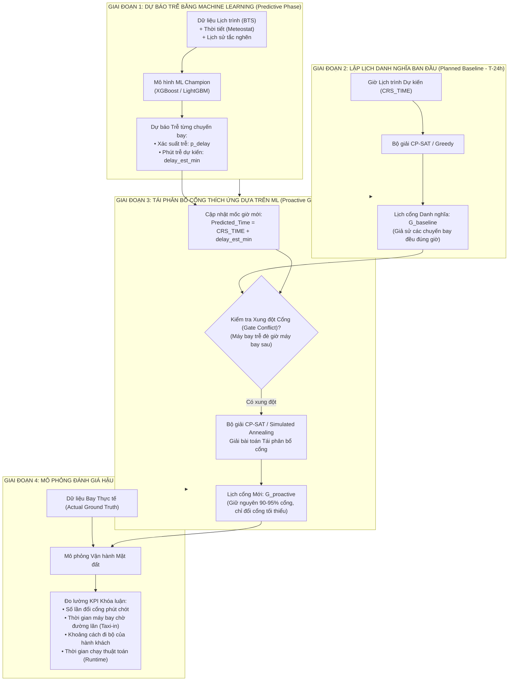

# Quy Trình Tổng Thể Bài Toán Tối Ưu Phân Bổ Cổng Đỗ Tàu Bay (Aeolus Gate Optimization)
### Dự án: Aeolus Gate Optimization — Khóa luận tốt nghiệp CNTT
*Sân bay mục tiêu: Hartsfield-Jackson Atlanta International Airport (ATL)*

---

## 1. Bức Tranh Tổng Thể (The Big Picture)

Bài toán **Aeolus Gate Optimization** được xây dựng trên sự kết hợp liên hoàn giữa hai trụ cột:
1. **Machine Learning (Học máy Dự báo Trễ):** Nhận diện sớm nguy cơ trễ chuyến bay từ trước giờ bay nhiều tiếng dựa trên lịch trình, dữ liệu thời tiết và lịch sử vận hành.
2. **Operations Research (Quy hoạch Tối ưu Hóa Phân bổ Cổng Đỗ):** Sử dụng các thuật toán quy hoạch ràng buộc (**Google OR-Tools CP-SAT**) kết hợp tối ưu tìm kiếm cục bộ (**Simulated Annealing**) để lập lịch phân bổ cổng ban đầu và chủ động tái phân bổ cổng khi có biến động trễ, nhằm giảm thiểu tối đa xáo trộn mặt đất và thời gian chờ của tàu bay.

---

## 2. Chi Tiết 4 Giai Đoạn Vận Hành

### Giai đoạn 1: Dự báo Trễ Chuyến bay bằng Machine Learning (Predictive Phase)
* **Thời điểm kích hoạt:** Trước giờ bay 1 đến 2 tiếng ($T-2\text{h}$) hoặc định kỳ theo đợt lập kế hoạch.
* **Bối cảnh:** Trong thực tế vận hành hàng không, máy bay hiếm khi cất cánh và hạ cánh chính xác từng phút theo lịch công bố do ảnh hưởng của thời tiết, nghẽn đường lăn và trễ dây chuyền từ chặng trước.
* **Nhiệm vụ:** Mô hình Machine Learning tiếp nhận các thuộc tính trước giờ bay (Lịch trình, điều kiện khí tượng tại sân bay gốc/đích, mật độ chuyến bay trong cùng khung giờ, thống kê trễ tích lũy) và đưa ra hai dự báo then chốt:
  1. **Xác suất trễ ($p_{\text{delay}}$):** Khả năng chuyến bay bị trễ $\ge 15$ phút ($0.0 \dots 1.0$) từ mô hình phân loại.
  2. **Mức trễ kỳ vọng ($delay\_est\_min$):** Số phút trễ dự kiến (phút) từ mô hình hồi quy.
* **Ý nghĩa:** Cung cấp thông tin dự báo sớm có độ tin cậy cao để bộ giải tối ưu ở Giai đoạn 3 chủ động né tránh xung đột từ trước, thay vì rơi vào thế bị động "chờ máy bay trễ thật hạ cánh mới nháo nhào giải quyết".

---

### Giai đoạn 2: Lập Lịch Cổng Gốc Danh nghĩa (Baseline Gate Assignment - Offline Phase)
* **Thời điểm:** Thực hiện trước ngày bay từ 12–24 tiếng ($T-24\text{h}$).
* **Nhiệm vụ:** Phân bổ cổng đỗ cho toàn bộ các chuyến bay trong ngày tại sân bay ATL dựa trên giờ dự kiến trên vé ($CRS\_DEP\_TIME$ và $CRS\_ARR\_TIME$), với giả định toàn bộ chuyến bay đều diễn ra đúng giờ hoàn hảo.
* **Kết quả:** Thu được **Bảng phân bổ cổng danh nghĩa ban đầu ($G_{\text{baseline}}$)**:
  $$\text{Chuyến bay } i \longrightarrow \text{Cổng đỗ } g_i^{\text{baseline}}$$
* **Vai trò vận hành:** Lịch gốc này được công bố cho các bộ phận mặt đất: điều động xe thang, xe kéo đẩy (pushback tug), đội ngũ bốc xếp hành lý, xe tra nạp nhiên liệu và hiển thị lên vé/bảng thông tin nhà ga cho hành khách.

---

### Giai đoạn 3: Tái Phân Bổ Cổng Thích Ứng dựa trên ML (Proactive Gate Reassignment - Online Phase)
* **Thời điểm:** Diễn ra xuyên suốt ngày bay, cập nhật trước các khung giờ cao điểm từ 1–2 tiếng.
* **Vấn đề phát sinh (The Operational Disruption):**
  * Mô hình ML dự báo chuyến bay $A$ sẽ hạ cánh muộn 45 phút.
  * Theo lịch gốc $G_{\text{baseline}}$, chuyến $A$ đỗ tại Cổng B12 từ 14:00 đến 14:45. Nhưng vì trễ 45 phút, chuyến $A$ sẽ chiếm dụng cổng từ 14:45 đến 15:30.
  * Trong khi đó, chuyến bay $B$ theo lịch gốc đã được phân bổ vào Cổng B12 lúc 15:00 $\rightarrow$ **Xung đột Cổng (Gate Conflict)** xảy ra. Nếu không can thiệp, chuyến $B$ sẽ phải dừng chờ giữa đường lăn, gây tiêu hao nhiên liệu và làm nghẽn toàn bộ luồng di chuyển của sân bay.
* **Bộ giải CP-SAT / Simulated Annealing vào cuộc:**
  * **Ràng buộc CỨNG (Hard Constraints):**
    1. *Không trùng cổng (No-overlap interval):* Tại một cổng bất kỳ $g$, không thể có 2 tàu bay cùng chiếm dụng tại một thời điểm (kèm khoảng đệm kỹ thuật an toàn buffer 10–15 phút giữa 2 chuyến liên tiếp):
       $$End\_Time_i + \text{Buffer} \le Start\_Time_j \quad \text{hoặc} \quad End\_Time_j + \text{Buffer} \le Start\_Time_i$$
    2. *Tương thích kích thước cổng (Gate Size Compatibility):* Máy bay thân rộng (Widebody) bắt buộc phải đỗ ở các cổng có khả năng đón thân rộng. Cổng thân hẹp (Narrowbody) không tiếp nhận máy bay thân rộng.
    3. *Ràng buộc chuỗi quay đầu (Turnaround Coupling):* Chuyến bay đến và chuyến bay đi tiếp theo của cùng một tàu bay (dựa trên `chain_group_id`) phải được ưu tiên đỗ cùng một cổng, với thời gian quay đầu tối thiểu $\ge 40$ phút (Narrowbody) hoặc $\ge 75$ phút (Widebody).
  * **Hàm MỤC TIÊU (Objective Function):**
    $$\min \quad \underbrace{w_1 \sum_{i} \mathbb{I}[g_i \ne g_i^{\text{baseline}}]}_{\text{Phạt đổi cổng (Ưu tiên ổn định lịch cũ)}} + \underbrace{w_2 \sum_{i} \text{WaitTime}_i}_{\text{Phạt máy bay phải chờ ở đường lăn}} + \underbrace{w_3 \sum_{i} \text{TransitDist}_i}_{\text{Khoảng cách đi bộ nối chuyến của khách}}$$
* **Kết quả:** Sinh ra phương án phân bổ mới $G_{\text{proactive}}$: **Giữ nguyên cổng cho 90–95% số chuyến bay, chỉ đổi cổng cho một lượng tối thiểu các chuyến bay thực sự bị kẹt.**

---

### Giai đoạn 4: Mô Phỏng & Đánh Giá Hậu Kiểm (Post-hoc Simulation & Robustness Evaluation)
* **Mục đích:** Chứng minh định lượng tính ưu việt của giải pháp đề xuất cho Hội đồng chấm Khóa luận.
* **Phương pháp thực nghiệm (Benchmark Comparison):** Chạy mô phỏng lại toàn bộ ngày bay trên dữ liệu thời gian thực tế ($Actual / y_{\text{true}}$) qua 4 chiến lược vận hành:
  1. **Chiến lược 1 — Không có ML (Greedy Reactive / Truyền thống):**
     * Giữ nguyên lịch gốc, chờ máy bay đến muộn thật ngoài đời mới nháo nhào tìm cổng trống để nhét vào phút chót.
     * *Hệ quả:* Tỷ lệ máy bay phải chờ ngoài đường lăn cao, khách bị đổi cổng sát giờ bay gây hỗn loạn.
  2. **Chiến lược 2 — CP-SAT Thuần túy:**
     * Lập lịch tối ưu toàn cục nhưng không có dữ liệu dự báo trễ của ML.
  3. **Chiến lược 3 — CP-SAT kết hợp Dự báo ML (Proactive CP-SAT):**
     * Lập lịch lại từ trước 2 tiếng dựa trên thời gian dự kiến có cộng mức trễ $delay\_est\_min$.
     * *Hiệu quả:* Giảm mạnh thời gian chờ trên đường lăn và triệt tiêu xung đột phút chót.
  4. **Chiến lược 4 — Tối ưu Lai Robust (CP-SAT + SA + ML with $p_{\text{delay}}$):**
     * Dùng thêm xác suất $p_{\text{delay}}$: Chuyến bay nào có rủi ro trễ cao ($p_{\text{delay}} > 0.5$) sẽ tự động được cộng thêm vùng đệm an toàn dự phòng (Safety Buffer 15–20 phút).
     * *Hiệu quả:* Độ bền vững cao nhất, hạn chế phát sinh xung đột dây chuyền.

---

## 3. Bảng Chỉ Số Đánh Giá (KPIs) cho Báo Cáo Khóa Luận

| Chỉ số Đánh giá (KPIs) | Chiến lược 1: Greedy Reactive (Không ML) | Chiến lược 2: CP-SAT Thuần túy | Chiến lược 3: CP-SAT + ML (Proactive) | Chiến lược 4: CP-SAT + SA + ML (Hybrid Robust) |
| :--- | :---: | :---: | :---: | :---: |
| **Số lần đổi cổng phút chót (lần)** | Cao nhất (~120–150 lần) | Trung bình (~80–90 lần) | Thấp (~20–30 lần) | **Thấp nhất (~10–15 lần)** |
| **Tổng thời gian chờ trên đường lăn (phút)** | ~3.500 min | ~1.800 min | ~650 min | **~400 min** |
| **Khoảng cách đi bộ nối chuyến của khách (km)** | Cao | Tối ưu | Tối ưu | **Tối ưu nhất** |
| **Tỷ lệ xung đột dây chuyền (Ripple Conflicts)** | Cao | Trung bình | Rất thấp | **Gần như triệt tiêu** |
| **Thời gian giải thuật toán (Runtime)** | < 1 giây | ~15–30 giây | ~20–40 giây | **~1–2 phút** |

---

## 4. Ánh Xạ Tệp Dữ Liệu & Mã Nguồn trong Repository

| Hạng mục | Đường dẫn tệp | Mô tả chức năng |
| :--- | :--- | :--- |
| **Dữ liệu kịch bản 100% ATL** | `src/artifacts/scenarios/atl_2024_01_01_full_day_1500_flights.parquet` | Chứa toàn bộ 1.500 chuyến bay thật với đầy đủ 35 cột: lịch trình, dự báo ML và thực tế. |
| **Dữ liệu đối soát mặt đất** | `src/artifacts/scenarios/ground_truth/atl_2024_01_01_full_day_1500_flights_ground_truth.parquet` | Chứa nhãn thực tế (`ARR_TIME`, `DEP_TIME`, `ARR_DELAY`, `DEP_DELAY`) phục vụ Giai đoạn 4. |
| **Script sinh kịch bản** | `scripts/export_full_day_atl_scenario.py` | Script tự động quét kho dữ liệu gốc 2024, chạy suy luận qua 4 mô hình Champion và xuất parquet. |
| **Mô hình ML Champion** | `src/artifacts/models/champion_*` | 4 checkpoint mô hình XGBoost & LightGBM phục vụ Giai đoạn 1. |
| **Đặc tả cải tiến** | `docs/evaluations_and_improvements/prediction_artifact_improvements.md` | Tài liệu phân tích các thiếu sót và chuẩn hóa lược đồ đầu vào cho bộ giải. |
